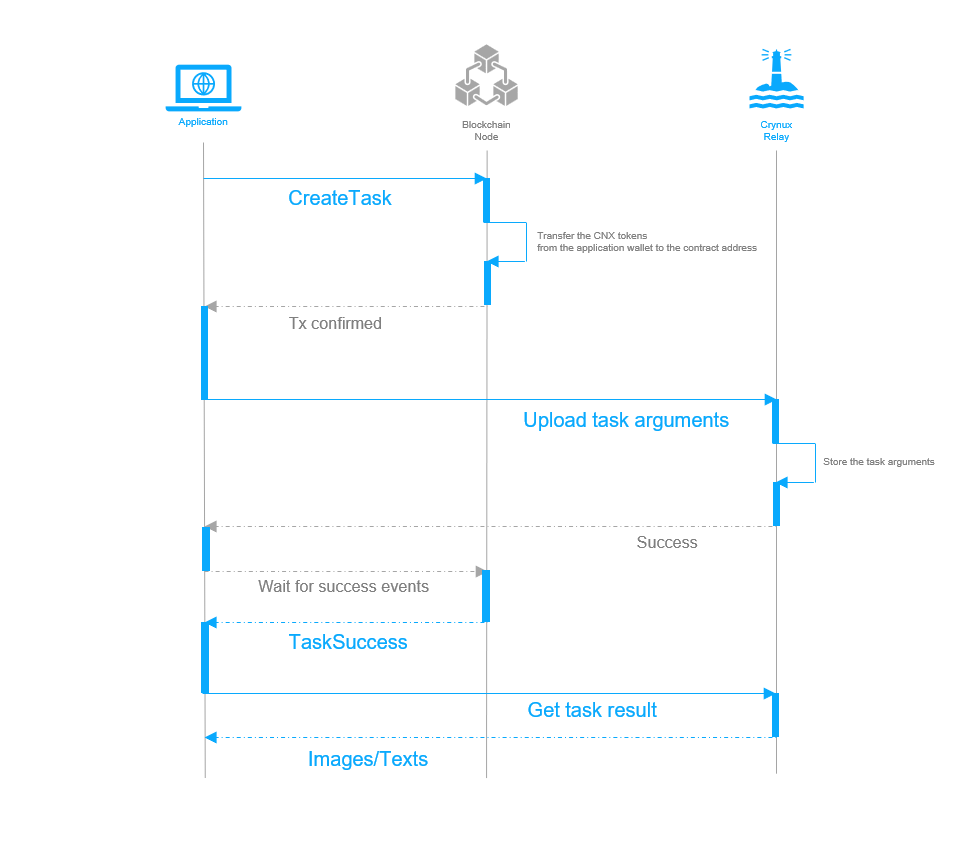

# Application Workflow

The Application could use the Crynux Network as an API service. The application sends the inference task to the network, and get the result back directly. Two types of the inference task are supported: the Stable Diffusion image generation task and the GPT text generation task.

The application will be talking to 2 components in the Network: a Blockchain node, and the Relay.

The application must have a wallet with enough CNX tokens to pay for the tasks, and a little bit of ETH to pay the gas fee.

## High Level Overview

The application workflow is illustrated in the graph below:

<figure><figcaption><p>High level application workflow</p></figcaption></figure>

The application starts the workflow by invoking the `CreateTask` method of the smart contract using the prepared wallet. The hash of the task arguments is passed to the method, which is used by the Nodes to verify the actual task arguments received from the Relay.

The smart contract transfers the required amount of the CNX tokens from the application wallet to its own address. The tokens will be transferred to the Nodes after the task is completed, and will be returned to the application wallet if the task is not completed successfully.

After the transaction is confirmed on-chain, the application should then send the actual task arguments to the Relay.

> The task arguments will be fetched by the selected nodes from the Relay, and then the task will be started on the nodes.
>
> When the images/texts are generated, the nodes will generate proofs and send them to the Blockchain, who will verify the correctness of the proofs, and transfer the tokens to the nodes after the verification.
>
> The nodes will also upload the result images/texts to the Relay, who will compare the results with the proofs on-chain to make sure the results are correct.

After sending the task arguments to the Relay, the application should simply wait for the `TaskSuccess` event from the Blockchain. When the event arrives, the application could get the images/texts from the Relay, and the task workflow is completed.

Note that there is no need to verify the results by the application itself, since they have been verified by the Relay already.

A more detailed and complete workflow involving all the network participants can be found in the task lifecycle:


[task-lifecycle.md](../system-design/task-lifecycle.md)


## The Reference Applications

The workflow has been fully implemented in the showcase applications: the Image Generator and the AI Chatbot. Which can be accessed at:

The Image Generator: [https://ig.crynux.ai](https://ig.crynux.ai)

The AI Chatbot: [https://chat.crynux.ai](https://chat.crynux.ai)

Both applications are using the Crynux Bridge as the backend. Crynux Bridge has a built-in wallet to pay for the task fees, so that the application doesn't need to prepare a wallet itself. The Crynux Bridge also isolates the Blockchain and Relay from the applications. The applications could simply submit the task arguments through API, and wait for the result without doing anything else.

The source code of the Crynux Bridge can be found at:



The source code of the web UI of the Image Generator:



The source code of the web UI of the AI Chatbot



## Application Workflow Step by Step

### 1. Prepare the application wallet


Crynux Network is currently deployed on an Ethereum compatible **private** Blockchain. **No real ETH and CNX tokens are used**. You could join the [Discord Server of Crynux](https://discord.gg/C5Uj9kAr) to get the test tokens.


An Ethereum compatible wallet must be generated. Which will be used by the application to invoke the smart contracts on-chain.

Enough CNX tokens must be present in the wallet. The tokens will be used to pay for the tasks. The application should keep monitoring the balance of the wallet, and notify the admins to transfer more tokens into the wallet before it is not enough to pay for the next task.

ETH tokens are also required in the wallet, to pay for the gas fees of sending the transaction.

#### Approve the Task Contract to spend the CNX tokens in the wallet

When the application invokes the `CreateTask` method of the Task Contract, the contract will transfer certain amount of CNX tokens to its own address. The purpose is that the Nodes could then trust that they will definitely get paid after they finish the task.

In order to achieve this, the Task Contract must be approved to spend the CNX tokens in the application wallet. Since CNX is a standard ERC20 token, this is done by invoking the `Approve` method of the CNX Token Contract from the application wallet, passing the address of the Task Contract as argument.

If the application is expected to create a lot of tasks frequently, a larger number of tokens could be approved at once to save gas fees. This is still safe, since the Task Contract can not do anything else other than the hard-coded behaviors.

As a reference, the source code that automatically approves all the remaining balance of the application wallet to the Task Contract in the Crynux Bridge [can be found here](https://github.com/crynux-ai/crynux-bridge/blob/aba6390424904c14b8f8676d5559c8ec9f6da503/blockchain/task.go#L177).


For the DApp, the application wallet is not required. The DApp will construct the transaction, and send it to the Metamask to be signed directly by the user, in the browser. The user's wallet will have to approve the CNX tokens to the Task Contract as well, before signing and sending the `CreateTask` transaction.


### 2. Create the Task on the Blockchain

#### Construct the task arguments

The arguments of the task are organized as a JSON string. An example of the arguments of an image generation task is given below:

```json
{
    "base_model": "emilianJR/chilloutmix_NiPrunedFp32Fix",
    "prompt": "a realistic portrait photo of a beautiful girl, blonde hair+++, smiling, facing the viewer",
    "negative_prompt": "low resolution++, bad hands",
    "task_config": {
        "num_images": 9,
        "safety_checker": False
    },
    "lora": {
        "model": "https://civitai.com/api/download/models/34562",
        "weight": 80
    },
    "controlnet": {
        "model": "lllyasviel/control_v11p_sd15_openpose",
        "weight": 90,
        "image_dataurl": "base64,image/png:...",
        "preprocess": {
            "method": "openpose_face"
        }
    }
}
```

The task definition above follows the schema given in the [Stable Diffusion Task Framework](https://github.com/crynux-ai/stable-diffusion-task). A wide range of the common configurations are supported. The framework also provides the JSON schema to be used to validate the task arguments. More introduction of the framework can be found in this doc:


[stable-diffusion-task.md](stable-diffusion-task.md)


The GPT text generation task is quite similar to the image generation task. The supported task arguments and the JSON schema can be found in the following doc:


[gpt-task.md](gpt-task.md)



The application should always validate the task arguments against the schema before sending it to the network, especially when the arguments are generated by the user in the application's frontend.


#### Send the task arguments to the Blockchain

After the JSON string of the task arguments is prepared, the application should construct and send the `CreateTask` transaction to the Blockchain.

`CreateTask` method of the [Task Contract](https://github.com/crynux-ai/crynux-contracts/blob/75a2f7014d9d797df9721be17161ec32c745b9dd/contracts/Task.sol#L75) has four arguments:

```solidity
function createTask(
    uint taskType,
    bytes32 taskHash,
    bytes32 dataHash,
    uint vramLimit
)
```

* `taskType` is an integer that identifies the task type: 0 for SD task and 1 for GPT task.
* `taskHash` is the keccak256 hash of the JSON string of the task arguments.
* `dataHash` is reserved for the future features and is not used right now. The application could just pass 32 zero bytes to it.
* `vramLimit` indicates the minimum VRAM required to execute the task. The Crynux Network will select the capable nodes based on this value.

The source code that implements the invocation of the CreateTask method in the Crynux Bridge [can be found here](https://github.com/crynux-ai/crynux-bridge/blob/652ea694980da774a283782886bedaa362a53a50/blockchain/task.go#L32).

#### Get the task creation result

After the transaction is sent, the application should get the creation result before proceeding to the next step. Since the transaction might be reverted by the Blockchain due to several reasons, such as not enough CNX tokens left in the application wallet.

All the possible reasons a transaction could be reverted for can be found [in the source code](https://github.com/crynux-ai/crynux-contracts/blob/43f98cc0d0b6726c54dc93103739414c6313a6c9/contracts/Task.sol#L59C21-L59C21).

If the transaction is reverted, no event will be emitted. So the creation result could only be queried using the transaction hash, or the receipt from the transaction creation step above.

### 3. Upload the Task Arguments to the Relay

When the transaction of the task creation is confirmed, the next step is to upload the actual JSON string of the task arguments to the Relay. The API endpoint to be used is:


[https://relay.h.crynux.ai/openapi.json](https://relay.h.crynux.ai/openapi.json)


The complete API documentation can be found in the [OpenAPI specifications](https://relay.h.crynux.ai/static/api\_docs.html).

The uploading is just a normal API invocation to the Relay server. The only step worth attention is that the request must be signed using the application wallet before sending to the Relay.

> The Relay monitors the Blockchain for all the task creations. It will record the task ID and the address of the task creator (i.e. the application wallet) when the TaskCreated event is emitted on-chain. When the API to upload task arguments is invoked, the Relay requires that the request must be made from the same task creator on-chain.

The signature is generated using ECDSA with the same curve that Ethereum uses, on the Keccak256 hash of a string, which is generated by including all the query and body params (except `timestamp` and `signature`) of the request in a JSON string, whose keys are sorted in alphabetical order, and concatenated with the current Unix timestamp.

The reference implementation of the signing method, in Crynux Bridge, [can be found here](https://github.com/crynux-ai/crynux-bridge/blob/main/relay/sign\_data.go). The code to upload the task arguments to the Relay can also be found [in the source code](https://github.com/crynux-ai/crynux-bridge/blob/652ea694980da774a283782886bedaa362a53a50/relay/inference\_task.go#L41).

### 4. Wait for the Task to Finish

When the task is finished, either the `TaskSuccess` or the `TaskAborted` event will be emitted. If the `TaskSuccess` event is emitted, the application could get the result images from the Relay. If the `TaskAborted` event is emitted, the task is failed.

Just like the task creation invocation, there are also several reasons why the task would fail during the execution. Might be that the task arguments do not pass the schema validation of the Nodes, or that some Nodes are not executing the consensus protocol correctly, or that the task is taking too long to finish on a single Node. The exact reason is included as an argument in the emitted event.&#x20;

If the task is aborted, in some cases the CNX tokens will be returned to the application wallet, while in other cases the tokens are still paid to the Nodes even the task is not completed, depending on who to blame for the task failure.

There are two ways the application could monitor the Blockchain for the relevant events. The first method is to keep tracking the new blocks, and filter the blocks for these two kinds of events.

The tracking method requires the application to properly handle the block continuity, especially when the application could crash due to some unhandled bugs. And if the application has been stopped for a long time, it may take quite a while to catch up with the new blocks.

The other method is to extract the task ID from the task creation transaction and save it, and periodically query the Blockchain for the newest task status. The block does not need to be tracked anymore in this method. The efficiency is lower than the previous method since a lot of meaningless queries should be made.

The Crynux Bridge uses the first method, the source code of the block synchronization [can be found here](https://github.com/crynux-ai/crynux-bridge/blob/main/tasks/sync\_block.go).

### 5. Fetch the result from the Relay

The last step is to get the actual images/texts from the Relay. This is done by calling the following API of the Relay:

#### Get images

The URL could be treated like an image downloading link as it returns the binary stream of the image content directly. The signature and timestamp is still required.


[https://relay.h.crynux.ai/openapi.json](https://relay.h.crynux.ai/openapi.json)


#### Get texts



When the application accesses the above URL after the `TaskSuccess` event is received, it could keep getting `404 not found` for a short while before it gets the correct images. The reason is that the Node will start to upload images/texts to the Relay only after the `TaskSuccess` event is received. So before the uploading is done, the application can not find the results on the Relay. Several times of retrying is required at this place.


The source code where the Crynux Bridge downloads the images is [located here](https://github.com/crynux-ai/crynux-bridge/blob/aba6390424904c14b8f8676d5559c8ec9f6da503/relay/inference\_task.go#L93).
