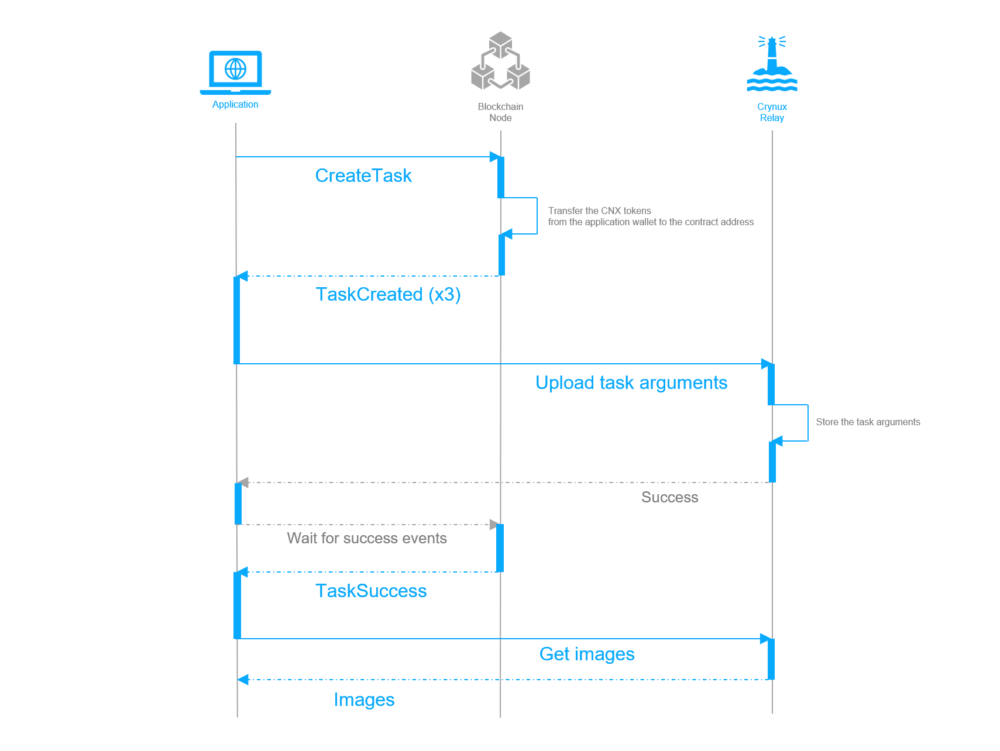

# Application Workflow

The Application could use the Hydrogen Network as an API service. The application sends the Stable Diffusion image generation task to the network, and get the result images back.

The application will be talking to 2 components in the Network: a Blockchain node, and the Relay.

The task is created on the Blockchain first. In order to create the task on-chain, the application must have a wallet filled with enough CNX tokens to pay for the task execution, and a little bit of ETH to pay the gas fee.

The high level workflow is illustrated in the sequential graph below:

<figure><figcaption><p>Sequential Graph of the Application Workflow</p></figcaption></figure>

The application starts the workflow by invoking the `CreateTask` method of the smart contract using the prepared wallet. The hash of the task arguments is passed to the method, which is used by the Nodes to verify the actual task arguments received from the Relay.

The smart contract transfers the required amount of the CNX tokens from the application wallet to its own address. The tokens will be transferred to the Nodes after the task is completed, and will be returned to the application wallet if the task is not completed successfully.

The smart contract then selects 3 nodes randomly, and emits 3 `TaskCreated` events (each one with a different node address as the argument) to notify the nodes.

After the transaction is confirmed on-chain, the application sends the actual task arguments to the Relay.

> The task arguments will be fetched by the selected Nodes, and the task will be started on the Nodes.
>
> When the images are generated, the Nodes will generate proofs and send them to the Blockchain, who will verify the correctness of the proofs, and transfer the tokens to them after the verification.
>
> The Nodes will also upload the actual images to the Relay, who will compare the images with the proofs on-chain to make sure the images are the ones that passed the Blockchain verification.&#x20;

From the application's perspective, it simply waits for the `TaskSuccess` event from the Blockchain. When the event arrives, the application could get the images from the Relay, and the task workflow is completed.

Note that there is no need to verify the images by the application, since they have been verified by the Relay already.

## Prepare the Application Wallet


Hydrogen Network is deployed on an Ethereum compatible **private** Blockchain. **No real ETH and CNX tokens are used**. You could join the [Discord Server of Crynux](https://discord.gg/Ug2AHUbrrm) to get the test tokens.


An Ethereum compatible wallet must be generated. Which will be used by the application to invoke the smart contracts on-chain.&#x20;

Enough CNX tokens must be present in the wallet. The tokens will be used to pay for the tasks. The application should keep monitoring the balance of the wallet, and notify the admins to transfer more tokens into the wallet before it is not enough to pay for the next task.

ETH tokens are also required in the wallet, to pay for the gas fees of sending the transaction.

#### Approve the Task Contract to spend the CNX tokens in the wallet

When the application invokes the `CreateTask` method of the Task Contract, the contract will transfer certain amount of CNX tokens to its own address. The purpose is that the Nodes could then trust that they will definitely get paid after they finish the task.

In order to achieve this, the Task Contract must be approved to spend the CNX tokens in the application wallet. Since CNX is a standard ERC20 token, this is done by invoking the `Approve` method of the CNX Token Contract from the application wallet, passing the address of the Task Contract as argument.

If the application is expected to create a lot of tasks frequently, a larger number of tokens could be approved at once to save gas fees. This is still safe, since the Task Contract can not do anything else other than the hard-coded behaviors.


For the DApp, the application wallet is not required. The DApp will construct the transaction, and send it to the Metamask to be signed directly by the user. The user's wallet will have to approve the CNX tokens to the Task Contract as well, before signing and sending the `CreateTask` transaction.


## Create the Stable Diffusion Task on the Blockchain

The arguments of a Stable Diffusion task are organized as a JSON string. An example is given below:

```json
{
    "base_model": "emilianJR/chilloutmix_NiPrunedFp32Fix",
    "prompt": "a realistic portrait photo of a beautiful girl, blonde hair+++, smiling, facing the viewer",
    "negative_prompt": "low resolution++, bad hands",
    "task_config": {
        "num_images": 9,
        "safety_checker": False
    },
    "lora": {
        "model": "https://civitai.com/api/download/models/34562",
        "weight": 80
    },
    "controlnet": {
        "model": "lllyasviel/control_v11p_sd15_openpose",
        "weight": 90,
        "image_dataurl": "base64,image/png:...",
        "preprocess": {
            "method": "openpose_face"
        }
    }
}
```

The task definition follows the schema given in the [Stable Diffusion Task Framework](https://github.com/crynux-ai/stable-diffusion-task). A wide range of the common configurations are supported. The framework also provides the JSON schema to be used to validate the task arguments.


The application should validate the task arguments against the schema before sending it to the network, especially when the arguments are generated by the user in the application's frontend.


After the JSON string of the task arguments is prepared, the application should send the `CreateTask` transaction to the Blockchain.

`CreateTask` method of the [Task Contract](https://github.com/crynux-ai/h-contracts/blob/main/contracts/Task.sol) has two arguments:

```solidity
function createTask(bytes32 taskHash, bytes32 dataHash)
```

The `taskHash` is the keccak256 hash of the JSON string of the task arguments.

The `dataHash` is reserved for the future features and is not used right now. The application could just pass 32 zero bytes to it.

#### Get the task creation result

After the transaction is sent, the application should get the creation result before proceeding to the next step. Since the transaction might be reverted by the Blockchain due to several reasons such as not enough CNX tokens left in the application wallet.

All the possible reasons a transaction is reverted for can be found [in the source code](https://github.com/crynux-ai/h-contracts/blob/43f98cc0d0b6726c54dc93103739414c6313a6c9/contracts/Task.sol#L59C21-L59C21).


## Upload the Task Arguments to the Relay

## Wait for the Task to Finish

## Fetch the Images from the Relay

