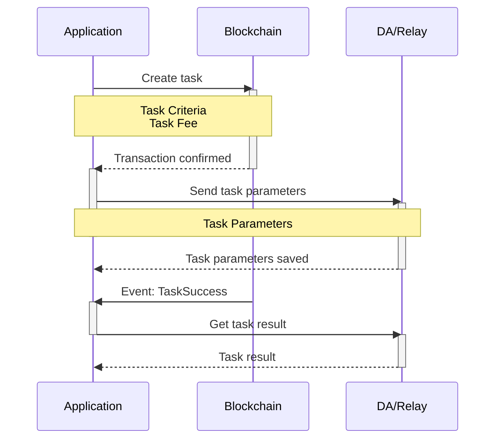

# Application Workflow

The application can utilize the Crynux Network as an API service. It sends inference tasks to the network and receives images or texts in return. Two types of inference tasks are supported: Stable Diffusion image generation and GPT text generation.

The application interacts with two network components: the blockchain node and the Relay. To send tasks successfully, it must have a wallet with sufficient Test CNX tokens for payment. Test CNX tokens can be acquired for free on the [Discord Server of Crynux](https://discord.gg/y8YKxb7uZk).

Reference applications are provided for both image generation and text generation tasks. The source code can be found on the GitHub.

As the first step, we will provide a high-level overview of the complete workflow, outlining the main steps involved in the process.

## Overview

The application workflow is illustrated in the graph below:



The application initiates the workflow by calling the `CreateTask` method of the smart contract. This method receives task parameters related to the task criteria, such as the task type and VRAM requirements, which the network uses to select suitable nodes.

The application transfers the task fee to the contract address by specifying it in the transaction's `value` field. Upon task completion, tokens are sent to the nodes. If the task fails, the fee is refunded to the application's wallet.

After the transaction is confirmed on-chain, the application should then send the task parameters to the Relay.

> Selected nodes will retrieve task parameters from the Relay and then execute the tasks locally.
>
> When images or texts are generated, nodes will create proofs and send them to the blockchain. The blockchain will verify the correctness of these proofs and transfer tokens to the nodes upon successful verification.
>
> The nodes will upload the result images/texts to the Relay, which will compare the results with the on-chain proofs to verify their accuracy.

After sending the task parameters to the Relay, the application should wait for the `TaskSuccess` event from the blockchain. Once the event is received, the application can retrieve the images or texts from the Relay, marking the completion of the task workflow.

The results have already been verified by the Relay, so no further verification by the application is necessary.

For a detailed workflow involving all network participants, please refer to the task lifecycle document:


[task-lifecycle.md](../system-design/task-lifecycle.md)


## The Reference Applications

The workflow has been fully implemented in the showcase applications: the Image Generator and the AI Chatbot. Which can be accessed at:

The Image Generator: [https://ig.crynux.ai](https://ig.crynux.ai)

The AI Chatbot: [https://chat.crynux.ai](https://chat.crynux.ai)

Both applications utilize the Crynux Bridge as the backend. The Crynux Bridge includes a built-in wallet to cover task fees, eliminating the need for applications to manage their own wallets. Additionally, it isolates the blockchain and Relay from the applications. This allows applications to simply submit task parameters via API and await the result without further action.

The Crynux Bridge can be used by all the applications. The source code of the Crynux Bridge can be found at:



The source code of the web UI of the Image Generator:



The source code of the web UI of the AI Chatbot



## Application Workflow Step by Step

### 1. Prepare the application wallet


Crynux Network is currently deployed on the L2 blockchain of Dymension as a testnet Rollapp. **Test CNX tokens are used**. You could[ join the Discord Server of Crynux ](https://discord.gg/y8YKxb7uZk)to get the test tokens for free.


An Ethereum compatible wallet must be generated. Which will be used by the application to invoke the smart contracts on-chain.

Ensure the wallet has sufficient Test CNX tokens to cover both task and transaction fees. The application should continuously monitor the wallet balance and alert admins to replenish tokens before it drops below the required amount for upcoming tasks.


In the DApp, an application wallet is not required. The DApp will create the transaction and send it to Metamask for the user to sign directly in the browser.


### 2. Create the Task on the Blockchain

#### Construct the task parameters

The task parameters are organized as a JSON string. An example of the arguments of an image generation task is given below:

```json
{
    "version": "2.0.0",
    "base_model": {
        "name": "stabilityai/sdxl-turbo"
    },
    "prompt": "best quality, ultra high res, photorealistic++++, 1girl, desert, full shot, dark stillsuit, "
              "stillsuit mask up, gloves, solo, highly detailed eyes,"
              "hyper-detailed, high quality visuals, dim Lighting, ultra-realistic, sharply focused, octane render,"
              "8k UHD",
    "negative_prompt": "no moon++, buried in sand, bare hands, figerless gloves, "
                       "blue stillsuit, barefoot, weapon, vegetation, clouds, glowing eyes++, helmet, "
                       "bare handed, no gloves, double mask, simplified, abstract, unrealistic, impressionistic, "
                       "low resolution,",
    "task_config": {
        "num_images": 9,
        "steps": 1,
        "cfg": 0
    },
    "lora": {
        "model": "https://civitai.com/api/download/models/178048"
    },
    "controlnet": {
        "model": "diffusers/controlnet-canny-sdxl-1.0",
        "image_dataurl": "data:image/png;base64,12FE1373...",
        "preprocess": {
            "method": "canny"
        },
        "weight": 70
    },
    "scheduler": {
        "method": "EulerAncestralDiscreteScheduler",
        "args": {
            "timestep_spacing": "trailing"
        }
    }
}
```

The task definition above follows the schema given in the [Stable Diffusion Task Framework](https://github.com/crynux-ai/stable-diffusion-task). A wide range of the common configurations are supported. The framework also provides the JSON schema to be used to validate the task arguments. More introduction of the framework can be found in this doc:


[stable-diffusion-task.md](stable-diffusion-task.md)


The GPT text generation task is quite similar to the image generation task. The supported task arguments and the JSON schema can be found in the following doc:


[gpt-task.md](gpt-task.md)



The application should always validate the task arguments against the schema before sending it to the network, especially when the arguments are generated by the user in the application's frontend.


#### Send the task arguments to the Blockchain

After the JSON string of the task arguments is prepared, the application should construct and send the `CreateTask` transaction to the Blockchain.

`CreateTask` method of the [Task Contract](https://github.com/crynux-ai/crynux-contracts/blob/75a2f7014d9d797df9721be17161ec32c745b9dd/contracts/Task.sol#L75) has five arguments:

```solidity
function createTask(
    uint taskType,
    bytes32 taskHash,
    bytes32 dataHash,
    uint vramLimit,
    uint cap
)
```

* `taskType` is an integer that identifies the task type: 0 for SD task and 1 for GPT task.
* `taskHash` is the keccak256 hash of the JSON string of the task arguments.
* `dataHash` is reserved for the future features and is not used right now. The application could just pass 32 zero bytes to it.
* `vramLimit` indicates the minimum VRAM required to execute the task. The Crynux Network will select the capable nodes based on this value.

In addition to the arguments listed above, the task fee should be set in the `value` field of the transaction. The application is free to choose any task fee value, a higher task fee will result in a faster task execution, while lower task fee will result in longer waiting time.

The source code that implements the invocation of the `CreateTask` method in the Crynux Bridge [can be found here](https://github.com/crynux-ai/crynux-bridge/blob/652ea694980da774a283782886bedaa362a53a50/blockchain/task.go#L32).

#### Get the task creation result

After the transaction is sent, the application should get the creation result before proceeding to the next step. Since the transaction might be reverted by the Blockchain due to several reasons, such as not enough CNX tokens left in the application wallet.

All the possible reasons a transaction could be reverted for can be found [in the source code](https://github.com/crynux-ai/crynux-contracts/blob/43f98cc0d0b6726c54dc93103739414c6313a6c9/contracts/Task.sol#L59C21-L59C21).

If the transaction is reverted, no event will be emitted. So the creation result could only be queried using the transaction hash, or the receipt from the transaction creation step above.

### 3. Upload the Task Parameters to the Relay

When the transaction of the task creation is confirmed, the next step is to upload the actual JSON string of the task parameters to the Relay. The API endpoint to be used is:


[https://dy.relay.crynux.ai/openapi.json](https://dy.relay.crynux.ai/openapi.json)


The complete API documentation can be found in the [OpenAPI specifications](https://dy.relay.crynux.ai/openapi.json).

The uploading is just a normal API invocation to the Relay server. The only step worth attention is that the request must be signed using the application wallet before sending to the Relay.

> The Relay monitors the blockchain for all the task creations. It will record the task ID and the address of the task creator (i.e. the application wallet) when the TaskCreated event is emitted on-chain. When the API to upload task arguments is invoked, the Relay requires that the request must be made from the same task creator on-chain.

The signature is generated using ECDSA with the same curve that Ethereum uses, on the Keccak256 hash of a string, which is generated by including all the query and body params (except `timestamp` and `signature`) of the request in a JSON string, whose keys are sorted in alphabetical order, and concatenated with the current Unix timestamp.

The reference implementation of the signing method in Crynux Bridge [can be found here](https://github.com/crynux-ai/crynux-bridge/blob/main/relay/sign\_data.go). The code to upload the task arguments to the Relay can also be found [in the source code](https://github.com/crynux-ai/crynux-bridge/blob/652ea694980da774a283782886bedaa362a53a50/relay/inference\_task.go#L41).

### 4. Wait for the Task to Finish

When the task is finished, either the `TaskSuccess` or the `TaskAborted` event will be emitted. If the `TaskSuccess` event is emitted, the application could get the result from the Relay. If the `TaskAborted` event is emitted, the task is failed.

Just like the task creation invocation, there are also several reasons why the task would fail during the execution. Might be that the task arguments do not pass the schema validation of the nodes, or that some nodes are not executing the consensus protocol correctly, or that the task is taking too long to finish on a single node. The exact reason is included as an argument in the emitted event.&#x20;

If the task is aborted, in some cases the CNX tokens will be returned to the application wallet, while in other cases the tokens are still paid to the nodes even the task is not completed, depending on who to blame for the task failure.

There are two ways the application could monitor the blockchain for the relevant events. The first method is to keep tracking the new blocks, and filter the blocks for these two kinds of events.

The tracking method requires the application to properly handle the block continuity, especially when the application could crash due to some unhandled bugs. And if the application has been stopped for a long time, it may take quite a while to catch up with the new blocks.

The other method is to extract the task ID from the task creation transaction and save it, and periodically query the blockchain for the newest task status. The block does not need to be tracked anymore in this method. The efficiency is lower than the previous method since a lot of meaningless queries should be made.

The Crynux Bridge uses the first method, the source code of the block synchronization [can be found here](https://github.com/crynux-ai/crynux-bridge/blob/main/tasks/sync\_block.go).

### 5. Fetch the result from the Relay

The last step is to get the actual images/texts from the Relay. This is done by calling the following API of the Relay:

#### Get images

The URL could be treated like an image downloading link as it returns the binary stream of the image content directly. The signature and timestamp is still required.


[https://dy.relay.crynux.ai/openapi.json](https://dy.relay.crynux.ai/openapi.json)


#### Get texts

The API endpoint to get text results from the Relay is the same as the endpoint above, except that the `image_num` should be set to zero.


When the application accesses the above URL after the `TaskSuccess` event is received, it could keep getting `404 not found` for a short while before it gets the correct results. The reason is that the node will start to upload images/texts to the Relay only after the `TaskSuccess` event is received. So before the uploading is done, the application can not find the results on the Relay. Several times of retrying is required at this place.


The source code where the Crynux Bridge downloads the images is [located here](https://github.com/crynux-ai/crynux-bridge/blob/aba6390424904c14b8f8676d5559c8ec9f6da503/relay/inference\_task.go#L93).
