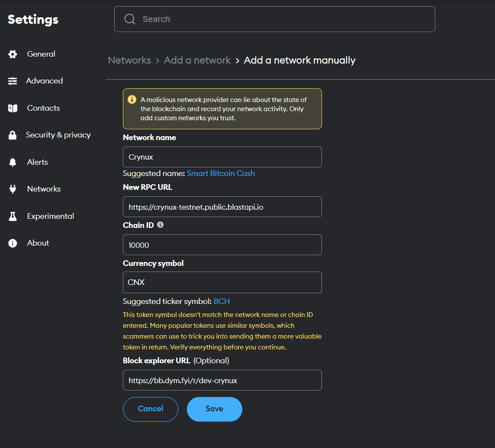

# Metamask

1. Click on the network selection button in Metamask

<figure><figcaption>
Select Network
</figcaption></figure>

2. Click "Add network" in the network selection modal:

<figure><figcaption>
Add Network
</figcaption></figure>

3. Click "Add a network manually" in the newly opened page:

<figure><figcaption>
Add a Network Manually
</figcaption></figure>

4. Fill in the network parameters according to the latest info given at the [Wallet Configuration](./) page, and then click "Save":

<figure><figcaption></figcaption></figure>

<figure><figcaption></figcaption></figure>

5. Click "Switch to Crynux" to use the Crynux Network right away, you should be able to see the balance in your wallet now:

<figure><figcaption></figcaption></figure>
