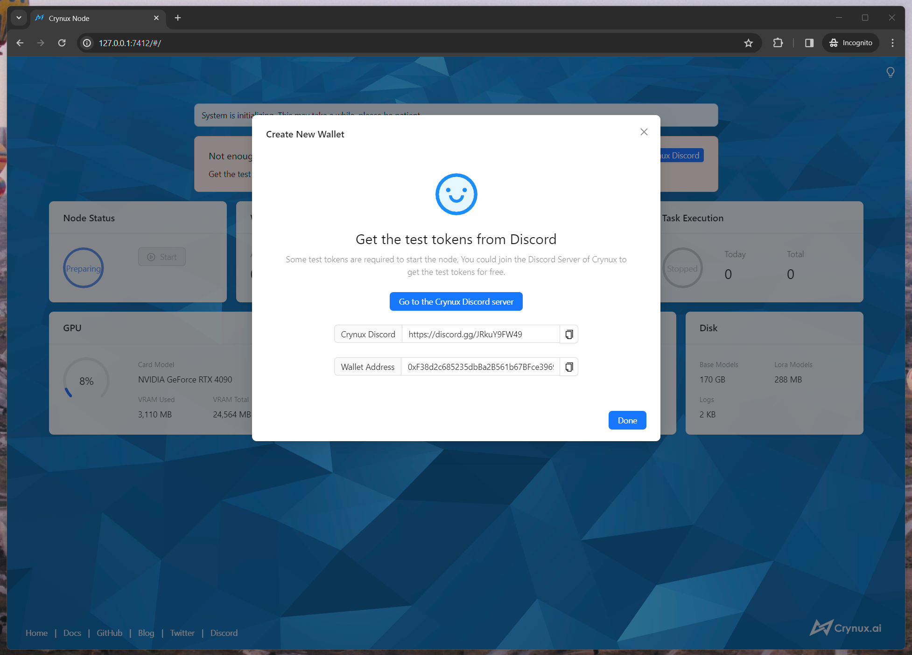

# Start a Node - Docker

## 0. Overview

* ~~Fill a form to tell us your GPU type, location, network bandwidth~~ \[<mark style="color:blue;">**No application form, no sign up, you don’t need to tell us**</mark>]
* ~~Join waitlist and wait for the email from us~~ \[<mark style="color:blue;">**No waitlist, just install the Docker image, you can start earning CNX tokens right away**</mark>]
* Follow the steps below:

## 1. Prerequisite

Before you start, make sure your device meets the following requirements:

<table><thead><tr><th width="187">Hardware</th><th>Requirements</th></tr></thead><tbody><tr><td>GPU</td><td>NVIDIA GPU with 8GB VRAM</td></tr><tr><td>Memory</td><td>16GB</td></tr><tr><td>Disk Space</td><td>60GB</td></tr><tr><td>Network</td><td>Public network access to Huggingface and Civitai</td></tr></tbody></table>

## 2. Install the software

### Install the latest NVIDIA driver

Download the latest NVIDIA driver from the [NVIDIA official website](https://www.nvidia.com/Download/index.aspx?lang=en-us), and finish the installation.

### Install the latest version of Docker

Download the latest version of the [Docker Desktop](https://docs.docker.com/get-docker/), and finish the installation.

<details>

<summary>If you have 16GB of memory and use Docker with WSL2 on Windows</summary>

The memory limit for WSL is default to 8GB, which is not enough to run the Node. You will have to change the default settings using a [`.wslconfig`](https://learn.microsoft.com/en-us/answers/questions/1296124/how-to-increase-memory-and-cpu-limits-for-wsl2-win) file to allow WSL to use 16GB memory.

</details>

<details>

<summary>If you are running on Linux (Ubuntu/Fedora/CentOS/...)</summary>

Install the latest version of NVIDIA Container Toolkit:

[https://docs.nvidia.com/datacenter/cloud-native/container-toolkit/latest/install-guide.html](https://docs.nvidia.com/datacenter/cloud-native/container-toolkit/latest/install-guide.html)

</details>

### Check the installation

**a. Run the following command in the terminal to check the version of the docker engine:**

```bash
$ docker --version
```

Make sure the returned version number is greater than 19.03.0:

```
Docker version 26.0.0, build 2ae903e
```

**b. Run the following command in the terminal:**

<pre class="language-bash"><code class="lang-bash"><strong>$ sudo docker run --rm --runtime=nvidia --gpus all ubuntu nvidia-smi
</strong></code></pre>

You should get the info of the GPU from `nvidia-smi` like this:

```
+-----------------------------------------------------------------------------+
| NVIDIA-SMI 535.86.10    Driver Version: 535.86.10    CUDA Version: 12.2     |
|-------------------------------+----------------------+----------------------+
| GPU  Name        Persistence-M| Bus-Id        Disp.A | Volatile Uncorr. ECC |
| Fan  Temp  Perf  Pwr:Usage/Cap|         Memory-Usage | GPU-Util  Compute M. |
|                               |                      |               MIG M. |
|===============================+======================+======================|
|   0  Tesla T4            On   | 00000000:00:1E.0 Off |                    0 |
| N/A   34C    P8     9W /  70W |      0MiB / 15109MiB |      0%      Default |
|                               |                      |                  N/A |
+-------------------------------+----------------------+----------------------+

+-----------------------------------------------------------------------------+
| Processes:                                                                  |
|  GPU   GI   CI        PID   Type   Process name                  GPU Memory |
|        ID   ID                                                   Usage      |
|=============================================================================|
|  No running processes found                                                 |
+-----------------------------------------------------------------------------+
```

## 3. Start the node using the Docker Compose

#### a. Create the working directory for the project

```bash
# Create the working directory

$ mkdir crynux_node
$ cd crynux_node
```

#### b. Create the config and data directory

The config and the data directory are created on the host machine, and will be mounted into the container so that the container state persists across container recreation:

```bash
# In the working directory

$ mkdir config
$ mkdir data
```

#### c. Create the Docker Compose file

Create a file with name `docker-compose.yml` inside the working directory `crynux_node`, and paste the following content:

```yaml
---
version: "3.8"
name: "crynux_node"

services:
  crynux_node:
    image: ghcr.io/crynux-ai/crynux-node:latest
    container_name: crynux_node
    restart: unless-stopped
    ports:
      - "127.0.0.1:7412:7412"
    volumes:
      - "./data:/app/data"
      - "./config:/app/config"
    deploy:
      resources:
        reservations:
          devices:
            - driver: nvidia
              capabilities: [gpu]
```

#### d. Start the container with

```shell
# In the working directory

$ docker compose up -d
```

#### e. Visit the WebUI in the browser

Open the browser and go to [http://localhost:7412](http://localhost:7412)

You should see the WebUI of the Node:

<figure><figcaption></figcaption></figure>

## 4. Prepare the wallet


**DO NOT** **use the Web UI to paste an existing private key if you're accessing the Web UI from a remote machine.**

If you're using HTTP protocol to access the WebUI, the connection is not encrypted. The private key might be intercepted by malicious middle man if transferred through the HTTP connection.

Instead, set the private key in the config file directly. Or secure the connection using HTTPS.

`Create New Wallet` is always fine to use though, since no private key is transferred during the creation process.&#x20;


A wallet with enough test tokens must be provided to the node. If this is the first time you start a node, click the "Create New Wallet" button and follow the instructions to create a new wallet and finish the backup of the private keys.

<figure><figcaption></figcaption></figure>

After the backup is completed, it is time to fill the wallet with some test tokens, the test tokens will be used to pay for the gas fees and the staking.

The test tokens can be acquired for free from the Discord server of Crynux, using the HappyAIGen bot. Go to the Discord server:



In the chat input bar of any channel, type in the following command:

```
/node wallet {address}
```

Remember to replace the `{address}` with the real wallet address from the node:

<figure><figcaption></figcaption></figure>

After the command is finished successfully, the test tokens should have already been transferred to your wallet. You could check the wallet balance in the UI of the node:

<figure><figcaption></figcaption></figure>

## 5. Wait for the system initialization to finish

If this is the first time you start a node, it could take quite a long while for the system to initialize. The most time consuming step is to download \~40GB of the commonly used model files from the Huggingface. The time may vary depending on your network speed.

After the models are downloaded, a test image generation task will be executed locally to examine the capability of your device. If the device is not capable to generate images, or the generation speed is too slow, the node will not be able to join the network. If the task is finished successfully, the initialization is completed:

<figure><figcaption></figcaption></figure>

## 6. Join the Crynux Network

Click the "Start" button to join the Crynux Network. After the transaction is confirmed on-chain, the node has successfully joined the network. When the node is selected by the network to execute a task, the task will start automatically, and the tokens will be transferred to the node wallet after the task is finished.

<figure><figcaption></figcaption></figure>

Now the Node is fully up and running. You could just leave it there to run tasks automatically.

The Node could be paused or stopped at any time by clicking the control buttons. If the node is in the middle of running a task, after clicking the buttons, the node will go into the "pending" status and continue with the running task. When the task is finished, the node will pause/stop automatically.

The difference between pausing and stopping is that pausing will not cause the staked CNX tokens to be returned, so that the transaction costs less gas fee than stopping. If you have a plan of going back, you could use pausing rather than stopping.&#x20;
