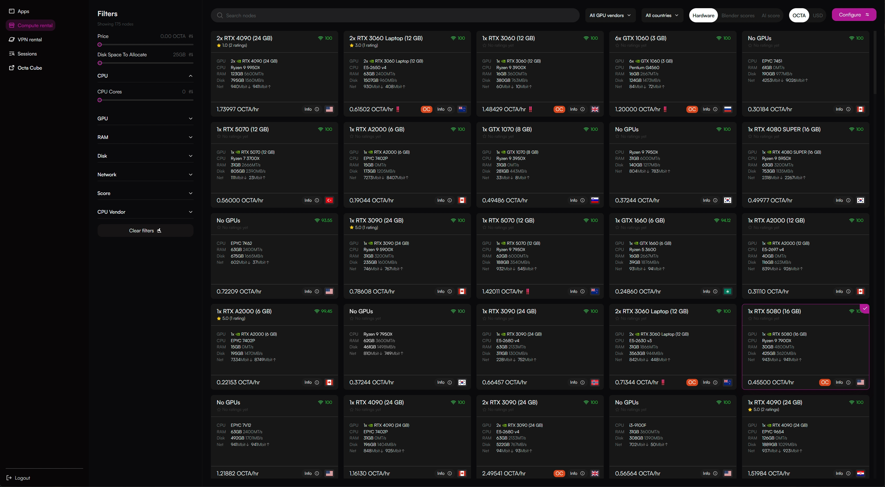
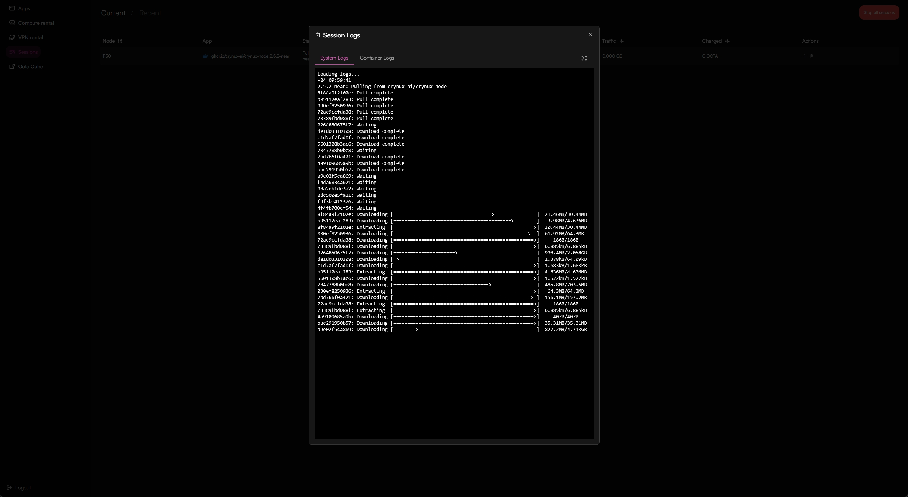
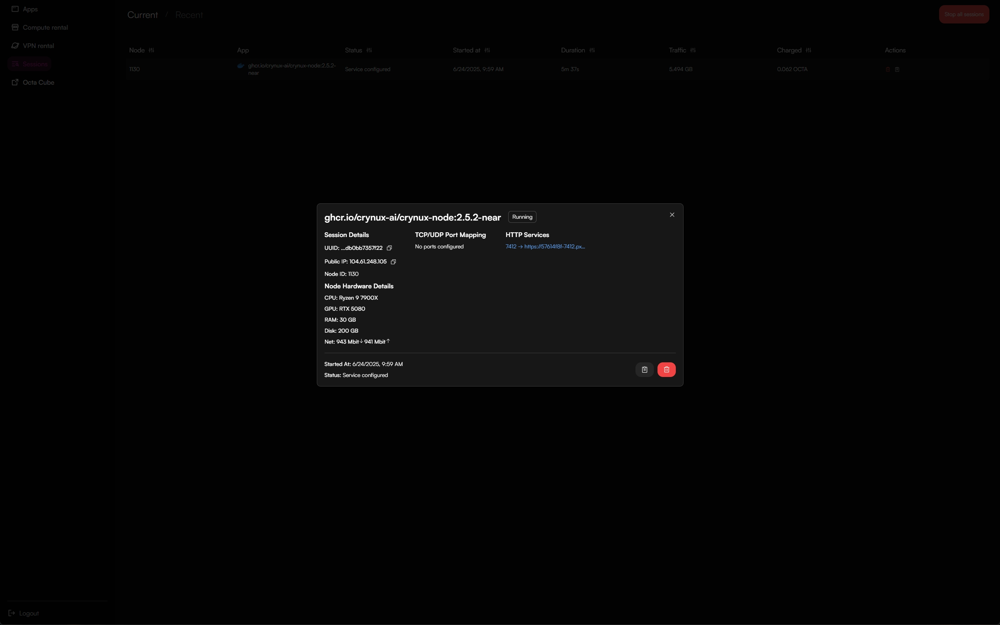
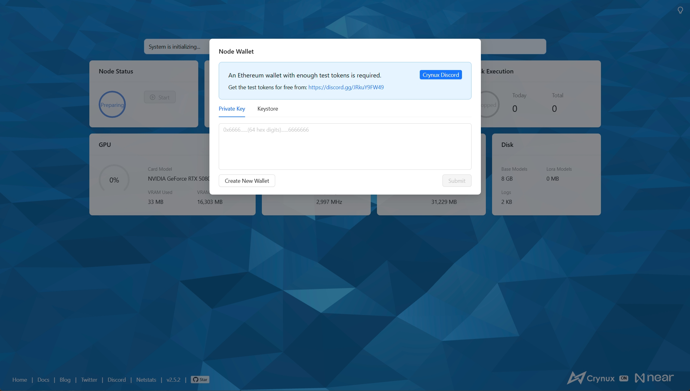
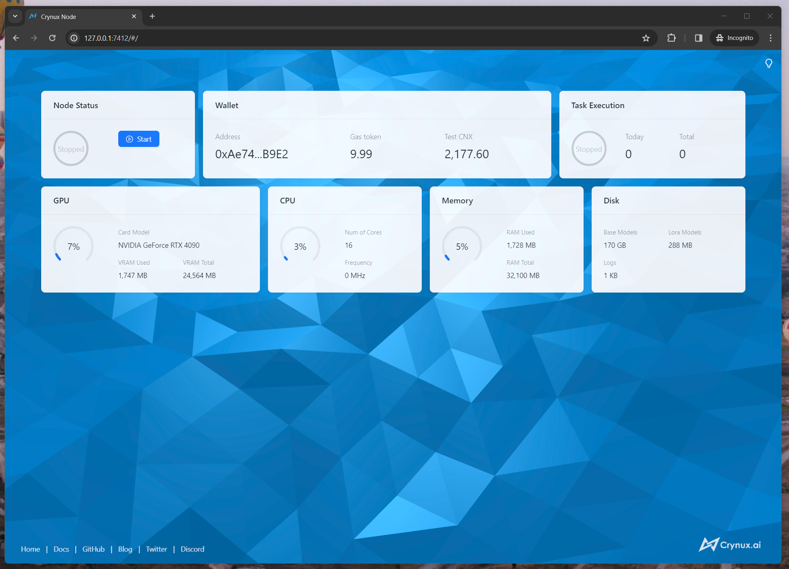

# Start a Node - Octa

The Crynux Node can be easily started on [Octa](https://marketplace.octa.space/) using Docker images.

## 1. Go to the Octa Marketplace and find the Crynux app

Visit the Octa Marketplace in a browser:



Search for `Crynux` and click on the app:

<figure><figcaption></figcaption></figure>

## 2. Select the GPU to start the Docker container

<figure><figcaption></figcaption></figure>

Select the GPU that fits your need. And then click "Configure".

## 3. Configure the Docker container

<figure><figcaption></figcaption></figure>

You could adjust the tag name in the "Image name" field to use a newer version of the Crynux Node, or select a different blockchain network such as `dymension` and `kasplex`.

Expose port `7412` for the remote access of the WebUI.

`100 GB` of disk space will be enough for normal operations of the node.

After you're done, click "Deploy" to start the Docker container:

<figure><figcaption></figcaption></figure>

Once Octa pulls and prepares the image on the node, it will start the container. To track progress, check the `Status` field in the session item. For more detailed insights, click the `View logs` button in the `Actions` column.

<figure><figcaption></figcaption></figure>

## 4. Find the URL to access the WebUI

Once the container has started, the `Status` will change to `Service configured`. Then, click on the session item to find the URL for accessing the WebUI:

<figure><figcaption></figcaption></figure>

Click on the link below `HTTP Services`, and you will be redirected to the WebUI in the browser:

<figure><figcaption></figcaption></figure>

## 5. Prepare the wallet

A wallet with enough test tokens must be provided to the node. If this is the first time you start a node, click the "Create New Wallet" button and follow the instructions to create a new wallet and finish the backup of the private keys:

<figure><figcaption></figcaption></figure>

### Get the test CNX tokens from the Discord Server

Some test CNX tokens are required to start the node. The test CNX tokens can be acquired for free in the Discord server of Crynux:



In the `happy-aigen-discussions` channel of the Discord server, type in the following command in the input bar, **DO NOT copy & paste the command, it only works when typed in using keyboard**:

```
/user join
```

Then bind the wallet address using the following command:

```
/node wallet {wallet_address}
```

Remember to replace `{wallet_address}` with the wallet address you just created in the Web UI.

<figure><figcaption></figcaption></figure>

After a short while, the test CNX tokens should appear in your node wallet:

<figure><figcaption></figcaption></figure>

## 6. Wait for the system initialization to finish

If this is the first time you start a node, it could take quite a long while for the system to initialize. The most time consuming step is to download \~40GB of the commonly used model files from the Huggingface. The time may vary depending on your network speed.

After the models are downloaded, a test image generation task will be executed locally to examine the capability of your device. If the device is not capable to generate images, or the generation speed is too slow, the node will not be able to join the network. If the task is finished successfully, the initialization is completed:

<figure><figcaption></figcaption></figure>

## 7. Join the Crynux Network

The Crynux Node will try to join the network automatically every time it is started. After the transaction is confirmed on-chain, the node has successfully joined the network. When the node is selected by the network to execute a task, the task will start automatically, and the tokens will be transferred to the node wallet after the task is finished.

<figure><figcaption></figcaption></figure>

Now the Node is fully up and running. You could just leave it there to run tasks automatically.

The Node could be paused or stopped at any time by clicking the control buttons. If the node is in the middle of running a task, after clicking the buttons, the node will go into the "pending" status and continue with the running task. When the task is finished, the node will pause/stop automatically.

The difference between pausing and stopping is that pausing will not cause the staked CNX tokens to be returned, so that the transaction costs less gas fee than stopping. If you have a plan of going back, you could use pausing rather than stopping.&#x20;
