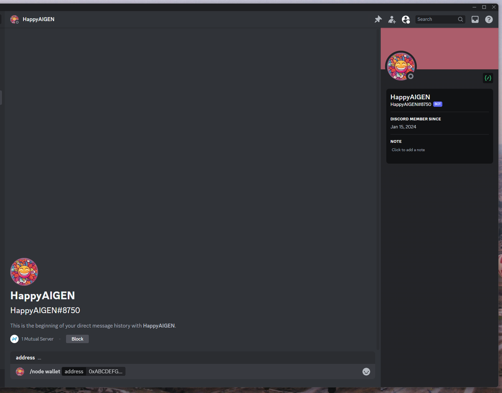

# Start a Node - Vast

The Crynux Node can be easily started on cloud services, such as [Vast.ai](https://vast.ai/), who supports starting a VM using Docker images directly. The steps to start a node on those services are quite similar. We will use Vast.ai as an example to show the complete steps to start a Crynux Node.

## 1. Start the container using template

We have already created the template for the Crynux Node on Vast, just use this template to start the node:



The content of the template is shown below:

<figure><figcaption></figcaption></figure>

Some highlights in case you are starting the container using other cloud services:

* Use the image link of Crynux Node to start the container:&#x20;

`ghcr.io/crynux-ai/crynux-node:latest`

* Expose port `7412` for WebUI
* Use the default docker ENTRYPOINT to start the container. Do not use interactive shells.

After selecting your desired hardware, and starting the instance, find the instance in the `INSTANCES` tab:

<figure><figcaption></figcaption></figure>

Wait until the container finishes initialization, and shows the `RUNNING` status.

## 2. Find the URL to access the WebUI

Click on the network info button to show the detailed ip address and ports:

<figure><figcaption></figcaption></figure>

The URL to access the WebUI will be shown in the popup:

<figure><figcaption></figcaption></figure>

In this case, the URL of the WebUI is `http://213.181.122.2:40021`. Just open it in a browser window, you should see the WebUI of the Node:

<figure><figcaption></figcaption></figure>

## 3. Prepare the wallet

[Use an SSH connection](https://vast.ai/docs/gpu-instances/ssh?_gl=1*ye4y7p*_gcl_au*OTc1MTUwMTIwLjE3MTY2MTA3OTkuMzAyNTUxNjAzLjE3MTY2NDIxMzkuMTcxNjY0MjEzOA..*_ga*NTc0NjQxMDIwLjE3MTY2MTA3OTk.*_ga_DG15WC8WXG*MTcxNjYxMDc5OS4xLjEuMTcxNjY0Nzg1MC42MC4wLjA.) to login to the Docker container you started, and set the private key in the config file at:`/app/config/config.yml`, and the field name is `privkey`:

```
ethereum:
  privkey: ""
```

After you filled the value of the private key, restart the Docker container.

## 4. Get the test CNX tokens from the Discord Server

Some test CNX tokens are required to start the node. The test CNX tokens can be acquired for free in the Discord server of Crynux:



In the `happy-aigen-discussions` channel of the Discord server, type in the following command in the input bar, **DO NOT copy & paste the command, it only works when typed in using keyboard**:

```
/user join
```

Then bind the wallet address using the following command:

```
/node wallet {wallet_address}
```

Remember to replace `{wallet_address}` with the wallet address you just created in the Web UI.

<figure><figcaption></figcaption></figure>

After a short while, the test CNX tokens should appear in your node wallet:

<figure><figcaption></figcaption></figure>

## 5. Wait for the system initialization to finish

If this is the first time you start a node, it could take quite a long while for the system to initialize. The most time consuming step is to download \~40GB of the commonly used model files from the Huggingface. The time may vary depending on your network speed.

After the models are downloaded, a test image generation task will be executed locally to examine the capability of your device. If the device is not capable to generate images, or the generation speed is too slow, the node will not be able to join the network. If the task is finished successfully, the initialization is completed:

<figure><figcaption></figcaption></figure>

## 6. Join the Crynux Network

The Crynux Node will try to join the network automatically every time it is started. After the transaction is confirmed on-chain, the node has successfully joined the network. When the node is selected by the network to execute a task, the task will start automatically, and the tokens will be transferred to the node wallet after the task is finished.

<figure><figcaption></figcaption></figure>

Now the Node is fully up and running. You could just leave it there to run tasks automatically.

The Node could be paused or stopped at any time by clicking the control buttons. If the node is in the middle of running a task, after clicking the buttons, the node will go into the "pending" status and continue with the running task. When the task is finished, the node will pause/stop automatically.

The difference between pausing and stopping is that pausing will not cause the staked CNX tokens to be returned, so that the transaction costs less gas fee than stopping. If you have a plan of going back, you could use pausing rather than stopping.&#x20;
