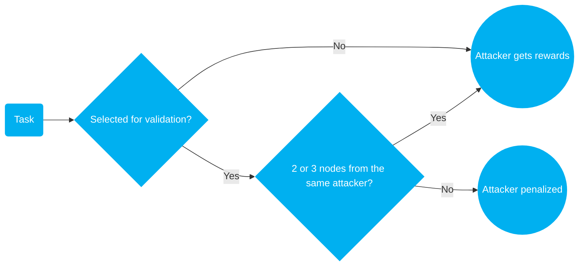
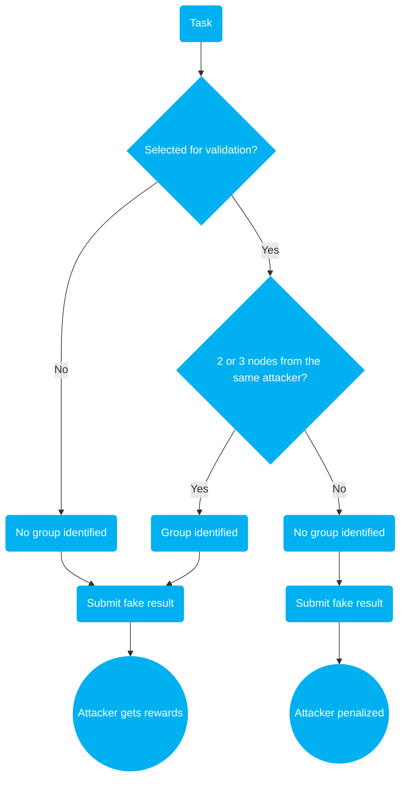
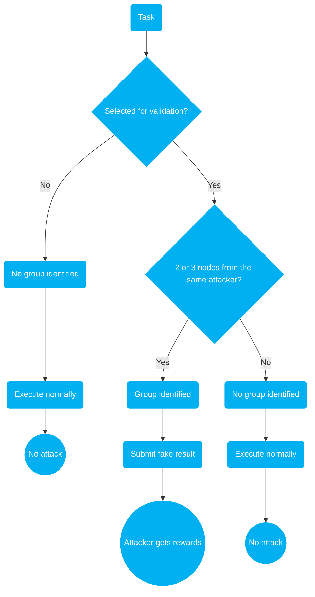
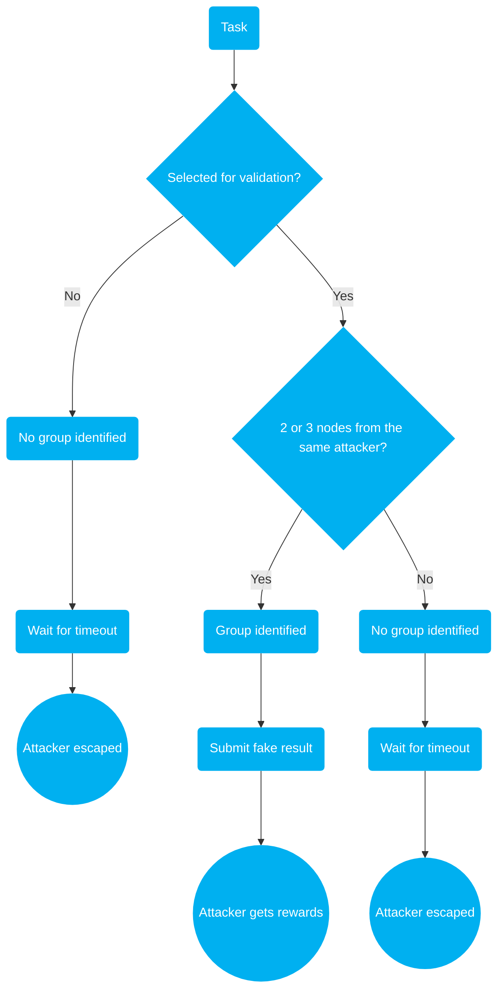

# Consensus Protocol

The consensus protocol in a decentralized system ensures the integrity of the network, allowing permissionless participation without the possibility of fraudulent activities. The consensus protocol is the most important component in any decentralized system, since it is where "decentralization" comes from.

The hardest part about the consensus protocol design is that **Everyone Could Be Malicious**. If a leader is selected, the leader could be malicious. If validators are chosen, the validators could be malicious. The goal of every participant is the same: maximizing the income while at the same time reducing the cost as much as possible. If vulnerability exists, even a minor one, it will be exploited, resulting in the losses for the honest participants. This situation can compel these participants to exit the network, leading to a network downfall eventually.

For example, consider a scenario in Crynux Network, where a malicious node submits a random image to the network without actually performing any computation. If we rely on the user to detect this fraud, allowing them to withhold payment until they have verified the result, it opens a loophole. A dishonest user could exploit this by denying all payments, effectively using the network services without paying.

The consensus protocol in the Crynux Network aims to verify the correctness of a task's output based on its input arguments. Additionally, it ensures that the node submitting the correct result gets the payment.

The consensus protocol must be enforced by the blockchain, which eliminates the need for a centralized authority. This decentralized approach safeguards against potential abuse of power by removing the temptation for any single party to cheat, given their control.

## Verifiable Secret Sampling (VSS) of Validation Tasks

When the application sends a task to the blockchain, the blockchain will decide whether to validate the task based on a pre-defined probability (e.g., 10%). If chosen for validation, the task is sent to 3 nodes for independent execution. The computation results from all 3 nodes will be cross-validated on-chain to prevent cheating. If a node submits a fake result, it will be punished by slashing its staked tokens on the blockchain.

The random sampling result should be kept secret from nodes until they submit their computation results. If a node knows in advance whether a task will be validated, it could cheat by submitting fake results for tasks that won't be validated.

Hiding the random sampling process from the public while keeping it verifiable on-chain is a challenging task, given that all data on the blockchain is public and transparent. Crynux achieved this using a combination of VRF (Verifiable Random Function) and ZKP (Zero-Knowledge Proofs).

Comparing to validating all the tasks on chain, the secret task sampling significantly enhances network efficiency, rivaling centralized platforms while remaining decentralized and permissionless by effectively preventing fraudulent activities. Please find the details of the sampling algorithm in the following document:


[verifiable-secret-sampling.md](verifiable-secret-sampling.md)


## Task Validation by Multiple Result Comparison

### Similarity Comparison of the Images

Due to some technical limitations, such as [this](https://github.com/pytorch/pytorch/issues/87992) ,and [this](https://pytorch.org/docs/stable/notes/randomness.html). It is currently impossible to generate two exactly same images on two different devices.

Luckily, we don't need the images to be exactly the same. If we could compute a similarity score between two results, and the score is high, the results are already **satisfied** to the application.

And yes, there will be some lower cost methods to generate a similar image than performing the actual Stable Diffusion computation, but as long as the result is similar enough to be accepted by the application, it is fine to the network.

The Crynux Network uses the [Perceptual Hash](https://apiumhub.com/tech-blog-barcelona/introduction-perceptual-hashes-measuring-similarity/), or pHash, to calculate the image similarity. The node submits the pHash of the images to the blockchain, and the blockchain calculates the [Hamming Distance](https://en.wikipedia.org/wiki/Hamming\_distance) between two pHashes as the similarity score.

### Similarity Comparison of the Texts

In GPT text generation tasks, the words are generated one after another. Each output word will be used as the input for the next word. If two different words are generated on two different cards in the middle of a text sequence, the rest parts of the sequence will highly likely to be completely different.

To make the texts comparison work, the same GPT task must be executed on 3 cards that are exactly the same, such as 3 of the RTX 4090s, rather than two of the 4090s and one of the 3090s. The text generation result will be exactly the same when running on cards that are in the same model, given the same random seed.

The Crynux Network will randomly choose 3 nodes that are equipped with the same cards when distributing a GPT task. The node will have to report the card model when joining the network. Note that there is no benefit to report a different card model to the network other than the one the node possesses, which will cause nothing else but the node being slashed when executing tasks.

### Random Number Generation on the Blockchain

Generating random numbers on the blockchain is then a critical step to the security of the whole network. Ethereum 2.0 has `prevrando`, which can be used as the source of the random number. On the other blockchains, the block hash of the last confirmed block is usually used. More advanced (and complex) methods exist such as the Verifiable Random Functions. Strictly speaking, however, none of these methods are safe enough in our scenario.

The attack one could perform, given that the result validation is effective, is for an attacker to host more nodes by himself, and try to have two or more of his own nodes selected for a single task. In which case the attacker could submit two identical fake results to cheat the blockchain.

If an attacker is hosting the blockchain node (and producing the blocks) himself, the last block hash, or `prevrando`, or the selection of the VRF, is known to him before the `CreateTask` transaction has been confirmed by the next block.  This leaves a chance for the attacker to find out if his nodes are selected for a task ahead of time.

The attacker could then reject the `CreateTask` transactions in which it can not cheat, i.e. not having two or more of his own nodes selected in the task.

By carefully constructing and organizing more adjacent blocks, the attacker could even control who will be selected in the next task. Note that this does not apply to the VRF method, where the source of the randomness is not from the blockchain. Which is immune to this kind of attack, but introduces other risks which we will not cover in this article.

Considering that to make this attack **practical**, the attacker must control a significant large number of nodes in the whole network by himself. The Crynux Network chooses to ignore this problem and uses the `prevrando` on the supported blockchains, and uses the last block hash on other blockchains.

## Staking based Penalization

Nodes are required to stake a certain amount of tokens on the blockchain before joining the network. If a node exhibits malicious behavior, its tokens will be slashed.

Given the VSS task validation scheme above, it is then a calculation of the required number of tokens to stake to prevent attacking attempts. If the staked tokens are not enough, the attacker can still make profit even if some tokens will be slashed.

### Sybil Attack

The attacker will start as many malicious nodes as he could. All the malicious nodes will do one thing: submitting the identical fake result for every task they received.

1. If the task is not selected for validation, the attacker gets the reward for free.&#x20;
2. If the task is selected for validation:
   1. If 2 or 3 nodes from the same attacker are selected for the task, the attacker gets the rewards for free.
   2. If there is only 1 node from the attacker is selected, the attacker loses staked tokens.

### Expectation of the Rewards from Sybil Attack

The probability of an attacker getting more than 2 nodes of himself selected in a task could be calculated as:

$$
p(h, d) = \frac{ C_d^2 * C_h^1 + C_d^3}{C_{d+h}^3}
$$

Where $$h$$ is the number of the honest nodes, and $$d$$ is the number of the dishonest nodes the attacker starts.

And the expectation of the rewards from sybil attack is given by:

$$
E =  (1 - r) * k + r * (p * k - (1-p) * s)
$$

Where $$r$$ is the sampling rate given in VSS, $$k$$ is the price of the task, and $$s$$ is the number of the staked tokens for a node.

By increasing the number of the staked tokens $$s$$, we could decrease the expectation $$E$$ down to zero or even below. If $$E$$ is below zero, there is no benefit to attack the system by starting more malicious nodes. The attacking will highly likely cause the attacker to lose money rather than earn.

The safety of the network now depends on the calculated value of the amount of the staked tokens $$s$$. Given a network size (the number of the total nodes in the network), and a target ratio of the malicious nodes (under which the network is safe), the probability of a successful attack $$p$$ is then fixed. Setting $$E$$ to zero, the amount of the staked tokens required for a single node $$s$$ is determined by:

$$
s = \frac{(1-r) * k  + r * p * k}{r * (1-p)}
$$

### Identifying the Validation Task Groups

An attacker could identify the validation task group by decrypting and comparing the task parameters received by all the malicious nodes. If parameters are identical for two adjacent tasks from the same application, they likely belong to the same validation group. The attacker might then return identical fake results to gain rewards without effort.

However, identifying task groups doesn't provide the attacker with additional advantages in a Sybil attack. The attacker already receives rewards by submitting two identical fake results for all tasks, without needing to identify the validation groups.

Another attack method involves submitting fake results only when the validation group is detected, while behaving normally otherwise. The network cannot identify this behavior.

For this attack to be effective, all malicious nodes must be equipped with GPUs, significantly increasing the cost compared to the Sybil attack mentioned earlier.

Given that only a small portion of the network's tasks will be validated (targeted by this attack), and the chance of an attacker discovering the identification groups is even smaller, the attacker would need to control a significant portion of the nodes, making the attack impractical with low potential income. This scenario is therefore excluded in the consensus protocol.

Additionally, although the task parameters may be identical, the attacker cannot be certain that the tasks are part of the same validation group. There's still a possibility that they are independent tasks. If the attacker submits two fake results, they will be penalized.

## Task Error and Timeout

Given that the network is a loosely coupled P2P system composed of home computers and laptops, we cannot assume the nodes are reliable. A node may lose contact with the network at any moment, even if it is still marked as available or executing a task on the blockchain.

The applications are also unreliable. Tasks submitted might be entirely inexecutable, such as combining the SD1.5 base model with an SDXL LoRA model.

### Task Error Reporting

When an exception occurred during the task execution on the node, if the exception is not recoverable, the node will report the error to the blockchain.

Error reporting is treated as a normal task result on the blockchain. If more than two nodes report an error to the blockchain, the task is aborted. If one node reports an error while the other two nodes submit the computation results correctly, the node will be penalized.

Crynux Network allows model downloads through an external link. However, network issues may occur during the download. It's challenging to determine if these issues affect all three nodes or if they are temporary.

To prevent mistakenly slashing honest nodes, reporting errors should only be used when the node is certain it's an issue with the task arguments, not a network problem. All other cases should be handled by the timeout mechanism below.

If the task is aborted due to error reporting, tokens will not be returned to the application. This is because the nodes have already expended resources on the task, and the application is responsible for the error.

### Task Cancellation on Timeout

The consensus protocol requires the submission of the commitments of all the 3 nodes. If a selected node goes offline before submitting the commitment to the blockchain, the other 2 nodes will have to wait for an unlimited time, which is not tolerable for both the nodes and the applications.

The timeout mechanism is introduced to solve this problem. After a pre-defined period, all the 3 nodes, and the application, are allowed to submit the request to cancel the task on the blockchain. Once submitted, the blockchain will abort the task immediately.

### Timeout Attack under VSS

The timeout mechanism introduces a new vulnerability to the network. An attacker could exploit this by returning fake results only when task validation groups are found. In other scenarios, rather than executing the tasks, the node could simply wait for the timeout to avoid penalties. And similar to a Sybil attack, the attacker can execute this attack without needing GPUs.

[Similar to the discussion earlier](consensus-protocol.md#identifying-the-validation-task-groups), the risk of this attack is low and therefore it is excluded from the consensus protocol.
