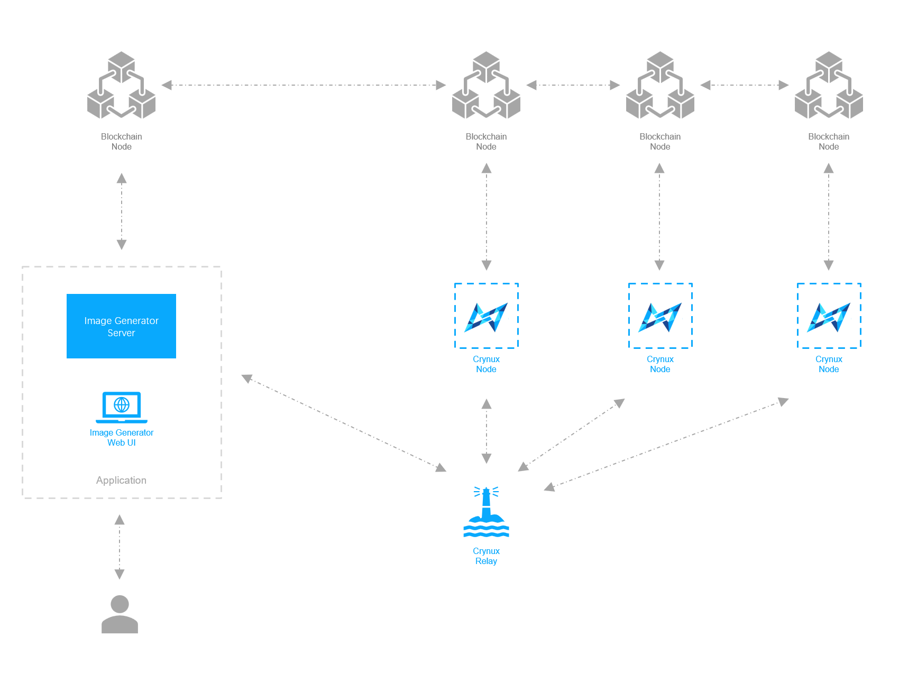

# Network Architecture

Crynux Network is illustrated in the graph below:

<figure><figcaption>
The Crynux Network Architecture
</figcaption></figure>

The core participants in the network are the **Nodes** and the **Applications**. The nodes provide computing power to the network, executing the Stable Diffusion image generation tasks from the applications, and receive tokens as the reward. The applications send the tasks to the nodes, paying with tokens, and get the images back.

Each of the nodes and the applications will start a **blockchain node**, and communicate with each other using it. The blockchain executes a consensus mechanism to make sure no one is cheating: the nodes could never use the fake images to get rewards, and the applications could never get the images without paying.

Beside the blockchain, the nodes and applications will also communicate through the **Relay**, to send data such as the task arguments and the images, which are too large to be stored on chain. These data are sent between the applications and the nodes directly, thus causes the data availability problem and the network reachability problem. The Relay stands between the nodes and the applications as a reliable intermediate to solve these problems.

## The Node

The node, once started, constantly monitors the blockchain for new tasks.

When a new task arrives from the blockchain, the node connects to the Relay to get the task arguments, such as the ID of the base model on Huggingface, and the URL of the LoRA model on Civitai. Then the node executes the task on the local hardware, producing the result images.

> A general framework has been developed to support most of the popular configurations in a Stable Diffusion image generation task, such as LoRA, Controlnet and Textual Inversion. The details on how to define a Stable Diffusion task can be found in the [Stable Diffusion Task introduction](../application-development/execute-tasks/text-to-image-task.md).

After the images are generated, the node executes the consensus protocol to proof to the blockchain that it is not cheating. The consensus protocol requires the node to calculate the p-hash of the images and disclose the p-hash on the blockchain. The p-hash is compared to the p-hashes generated by the other two nodes on-chain. If the p-hashes are the same (similar under a given threshold), the tokens are paid to the nodes. Otherwise the node will be slashed, the tokens staked by the node will be transferred to the incentivization pool, and the node will be kicked out of the network.

More about the running workflow of a task can be found in the task lifecycle introduction:


[task-lifecycle.md](task-lifecycle.md)


More explanations about the design of the consensus protocol can be found here:


[consensus-protocol](consensus-protocol/)


The source code of the Node of the Hydrogen Network could be found in the repository [https://github.com/crynux-ai/crynux-node](https://github.com/crynux-ai/h-node).

## The Application

The applications are developed by the third-parties. The applications treat Crynux Network as an API service to enhance their abilities.&#x20;

The application constructs the arguments of the Stable Diffusion/GPT task, and sends the hash of the task arguments to the blockchain to create the task, alongside with the tokens to be paid to the nodes.

After the blockchain confirmation, the application sends the task arguments to the relay, and then wait for the notification of task success on the blockchain.

Once the task success event has been emitted on the blockchain, the application could fetch the images/texts from the relay, and continue with its own subsequent business logics.

A showcase application, the [Image Generator](https://ig.crynux.ai), has been developed to demonstrate the workflow. The showcase application is quite similar to the [stable-diffusion-webui](https://github.com/AUTOMATIC1111/stable-diffusion-webui), which is a web interface for the users to generate images using different models and text prompt. The difference is that, our application does not require the presence of a local GPU, thus could be used on any devices.

The Image Generator could be accessed at: [https://ig.crynux.ai](https://ig.crynux.ai).

The Image Generator is designed to be a traditional centralized application. The wallet is created and operated transparently by the application backend. To the end users, the blockchain, the tokens, are completely invisible, which makes it easier for the users to get started, comparing to a DApp where the users have to install the Metamask, and prepare a wallet with enough tokens before using the app.

However, the DApp is absolutely supported. the DApp could interact with the blockchain directly, sign the transaction with the user's wallet using Metamask. The workflow with the relay remains the same.

A detailed explanation of the application workflow is described here:


[application-workflow.md](../application-development/application-workflow.md)


The source code of the Image Generator could be found at:

Backend: [https://github.com/crynux-ai/crynux-bridge](https://github.com/crynux-ai/crynux-bridge)

Web UI: [https://github.com/crynux-ai/ig-web](https://github.com/crynux-ai/ig-web)

## The Blockchain

The blockchain ensures that the consensus protocol is executed correctly. A list of all the nodes and their status are maintained. No central party is controlling the network. The nodes could join and quit the network freely at any time. As long as there are enough nodes, the network will operate normally.

Certain amount of tokens must be staked on-chain in order to join the network. If the node is found cheating, the staked tokens are slashed.

&#x20;When a task is submitted by an application, the blockchain randomly selects 3 available nodes to execute the task. When the node discloses their image hashes on-chain, the blockchain compares the hashes of the 3 nodes, and slash the node whose result is different.

Hydrogen Network could be deployed on any blockchain system that supports the smart contracts. The source code of the smart contracts is in this repository:

[https://github.com/crynux-ai/crynux-contracts](https://github.com/crynux-ai/h-contracts)

## The Relay

The relay is actually a compromization on the decentralization of the network, in exchange for the network usability and efficiency.

Since the task arguments and the result images are too large to be stored directly on-chain, the data can only be stored at some other place that is accessible by the nodes. However, if the data becomes unavailable, due to for example, the storage system crashing, the nodes cannot retrieve the task arguments and thus cannot finish the task. Since the blockchain has no way to verify whether the data is accessible by the node or not, it can not tell whether the node is cheating, which is a situation that the system fails to handle. This is known as the data availability problem of the blockchain.

Ideally a decentralized storage network that is closely coupled with the blockchain could solve the problem. The data, once stored, can never be lost, and the smart contract could invoke a function such as `getData(hash)` to verify the integrity of these data. Unfortunately we don't have such a solution at this time.

The relay in Crynux Network stores the task arguments and the images, making them available to the relevant parties. The network should assume that the data stored in the relay is reliable and always accessible.

Given that the data is useless after the task is completed, the relay needs to keep the data available only during the task execution process.

Another problem is the network connectivity. Often the applications and the nodes are located under different subnets, which makes the direct connection impossible. This is also a well recognized problem in the P2P network.

The relay in Crynux Network is located at the public network, where everyone could access it. The relay serves as the intermediate channel for the nodes and applications to communicate.

The source code of the relay could be found at:

[https://github.com/crynux-ai/crynux-relay](https://github.com/crynux-ai/h-relay)

