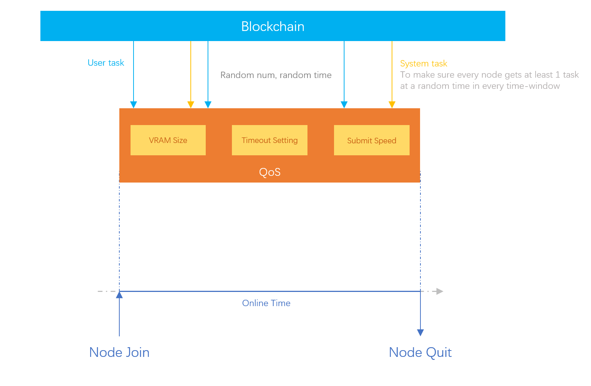
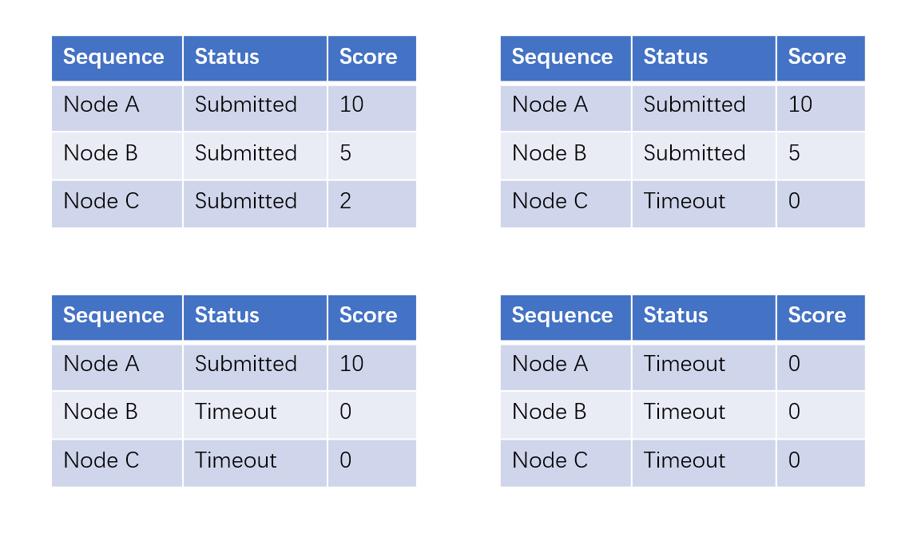

# Quality of Service (QoS)

To encourage the nodes to provide better service to the network, i.e. faster response time, faster execution time and shorter timeout period, several QoS (Quality of Service) scores are introduced to evaluate the overall quality of the node:

* the VRAM size
* the timeout setting
* the submission speed

The QoS score of a node is continuously updated when the node is executing tasks. The scores are then directly utilized to influence several key aspects of the network's operation.

By giving more advantages to the nodes with higher QoS scores, the nodes are encouraged to improve their hardware and network environment, thus improving the overall service quality of the whole network to the applications.

## QoS Scores Usage

### Task Fee Distribution

The task fee distribution among the 3 participating nodes is heavily influenced by the Submission Speed score. Nodes with higher scores are rewarded with a larger portion of the task fees, encouraging nodes to not only complete tasks accurately but also as quickly as possible. This distribution mechanism ensures that nodes are motivated to maintain high performance to maximize their earnings.

### Penalization on the Node Selection Probability

Nodes with consistently low Submission Speed score will face penalization in terms of their probability of being selected for future tasks. This approach ensures that higher-performing nodes are given priority in task allocation, thereby maintaining the overall quality and efficiency of the network.

### Bad Node Kicking Out

If a node’s performance falls below a certain threshold for a prolonged period, the network has mechanisms to remove (kick out) this node from participating further. This is crucial to prevent underperforming nodes from negatively impacting the network’s performance and reliability.

For instance, if a node is shutdown without sending the transaction to inform the blockchain, it will still receive new tasks. However, all these upcoming tasks will be aborted, leading to a negative experience for the applications that issued the tasks.

Now that we have the Submission Speed score, which will drop dramatically during the first several aborts of the tasks, after the threshold is reached, the node will be forced to quit the network by the blockchain, and no more tasks will be sent to the node.

### Token Incentivization Distribution

A combination (weighed sum) of all the 3 QoS scores is used to decide the portion of the token incentivization given to each node in the node mining mechanism. A node with higher QoS scores will get more tokens as extra reward from the node mining. The details can be found in the following document:


[Broken link](broken-reference)


## QoS Scores Calculation

The QoS scores of a node at a certain time are calculated using the node data (mostly task execution related) collected in a time window. The size of the time windows vary among different use cases.

Some of the use cases require the scores exist even if no task has been executed in the whole time window. To support such use cases, the Blockchain will randomly send system generated tasks to the nodes at random times, to ensure that every node gets at least 1 task at each time window.

<figure><figcaption>
QoS Score Calculation
</figcaption></figure>

### The VRAM Size

The VRAM size is a critical factor that determines how many types of the AI tasks a node could support. For example, an SDXL image generation task will require roughly 12GB of VRAM. If running on an NVIDIA graphic card that has only 6GB of VRAM, the task will fail with a CUDA OOM error.

Comparing to the VRAM, the GPU frequency (and bandwidth) affects only the speed of the execution. For example, both NVIDIA RTX 4060 and RTX 3060 have the same VRAM size of 8GB. They will be able to run the same set of the tasks in the Crynux Network, it is just the execution time will be longer for the old 3060 card.

The VRAM size score $$R_i$$ is calculated by dividing the VRAM size of the node by the max VRAM size in the network:

$$
R_i = \frac{V_i}{max(V_j | j \in N )}
$$

Where $$V_i$$ is the VRAM size of the $$i$$th node in bytes, and $$N$$ is the collection of all the nodes in the network.

### The Timeout Setting

According to the [Consensus Protocol](consensus-protocol.md), the nodes could perform the Timeout Attack to earn tokens for free. The solution is to limit the percentage rate by increasing the timeout period and the staking amount.

However, longer timeout period makes the applications wait longer if something is wrong with the task,   which leads to the poor user experience. And the nodes will get less incomes since they could run less tasks in the same time range.

By staking more tokens, the node could decrease its timeout period while still maintaining a safe percentage rate that is acceptable by the network. Crynux Network encourages the nodes to set a shorter timeout by giving more incentives to them, thus increasing the overall responsiveness of the whole network.

The timeout settings score $$P_i$$ is calculated by normalizing the timeout period between the minimum timeout period allowed in the network, and the maximum timeout period set by the node in the network.

$$
P_i = 1 - \frac{O_i-O_{min}}{max(O_j | j \in N) - O_{min}} = \frac{max(O_j | j \in N) - O_i}{max(O_j | j \in N) - O_{min}}
$$

$$O_i$$ is the timeout period in seconds, and $$O_{min}$$ is the minimum timeout period allowed by the network.

### The Submission Speed

There are quite a lot of factors that affect the submission speed of the node. Such as the network quality, the GPU frequency, the number of the tensor cores, and even the system memory speed. Crynux Network encourages faster submission of the tasks to improve the application's experience. By introducing competition between the nodes who are selected for the same task, giving different rewards to the nodes according to their submission order, Crynux Network rewards the improvement the node has made on all the submission speed related factors as a whole.

**Round score:** There are two rounds of submission in a single task: result commitment and result disclosure. For each round, the Crynux Network records the order of submission of the nodes, and assigns higher score to the nodes who have submitted earlier. The round score $${rs}_i$$ a node could get in a round $$i$$ can be visualized as:&#x20;

<figure><figcaption>
The round score of a node by its submission order and status
</figcaption></figure>

**Task score:** the task score a node gets for the $$i$$th task $${ts}_i$$ is calculated simply by summing up the scores the node gets for all the rounds in the task:

$$
{ts}_i = {rs}_c + {rs}_d
$$

where $${rs}_c$$ is the round score of the commitment round, and $${rs}_d$$ is the round score of the disclosure round.

**Node score:** the node score is calculated by averaging all the scores the node gets for all the tasks it received in the month:

$$
{ns}_i = \frac{\sum_{j=1}^n {ts}_j}{n}
$$

Where $$n$$ is the total number of the tasks the node has executed in this month.


Note that if there are no nodes that have submitted result in a task. It is highly likely that the task is itself misconfigured, and the task score is simply ignored, and will not be included in the average score calculation.


Finally, the score a node gets for the submission speed factor is calculated by normalizing the node score above to be a fraction between the max node score in the network and zero:

$$
B_i = \frac{ {ns}_i} {max({ns}_j | j \in N )}
$$

##
