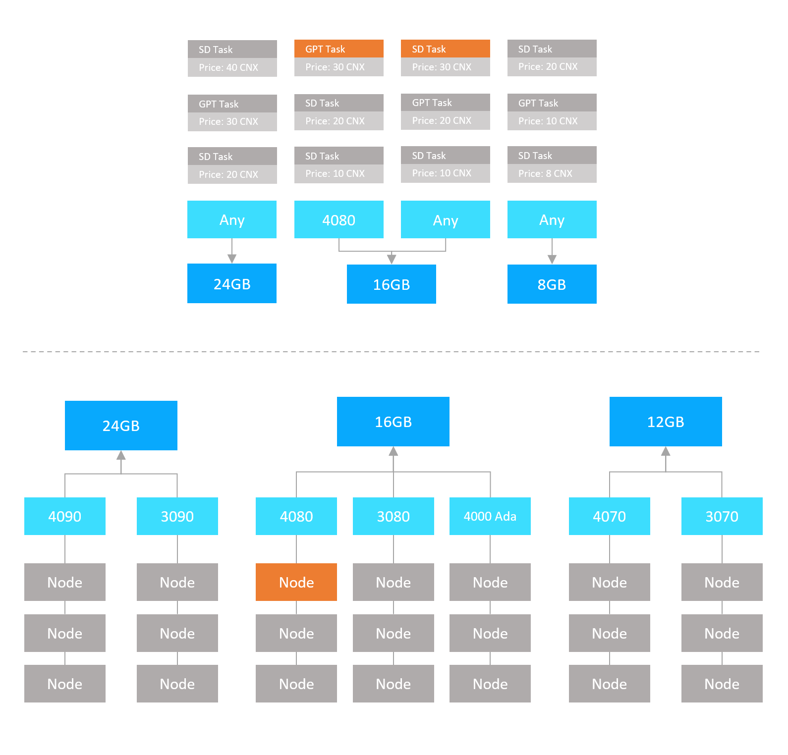

# Task Dispatching

When creating a task, the application can specify criteria such as the minimum VRAM requirement or restrict the node selection to a specific GPU model. The blockchain will identify all eligible nodes that meet the criteria and then randomly select one from these candidates.

If no available nodes meet the criteria, the task will be added to the queue to await more nodes. When a node satisfying the criteria is freed, the highest-price task from the queue will be assigned to this available node.

To optimize task execution speed while maintaining consensus strength, nodes are selected randomly from candidates with different probabilities. Factors influencing a node's selection probability include its local model cache and QoS score. Nodes with faster GPUs, superior networks, fewer timeouts, or locally cached models needed for the task will have a higher likelihood of selection.

The details of the task dispatching algorithm are described in the following sections.

<figure><figcaption>
Task Dispatching Overview
</figcaption></figure>

## Assigning Task to the Nodes

The nodes on the blockchain are first grouped by their card model, such as the Nvidia RTX 4090 group and the RTX 3080 group. These card model groups are then further grouped by their VRAM size. For example, the 16GB VRAM group may include the RTX 4080, RTX 3080, and RTX 4000 Ada groups. The blockchain will use these card groups to select candidates for a task.

If the application sets `Required GPU` in the task parameters, only the group with the required GPU model will be selected as the candidates. Otherwise, all the groups with VRAM equal to or larger than the task's requirement are chosen as candidates.

The node will then be randomly selected from all candidates based on their selection probability.

### Node Selection Probability

The selection probability of a node depends on the following factors:

#### Model Cache

If a node recently executed tasks using the same model as the current task, it is likely that the model is still stored locally on the disk or even better, cached in the memory. This prevents the need for downloading or reloading the model, significantly speeding up task execution. Such nodes are given higher probabilities for selection.

#### QoS Score

Newer GPUs with the same VRAM but higher frequencies execute tasks faster. To speed up task execution, Crynux Network prioritizes faster nodes by giving them higher selection probabilities.

To prevent nodes from reporting fake frequencies and GPU models, Crynux Network uses the Task Execution Speed score of the QoS instead of the reported frequencies. This score evaluates nodes by comparing their speed in executing the validation tasks. Nodes that complete the task faster receive a higher QoS score and are thus more likely to be selected for future tasks.

Details about the QoS scores can be found in the following document:


[quality-of-service-qos.md](quality-of-service-qos.md)


If there are not enough candidate nodes to be selected from, the task will be added to the task queue and wait for more nodes to become available.

## Task Queue

Tasks added to the queue are grouped based on VRAM and GPU model requirements. Initially, tasks are sorted into VRAM groups (e.g., 16GB, 24GB). Within these groups, tasks are further categorized by GPU model (e.g., 4090, A100). If no specific GPU model is required, tasks are placed in an "Any" group.

Tasks within the same group are sorted by **task value**. When a task is taken from the queue, the task with the highest value is prioritized. The task value, represented as "CNX per second", is calculated by dividing the task fee by the estimated execution time. For more details on task value estimation, refer to the following document:


[task-pricing.md](task-pricing.md)


### Dequeue a Task for a Newly Available Node

The blockchain will try to retrieve a task from the task queue when a new node becomes available. Which will happen when one of the following situations occurs:

* A running task is finished.
* A new node joins the network.
* A node resumes from the paused status.

> When a new task is sent to the blockchain, it attempts to dispatch the task immediately to the nodes, regardless of the task queue’s status. Tasks remain in the queue only if there are not enough **matching** nodes available. Even if the task queue isn't empty, there might still be available nodes in the network matching the new task, providing a chance for the new task to execute first.

Depending on the GPU model and the VRAM size of the node, the candidate task groups including:

* The task group of the same GPU model
* The "Any" groups that have a equal or smaller VRAM requirement

The first tasks of each candidate group are compared, and the task with the highest value is selected.

### Max Size of the Task Queue

The max size of the task queue is estimated dynamically using the total number of nodes of the network:

$$
S = \alpha * N
$$

Where $$N$$ is the number of nodes in the network, and $$\alpha$$ is a fixed multiplier that will be set as the network parameter.

If the max size is reached, when a new task is sent to the task queue, the task with the lowest task value in the queue will be removed and aborted. The task creator of the removed task will receive the `TaskAborted` event.

