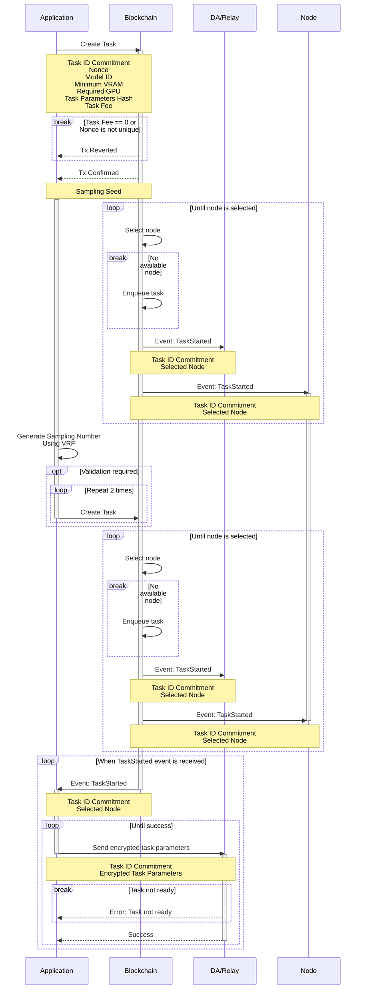
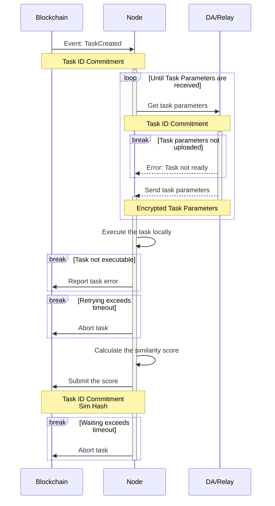

# Task Lifecycle

## Overview

The task is initiated by the application. The details of the task, such as the prompt and the image sizes in the Stable Diffusion image generation, are all included in the `Task Parameters`.&#x20;

The `Task Parameters` are not sent to the blockchain due to size constraints. Instead, the application sends the task's consensus-related metadata to the blockchain to create the task. Once the task is dispatched to a node, the application encrypts the `Task Parameters` using the node's public key and sends them to the DA/relay.

To ensure successful cross-validation for the nodes, the blockchain may require the application to send two additional tasks with identical `Task Parameters`. The application will be unable to obtain the computation results if the additional tasks are not sent.

## Task Creation

The application starts a task by signing a transaction, invoking the smart contract to create the task on the Blockchain.

The application must set the task fee it is willing to pay in the `value` field of the transaction.

The transaction might be reverted, due to several reasons:

* The transaction value is not set (task fee is not paid).
* The Nonce has already been used before.

For each of the tasks, the blockchain will attempt to locate a suitable node that is available to execute the task. If such a node is found, the task starts immediately. Otherwise, the task is added to the queue. When a new node becomes available, it will retrieve the task from the queue and begin execution. In both cases, the blockchain emits a `TaskStarted` event when the task begins, including the node's address.

Upon receiving the `TaskStarted` event, the application should encrypt the task parameters using the node's public key and send them to the DA/relay.

The relay permits uploading only upon receiving the `TaskStarted` event from the blockchain. The application might need to wait briefly for the upload to succeed. After the task arguments are uploaded to the relay, the task creation process is completed.

## Task Execution

When the node receives the `TaskCreated` event, it will start to execute the task locally.

The execution starts by fetching the `Task Parameters` from the DA/Relay. The node will check the local existence of the models specified in the `Task Parameters`. If the models are not cached locally, they will be downloaded.

If the model download link or the Huggingface ID is **confirmed** to be invalid, such as a 404 response from Civitai, the node will report error to the Blockchain. If there are network issues during the download, the node will retry the download several times until the timeout period is reached. The task will be cancelled by the node if the timeout is reached.

The task is then sent to the execution engine of the node. If the execution engine finds out that the task is misconfigured, such as an SDXL LoRA model combined with an SD1.5 base model, it will report the error to the Blockchain.

When the task has finished successfully, the node has the computation result such as the images. It will calculate the similarity hash of the result, and then submit it to the blockchain.

After submission, the node waits for task validation. If validation isn't completed within the timeout period, the node might abort the task to accept new ones instead of waiting indefinitely.

## Result Validation

## Result Retrieval

<figure><figcaption>
The Sequential Graph of Result Retrieval
</figcaption></figure>

The application will monitor the Blockchain for the events, after the initial creation of the task on-chain. If the `TaskSuccess` event is received, the application could get the images from the relay.


Since the images are uploaded by the node after the node receives the `TaskSuccess` event as well, there is a short delay between the event has been emitted and the images have been uploaded. Before the images are uploaded, the relay will return `400 File not found` to the application. The application should take it into consideration.&#x20;


If the `TaskAborted` event is received, the application could receive the abort reason as the argument in the event. The application will have to retry the task if needed.
