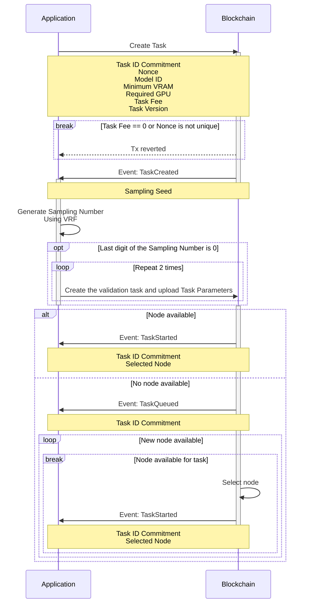
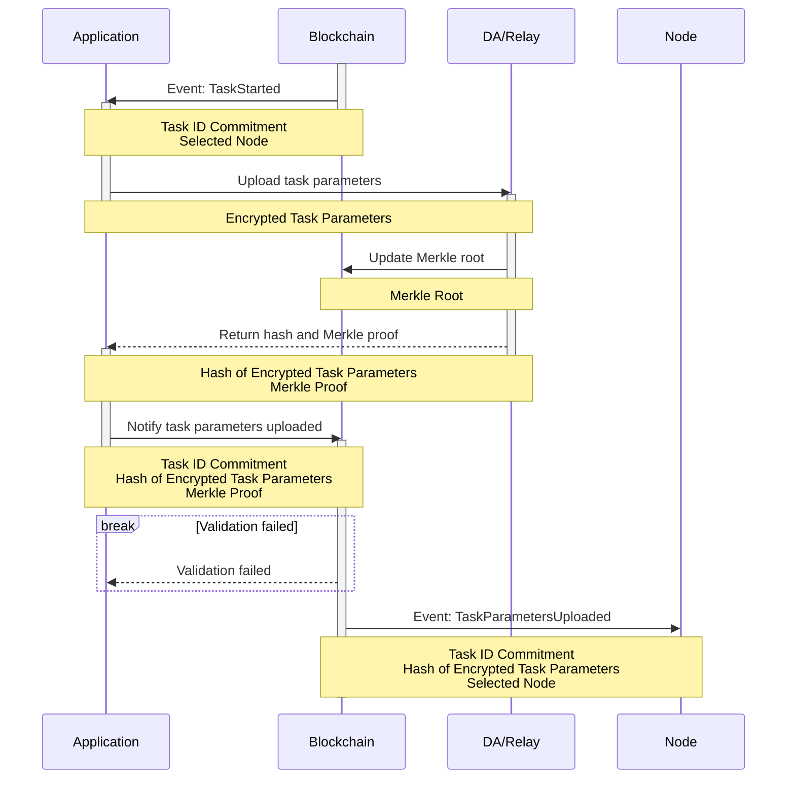
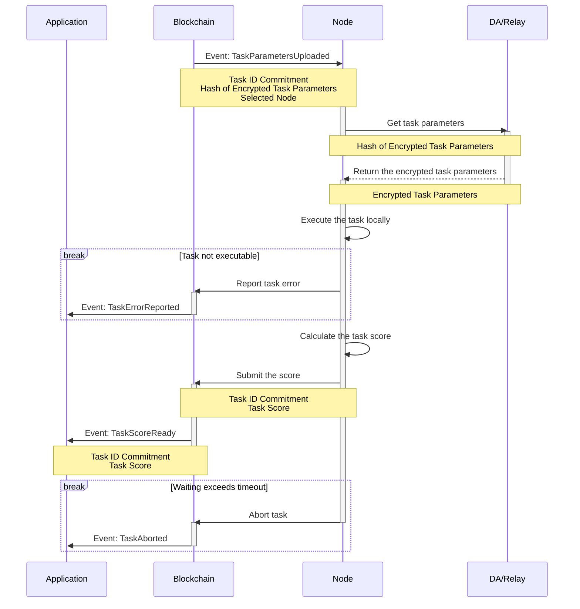
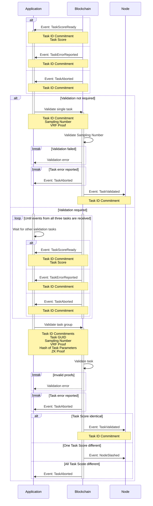
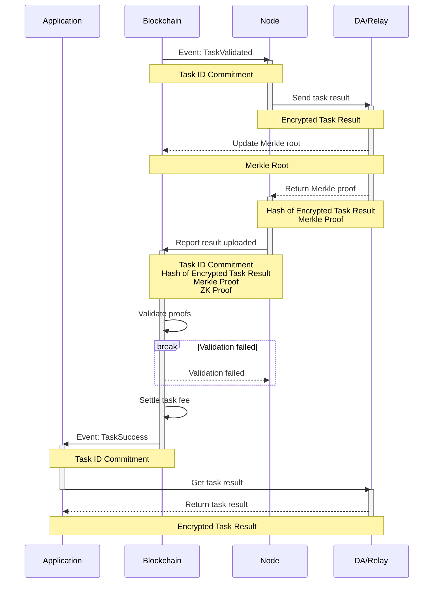

# Task Lifecycle

## Overview

Tasks are central to the Crynux Network. Each application use case is represented as a different task. Applications interact with the network by sending various tasks, and nodes are responsible solely for executing these tasks.

A task consists of a group of `Task Parameters`. For instance, in a Stable Diffusion image generation task, the `Task Parameters` might include:

* **Text Prompt:** The description or scene you want to generate.
* **Image Size:** Dimensions of the generated image.
* **Guidance Scale:** Controls the strength of the prompt on the image generation.
* **Controlnet Image:** An image used as the reference in the Controlnet.

Here is a concrete example of the `Task Parameters` of an SD image generation task:

```json
{
    "version": "2.0.0",
    "base_model": {
        "name": "stabilityai/sdxl-turbo"
    },
    "prompt": "best quality, ultra high res, photorealistic++++, 1girl, desert, full shot, dark stillsuit, "
              "stillsuit mask up, gloves, solo, highly detailed eyes,"
              "hyper-detailed, high quality visuals, dim Lighting, ultra-realistic, sharply focused, octane render,"
              "8k UHD",
    "negative_prompt": "no moon++, buried in sand, bare hands, figerless gloves, "
                       "blue stillsuit, barefoot, weapon, vegetation, clouds, glowing eyes++, helmet, "
                       "bare handed, no gloves, double mask, simplified, abstract, unrealistic, impressionistic, "
                       "low resolution,",
    "task_config": {
        "num_images": 9,
        "steps": 1,
        "cfg": 0
    },
    "lora": {
        "model": "https://civitai.com/api/download/models/178048"
    },
    "controlnet": {
        "model": "diffusers/controlnet-canny-sdxl-1.0",
        "image_dataurl": "data:image/png;base64,12FE1373...",
        "preprocess": {
            "method": "canny"
        },
        "weight": 70
    },
    "scheduler": {
        "method": "EulerAncestralDiscreteScheduler",
        "args": {
            "timestep_spacing": "trailing"
        }
    }
}
```

The lifecycle of a task consists of four stages: **Task Creation**, **Task Execution**, **Result Validation**, and **Result Retrieval**.

In the **Task Creation** stage, the application initiates a task by sending a transaction to the blockchain. The `Task Parameters` are not sent to the blockchain due to size constraints. Instead, the application sends the task's consensus-related metadata to the blockchain to create the task. Once the task is dispatched to a node, the application encrypts the `Task Parameters` using the node's public key and sends them to the DA/Relay.

To ensure successful cross-validation for the nodes, the blockchain may require the application to send two additional tasks with identical `Task Parameters`. The application will be unable to obtain the computation results if the additional tasks are not sent.

In the **Task Execution** stage, the node is notified about the task by the blockchain. It then receives the task metadata from the blockchain, fetches the `Task Parameters` from the DA/Relay, and executes the task locally.

Upon a successful run, the node computes the similarity hash of the result and submits it to the blockchain for validation.

In the **Result Validation** stage, the application either completes the task directly or waits for other validation tasks to complete, based on the VSS selection result. In both scenarios, it must submit the relevant proofs to the blockchain to initiate validation. The application will not be able to get the computation result if the proofs are not submitted.

The blockchain will perform the validation. Once validation is complete, the task proceeds to the **Result Retrieval** stage.

The node will upload the actual computation result to the DA/Relay, and claim the task fee from the blockchain by proving the availability of the computation result to the application. The node will get the task fee immediately when the validation completes on-chain. No interaction from the application is required.

After the validation, the application is notified to download the result from the DA/Relay, and the task is completed.

The subsequent sections detail all the stages. This document focuses on listing the interaction steps between components, the parameters required for each step, and the possible status and return values. Explanations on why a parameter is required are given in other documents. For the validation related parameters, refer to the following document:


[verifiable-secret-sampling.md](../verifiable-secret-sampling.md)


For the node criteria related parameters, refer to the following document:


[task-dispatching.md](../task-dispatching.md)


And the pricing related parameters:


[task-pricing.md](../task-pricing.md)


## Task Creation

### Create Task On-Chain



The application starts a task by signing a transaction, invoking the smart contract to create the task on the Blockchain.

The application must set the task fee it is willing to pay in the `value` field of the transaction.

The transaction might be reverted, due to several reasons:

* The transaction value is not set (task fee is not paid).
* The Nonce has already been used before.

If the transaction is confirmed, the application receives a `Sampling Seed`. The application then uses the VRF algorithm with this `Sampling Seed` to generate a `Sampling Number`. If the last digit of the `Sampling Number` is 0, the application should create two additional tasks to form a task validation group. The details of the task validation are described in the following document:


[verifiable-secret-sampling.md](../verifiable-secret-sampling.md)


For each of the tasks, the blockchain will attempt to locate a suitable node that is available to execute the task. If such a node is found, the task starts immediately. Otherwise, the task is added to the queue and `TaskQueued` event is emitted. When a new node becomes available, it will retrieve the task from the queue and begin execution. In both cases, the blockchain emits a `TaskStarted` event when the task begins, including the node's address. Details of this process are outlined in the following document:


[task-dispatching.md](../task-dispatching.md)


### Upload Task Parameters



Upon receiving the `TaskStarted` event, the application should encrypt the `Task Parameters` using the node's public key and send them to the DA/Relay. The DA/Relay will update the `Merkle Root` to the blockchain for validation, and return the `Merkle Proof` to the application.

The application sends the hash and `Merkle Proof` to the blockchain. The blockchain verifies the proof against the `Merkle Root` submitted by the DA/Relay, ensuring the `Task Parameters` are uploaded. It then emits the `TaskParametersUploaded` event to notify the node to start execution.

## Task Execution



When the node receives the `TaskStarted` event, it will start to execute the task locally.

The execution starts by fetching the `Encrypted Task Parameters` from the DA/Relay. After the parameters are received, the node decrypts them using its own private key, and starts the execution.

The first step is to download the models. The node will check the local existence of the models specified in the `Task Parameters`. If the models are not cached locally, they will be downloaded from the network.

If there are network issues during the download, the node will retry the download several times until the timeout period is reached. The task will be cancelled by the node if the timeout is reached.

If the model download link is confirmed to be invalid, such as a 404 response from Civitai, the node will report error to the blockchain.

The task is then sent to the execution engine of the node. If the execution engine finds out that the task is misconfigured, such as an SDXL LoRA model combined with an SD1.5 base model, it will report the error to the blockchain.

When the task has finished execution successfully, the node has the final computation result such as the images. It will calculate the score of the result, and then submit it to the blockchain.

The blockchain will emit `TaskScoreReady` event to the application, and wait for the application to perform the validation process.

The node will also wait for the task validation. If validation isn't completed within the timeout period, the node might abort the task to accept new ones instead of waiting indefinitely.

## Result Validation



Upon receiving the `TaskResultReady` event, the application's response varies based on the need for task validation:

### Task does not Require Validation

If the task does not require validation, the application should send the "Complete Task" transaction directly to the blockchain, including proofs of the `Sampling Number`.

The blockchain will then validate the proofs. If the validation passes, the blockchain will emit `TaskValidated` event to the node to notify it to disclose the actual computation result. The transaction will fail if the validation does not pass.

For more information on the validation process, please see the following document:


[verifiable-secret-sampling.md](../verifiable-secret-sampling.md)


### Task Requires Validation

If validation is required, the application should wait for the `TaskResultReady` event from the other two tasks in the validation group. Once all three tasks have submitted their similarity hashes, the application will disclose their relationship for blockchain validation.

There are more validations to be performed by the blockchain, comparing to the validation of tasks that do not require validation. For more information on the validation process, please see the following document:


[verifiable-secret-sampling.md](../verifiable-secret-sampling.md)


If the validation passes, the blockchain will emit `TaskValidated` event to all the three nodes. The transaction will fail if the proofs provided by the application are invalid.

If the `Sim Hash` are different across the nodes, if two of them are identical, the other node will be slashed. If all three `Sim Hash`are different, the task will be aborted.

## Result Retrieval



Upon receiving the `TaskValidated` event, the node can upload the computation result to the DA/Relay service and obtain the task fee by proving to the blockchain that the upload was correct. The proving is implemented using ZKP, the details are described in the following section of the documentation:


[verifiable-secret-sampling.md](../verifiable-secret-sampling.md)


The computation result is encrypted with the application's public key before being sent to the DA/Relay, ensuring that only the application can decrypt and access the actual result.

Once the node submits the proofs to the blockchain, and they are verified, the blockchain will transfer the task fee to the node and emit a `TaskSuccess` event to the application. The application can then retrieve the computation result from the DA/Relay service, completing the task.
