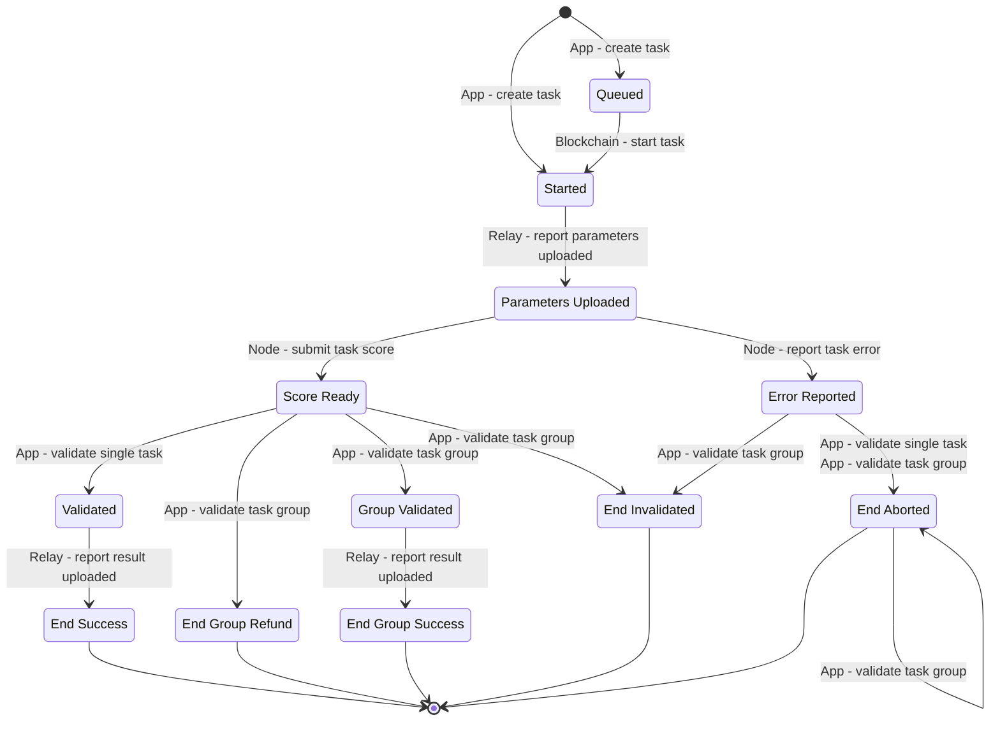

# Task State Transitions

## State Transition Graph

The task could be aborted at any state, as long as the timeout period has reached. The abort action could be issued from both the application and the selected node.&#x20;

The task state transition graph is given below. **To simplify the graph, all the abort transition is omitted**:

## Group Validation Results

When a task is validated in a validation group, its result state is determined according to the table below:

<table data-full-width="true"><thead><tr><th width="155">Task 1 Before</th><th width="150">Task 2 Before</th><th width="148">Task 3 Before</th><th>Task 1 After</th><th width="218">Task 2 After</th><th>Task 3 After</th></tr></thead><tbody><tr><td>Score A</td><td>Score A</td><td>Score A</td><td>GroupValidated</td><td>EndGroupRefund</td><td>EndGroupRefund</td></tr><tr><td>Score A</td><td>Score A</td><td>Score B</td><td>GroupValidated</td><td>EndGroupRefund</td><td>EndInvalidated</td></tr><tr><td>Score A</td><td>Score B</td><td>Score C</td><td>EndAborted</td><td>EndAborted</td><td>EndAborted</td></tr><tr><td>Score A</td><td>Score A</td><td>Report Error</td><td>GroupValidated</td><td>EndGroupRefund</td><td>EndInvalidated</td></tr><tr><td>Score A</td><td>Score B</td><td>Report Error</td><td>EndAborted</td><td>EndAborted</td><td>EndAborted</td></tr><tr><td>Score A</td><td>Score A</td><td>Abort</td><td>GroupValidated</td><td>EndGroupRefund</td><td>EndAborted</td></tr><tr><td>Score A</td><td>Score B</td><td>Abort</td><td>EndAborted</td><td>EndAborted</td><td>EndAborted</td></tr><tr><td>Score</td><td>Report Error</td><td>Report Error</td><td>EndInvalidated</td><td>EndAborted</td><td>EndAborted</td></tr><tr><td>Score</td><td>Report Error</td><td>Abort</td><td>EndAborted</td><td>EndAborted</td><td>EndAborted</td></tr><tr><td>Score</td><td>Abort</td><td>Abort</td><td>EndAborted</td><td>EndAborted</td><td>EndAborted</td></tr><tr><td>Report Error</td><td>Report Error</td><td>Report Error</td><td>EndAborted</td><td>EndAborted</td><td>EndAborted</td></tr><tr><td>Report Error</td><td>Report Error</td><td>Abort</td><td>EndAborted</td><td>EndAborted</td><td>EndAborted</td></tr><tr><td>Report Error</td><td>Abort</td><td>Abort</td><td>EndAborted</td><td>EndAborted</td><td>EndAborted</td></tr><tr><td>Abort</td><td>Abort</td><td>Abort</td><td>EndAborted</td><td>EndAborted</td><td>EndAborted</td></tr></tbody></table>

## Actions for Each State

| State             | Action                                                         |
| ----------------- | -------------------------------------------------------------- |
| Group Validated   | Record the address of all the 3 nodes in the validation group. |
| End Success       | Settle the payment. Release the node.                          |
| End Group Refund  | Refund the payment. Release the node.                          |
| End Group Success | Distribute payment to 3 nodes. Release the node.               |
| End Invalidated   | Refund the payment. Slash the node.                            |
| End Aborted       | Refund the payment. Release the node.                          |
