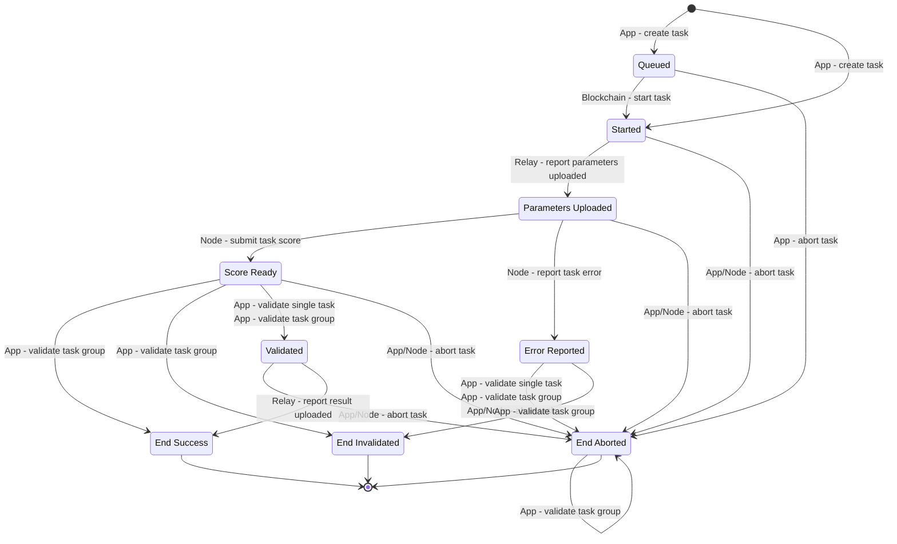

# Task State Transitions

## State Transition Graph

A complete task state transition graph is given below:

## Group Validation Results

When a task is validated in a validation group, its result state is determined according to the table below:

<table data-full-width="true"><thead><tr><th width="105">Task 1</th><th width="94">Task 2</th><th width="95">Task 3</th><th>Task 1</th><th>Task 2</th><th>Task 3</th></tr></thead><tbody><tr><td>Score A</td><td>Score A</td><td>Score A</td><td>Validated</td><td>EndSuccess</td><td>EndSuccess</td></tr><tr><td>Score A</td><td>Score A</td><td>Score B</td><td>Validated</td><td>EndSuccess</td><td>EndInvalidated</td></tr><tr><td>Score A</td><td>Score B</td><td>Score C</td><td>EndAborted</td><td>EndAborted</td><td>EndAborted</td></tr><tr><td>Score A</td><td>Score A</td><td>Report Error</td><td>Validated</td><td>EndSuccess</td><td>EndInvalidated</td></tr><tr><td>Score A</td><td>Score B</td><td>Report Error</td><td>EndAborted</td><td>EndAborted</td><td>EndAborted</td></tr><tr><td>Score A</td><td>Score A</td><td>Abort</td><td>Validated</td><td>EndSuccess</td><td>EndAborted</td></tr><tr><td>Score A</td><td>Score B</td><td>Abort</td><td>EndAborted</td><td>EndAborted</td><td>EndAborted</td></tr><tr><td>Score</td><td>Report Error</td><td>Report Error</td><td>EndInvalidated</td><td>EndAborted</td><td>EndAborted</td></tr><tr><td>Score</td><td>Report Error</td><td>Abort</td><td>EndAborted</td><td>EndAborted</td><td>EndAborted</td></tr><tr><td>Score</td><td>Abort</td><td>Abort</td><td>EndAborted</td><td>EndAborted</td><td>EndAborted</td></tr><tr><td>Report Error</td><td>Report Error</td><td>Report Error</td><td>EndAborted</td><td>EndAborted</td><td>EndAborted</td></tr><tr><td>Report Error</td><td>Report Error</td><td>Abort</td><td>EndAborted</td><td>EndAborted</td><td>EndAborted</td></tr><tr><td>Report Error</td><td>Abort</td><td>Abort</td><td>EndAborted</td><td>EndAborted</td><td>EndAborted</td></tr><tr><td>Abort</td><td>Abort</td><td>Abort</td><td>EndAborted</td><td>EndAborted</td><td>EndAborted</td></tr></tbody></table>
