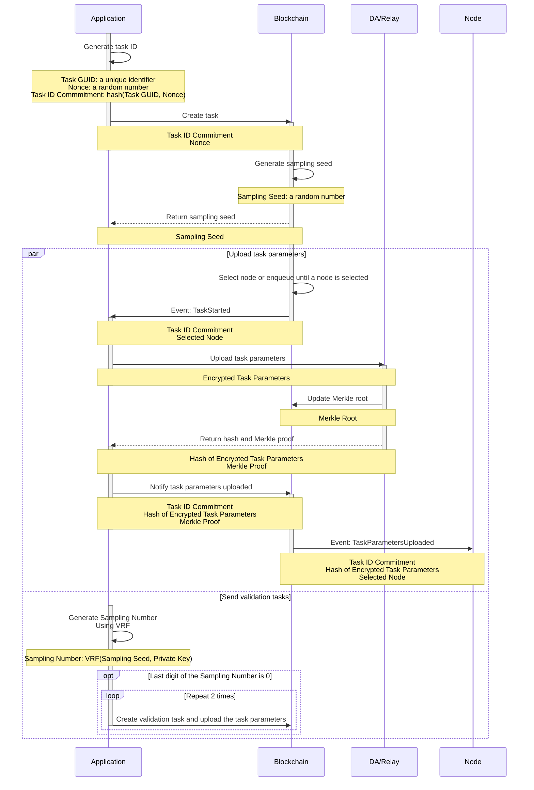
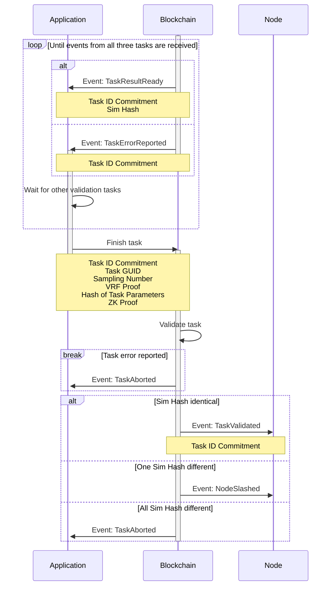
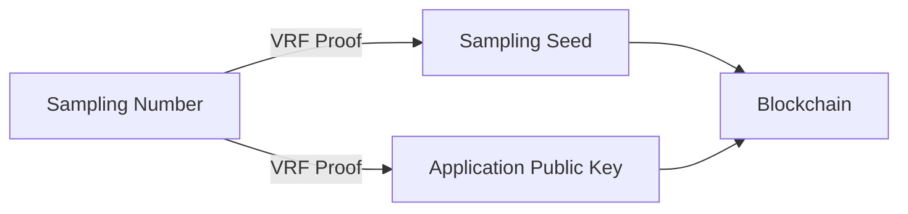
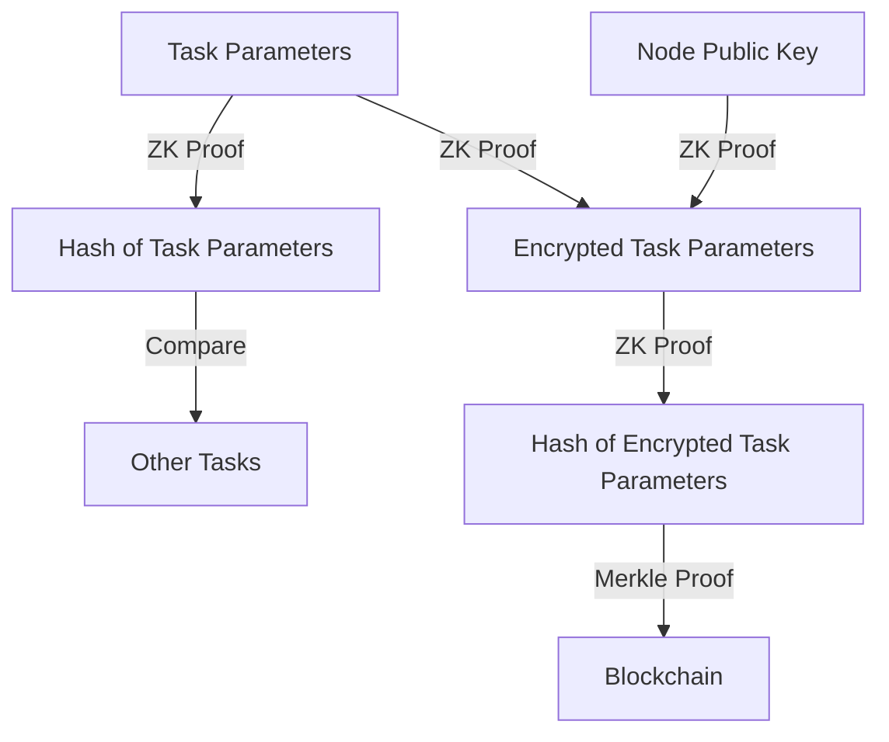
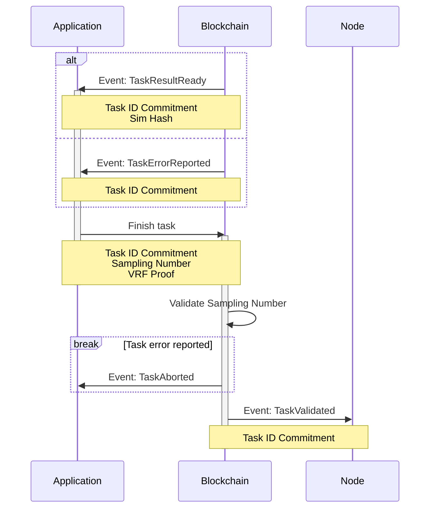
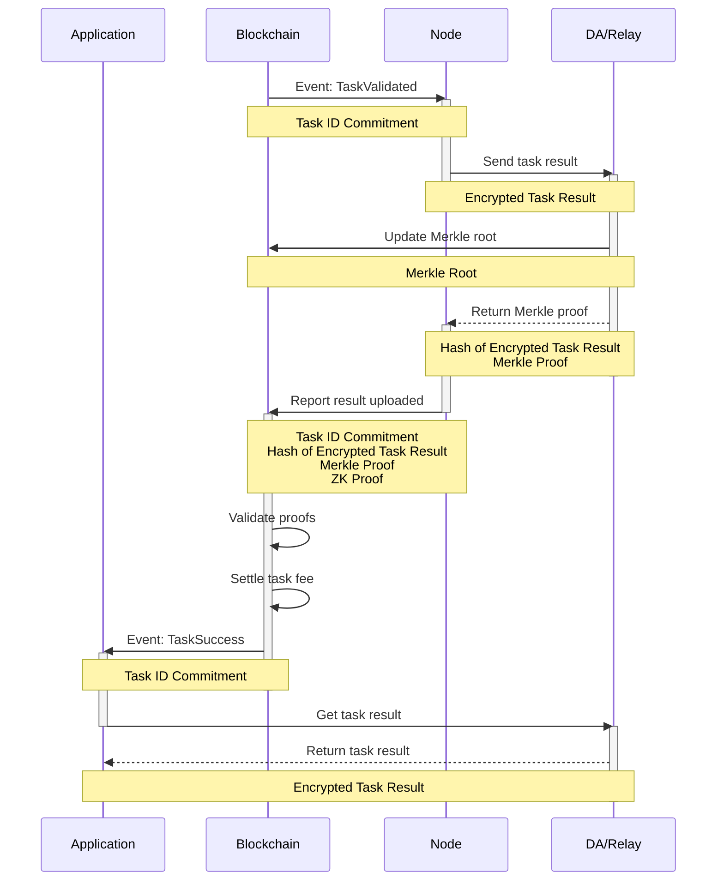
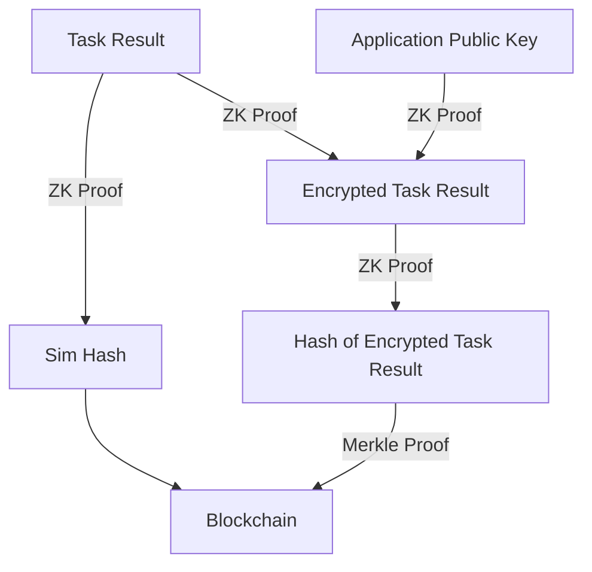

# Verifiable Secret Sampling

To prevent any malicious node from sending fake computing results to the network for free rewards, Crynux Network validates task results by selecting three random nodes to independently execute the same task and compare their outputs to detect any cheating.

However, using triple computing power for every task wastes resources, cutting network capacity by two-thirds and increasing wait times. This inefficiency is compounded if one node is slow due to network issues, further lengthening task execution times.

Instead of validating every task, an effective approach is to randomly sample a small portion of tasks for validation. As long as the node is unaware of whether its task will be validated, it cannot execute any attacks.

The random sampling process must be enforced by the blockchain using smart contracts to ensure no participants can manipulate the selection or alter the sampling rate for personal gain. The challenge then is to conceal the sampling results from the public despite the transparency of blockchain data.

The complexity of the problem further increases because the task arguments and results are too large to store directly on the blockchain. This makes it difficult for the blockchain to verify the correctness and delivery of certain data, increasing the risk of participants cheating.

Crynux implements a Verifiable Secret Sampling algorithm using the [VRF (Verifiable Random Function)](https://en.wikipedia.org/wiki/Verifiable\_random\_function) and [ZKP (Zero-Knowledge Proofs)](https://en.wikipedia.org/wiki/Zero-knowledge\_proof).&#x20;

When a task is sent to the blockchain, it determines secretly whether the task will be validated based on a pre-defined sampling rate. If the task is selected for validation, three tasks will be sent to the nodes.

Nodes cannot know the sampling results before submitting their computations to the blockchain. Once the task execution is complete, the sampling results are revealed on-chain for verification. This ensures the sampling were generated prior to the task and prevents manipulation.

Comparing to validating all the tasks on chain, the secret task sampling significantly enhances network efficiency, rivaling centralized platforms while remaining decentralized and permissionless by effectively preventing fraudulent activities.

The algorithm's detailed description will be provided in the next sections.


The sequence diagrams in this document focus solely on consensus-related parameters. For a comprehensive list of all parameters, please refer to the task lifecycle documentation:

[Task Lifecyle](task-lifecycle.md)


## Task Creation

### Task GUID and Task ID Commitment

To initiate a task, the application creates a unique `Task GUID`.

The `Task GUID` for each task is obscured by generating a `Task ID Commitment`. This commitment is a hash of the real `Task GUID` combined with a random number `Nonce`.&#x20;

For three tasks within the same validation group, each `Task ID Commitment` is derived from the same `Task GUID` but uses different random numbers, making them appear unrelated in public data. Only the `Task ID Commitment` is sent to the blockchain, and is used to identify the task during the whole task lifecycle. This prevents the nodes from knowing whether the task will be validated or not.

After execution, the application will reveal the real `Task GUID` on the blockchain. This allows the blockchain to validate task relationships, preventing the application from fraudulently grouping unrelated tasks. This ensures honest nodes are not penalized.

### Secret Selection of Validation Tasks

The sampling process begins when the application sends the transaction to create a task on the blockchain. Upon receiving the task, the blockchain generates a random number to be used as the `Sampling Seed` for the VRF and return it to the application.

The application uses VRF locally to generate the `Sampling Number`, using the `Sampling Seed` and its own private key as the VRF inputs. With a 10% sampling ratio, the task will be selected for validation if the `Sampling Number` ends in 0.

The `Sampling Number` is only known to the application, since no one else knows its private key.

The application cannot cheat on the `Sampling Number` either, as the `Sampling Seed` is fixed on the blockchain. Additionally, the public key of the application is set before the task and is known to the blockchain.

### Sending the Validation Tasks

If the task is not selected for validation, the application will simply stop and await for the notification to upload the `Task Parameters`. However, if the task is selected, the application must send two additional tasks with the same `Task Parameters` for validation purposes.


The application will not get the computing result if the validation tasks are not submitted or if they are submitted with inconsistent parameters. The blockchain will verify the correctness of the validation tasks before allowing the application to get the computation result. More details are provided in the next section.


The fees charged for the validation tasks will be refunded once the task is completed. This extra charge ensures that the validation tasks appear identical to regular tasks, preventing nodes from distinguishing them based on the fees.

If an application sends tasks infrequently, such as a human sending tasks to the blockchain via a browser-based DApp and Metamask, the node can monitor the user's address for new tasks. If no additional tasks are sent from the same address in a short period, the task is likely non-validation. However, if tasks are sent frequently, it becomes impossible for the node to determine if a task is for validation.

The higher probability of guessing correctly increases the chance of a node performing a successful [statistical attack](consensus-protocol/#expectation-of-the-income). Increasing the required amount of staking could solve this issue. A task mixer can also be designed to combine tasks from all applications before dispatching them to the nodes, thereby concealing the origin of the tasks from the nodes.

### Uploading Task Parameters to the DA/Relay

When a task is created on the blockchain, the blockchain will try to select a node based on the task's criteria. If no node is available, the task is added to a queue. Once a new node becomes available, the task is retrieved from the queue and executed. Details of this process are outlined in the following document:


[task-dispatching.md](task-dispatching.md)


When a node is selected for the task, the blockchain will emit `TaskStarted` event to notify the application to upload `Task Parameters`.

Knowing which node will execute the task, the application encrypts the `Task Parameters`, such as the prompt and image size, using the node's public key. It then sends the `Encrypted Task Parameters` to the DA/Relay service and gets the `Merkle Proof` in return.


The DA/Relay will save the data and make it publicly available. A [Merkle Tree](https://en.wikipedia.org/wiki/Merkle\_tree) is generated for a collection of recently submitted data, and the Merkle Root is sent to the smart contract on the blockchain. The application receives the Merkle Proof for the data. Using the correct Merkle Proof, the blockchain can verify data availability under a specific hash, confirming its existence and public accessibility.


The `Encrypted Task Parameters` can only be decrypted by the assigned node. Nodes cannot decrypt the parameters of other tasks, making it impossible to determine if a task will be validated by comparing task parameters.

After sending the `Encrypted Task Parameters` to the DA/Relay and obtaining the `Merkle Proof`, the application notifies the blockchain by sending the `Merkle Proof` to the blockchain. The blockchain verifies the `Merkle Proof`, and emits `TaskParametersUploaded` event to notify the node to start the execution.

The verification of the `Merkle Proof` only makes sure **some** **data** is uploaded to the DA/Relay and is claimed to be the encrypted `Task Parameters` for the given `Task ID Commitment`, it doesn't guarantee the correctness of the `Task Parameters`. The task parameters may still be inconsistent across tasks in a validation group, may be in an invalid format, or may be undecryptable by the node at all.

If the `Task Parameters` are invalid, the node will report error to the blockchain, and the task will be aborted. The task fee is returned to the application, but the transaction fee is still charged, which will stop the application from sending the invalid `Task Parameters` intentionally.

The consistency of the `Task Parameters` across the validation group will be verified later using Zero-Knowledge Proof (ZKP).

## Task Execution

Upon receiving the `TaskParametersUploaded` event from the blockchain, the node retrieves the `Encrypted Task Parameters` from the DA/Relay service, decrypts them, and executes the task on the local GPU.

After the computation is finished, the node will calculate the `Sim Hash` of the result, and send the `Sim Hash` to the blockchain. Then the node should wait for a future notification from the blockchain. If the wait exceeds the timeout period, the node may abort the task. The task fee will then be refunded to the application.

The node cannot send the task result to the DA/Relay service at this stage. If the result is transmitted, the application could retrieve it prematurely and disrupt subsequent processes. The blockchain lacks mechanisms to identify and penalize the application in such scenarios.

When the `Sim Hash` is sent, the blockchain emits `TaskResultReady` event to notify the application. If the `Task Parameters` are invalid, the node will report error to the blockchain, and the blockchain will emit `TaskErrorReported`. In both cases, the task enters the **Result Validation** stage.

## Result Validation

When the `TaskResultReady` or `TaskErrorReported` event is received, the application should proceed with one of two different strategies based on the previously generated `Sampling Number`.

### Tasks Require Validation

If the `Sampling Number` ends with 0, the task requires validation. The application will wait for the submission of all the 3 `Sim Hash` (or error reporting) on the blockchain, and then disclose the relationship of the tasks, and other relevant proofs for the blockchain to validate:

#### Sampling Number Validation

The application sends the `VRF Proof` and the `Sampling Number` to the blockchain, and the blockchain validates the `Sampling Number` using the `VRF Proof` and the `Application Public Key`. This ensures that the `Sampling Number` is generated from the on-chain `Sampling Seed` and the application's private key.

If the `VRF Proof` is valid, the blockchain will verify whether the `Sampling Number` ends in 0. If valid, the blockchain confirms that the task was genuinely selected during the secret task selection.

#### Task Relationship Validation

The application sends the `Task ID Commitment` of all three tasks along with the actual `Task GUID` to the blockchain. The blockchain validates the `Task ID Commitment` with the previously uploaded `Nonce`, ensuring they are generated from the same `Task GUID`.

The task relationship validation ensures the application does not send misleading information to the blockchain, such as the combination of three irrelevant tasks, which could cause honest nodes to be penalized.

#### Task Parameters Validation

This validation ensures the `Task Parameters` provided by the application are consistent across all three nodes. Inconsistent parameters given to different nodes result in different `SimHash` being submitted to the blockchain, causing honest nodes to be penalized.

The validation is implemented using Zero-Knowledge Proofs. The application sends the hash of the `Task Parameters`, along with a `ZK Proof` to the blockchain.

The `ZK Proof` is constructed to use the plain text `Task Parameters` as the private input, the `Public Key` of the node as the public input, and publicly outputs the hash of the `Task Parameters` and the hash of the `Encrypted Task Parameters`. A valid `ZK Proof` ensures that:

1. The `Task Parameters` has the given hash value `Hash of Task Parameters`.
2. The `Task Parameters` are encrypted using the `Node Public Key`, and the cipher text has the given hash value `Hash of Encrypted Task Parameters`.

If the `ZK Proof` is valid, the blockchain verifies that the three `Hash of Encrypted Task Parameters` match those provided by the application in the **Task Creation** stage, which are previous verified using the `Merkle Proof`. This ensures that the `Task Parameters` referenced in the `ZK Proof` are identical to those actually executed by the nodes.

The blockchain then compares the three  `Hash of Task Parameters` to ensure they are identical. This prevents the application from submitting inconsistent `Task Parameters` to different nodes, which could lead to the penalization of the honest nodes.

There is no way to penalize the application for submitting inconsistent `Task Parameters` for different tasks in a validation group. The application could always escape from the penalization by not sending the validation transaction, and simply waiting for the timeout of the tasks.

The application will not send inconsistent tasks intentionally though, since there is a small cost of the transaction fee, and there is no benefit at all.

#### Task Result Validation

The blockchain uses three `Sim Hash` values to verify task results. If one node submits a `Sim Hash` significantly different from the other two, it will be penalized. If all the three `Sim Hash` are different, the task will be aborted.

### Tasks Do Not Require Validation

If the `Sampling Number` does not end in 0, which means the task does not require validation, the validation will be much simpler.&#x20;

The [Relationship Validation](verifiable-secret-sampling.md#task-relationship-validation) and the [Parameters Validation](verifiable-secret-sampling.md#task-parameters-validation) are both skipped. Only the `Sampling Number` needs validation to ensure the task doesn't require result validation.

The [Sampling Number Validation](verifiable-secret-sampling.md#sampling-number-validation) remains unchanged, with the exception that the blockchain must ensure the `Sampling Number` does not end in 0.

## Result Retrieval

After the node receives the `TaskValidated` event, it encrypts the task result using the public key of the application, and sends the cipher text to the DA/Relay service.&#x20;

After receiving the `Merkle Proof`, the node generates a `ZK Proof` and submits it to the blockchain.

The `ZK Proof` uses the `Task Result` as the private input, the `Application Public Key` as the public input, and publicly outputs the `Sim Hash`, and the `Hash of Encrypted Task Result`. A valid `ZK Proof` makes sure:

1. The `Task Result` has the given `Sim Hash`.
2. The `Task Result` is encrypted using the `Application Public Key`, and the cipher text has the given hash `Hash of Encrypted Task Result`.

The blockchain verifies the `Sim Hash` against the previously submitted one from the node to pass the result validation. This ensures that the `Task Result` produces the correct `Sim Hash`.

The blockchain verifies the  `Hash of Encrypted Task Result` using the `Merkle Proof` against the `Merkle Root` submitted by the DA/Relay. This ensures that the correct cipher texts have been uploaded to the DA/Relay service and are accessible to the application.

If all the validation passes, the blockchain distributes the task fee to all participating nodes based on their [QoS scores](quality-of-service-qos.md) and notifies the application to retrieve the task result. Once the application retrieves the result, the task is marked as completed.
