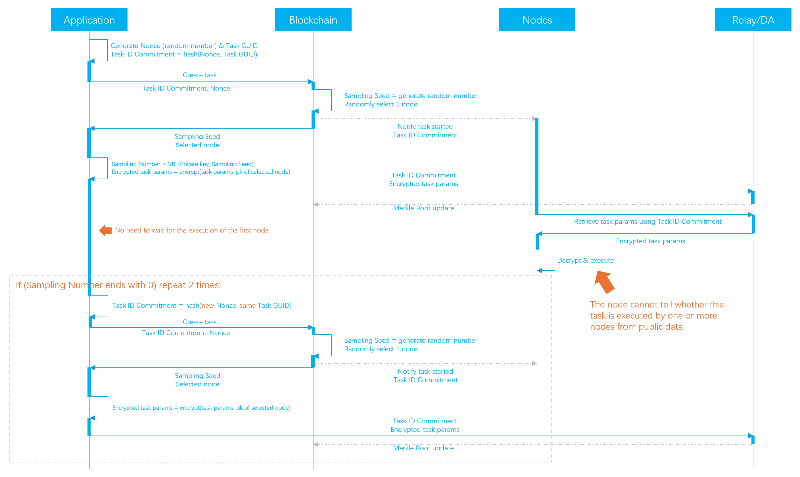

# VRF Task Sampling

## Task Creation

<figure><figcaption></figcaption></figure>

### Secret Selection of Tasks

The sampling process begins when the application sends a task to the blockchain. Upon receiving the task, the blockchain:

1. Generates a random number to be used as the `Sampling Seed` for the VRF.
2. &#x20;Randomly selects a qualified node to execute the task.

The application uses VRF locally to generate the `Sampling Number`, giving the `Sampling Seed` and its own private key as the VRF inputs.

With a 10% sampling probability, we could select the tasks for validation if their `Sampling Number` ends in 0.


The `Sampling Number` is only known to the application, since no one else knows the private key.

The application can not cheat on the `Sampling Number` either, since the `Sampling Seed` is fixed on the blockchain, and the public key of the application is fixed prior to the task, and is known to the blockchain.


### Uploading Task Params to the DA/Relay

Knowing which node will execute the task, the application encrypts the task parameters, like the prompt and image sizes, using the node's public key. It then sends the encrypted parameters to the DA/Relay service.

The task parameters can only be decrypted by the assigned node. Nodes cannot decrypt the parameters of other tasks, making it impossible to determine if a task will be validated by comparing task parameters.


The DA/Relay will periodically update its Merkle Root on the blockchain. Smart contracts can then use this to validate the integrity of specific off-chain data.

Crynux will leverage the Merkle Root and Zero-Knowledge Proofs to validate task parameters and results. More details will follow.


### Sending the Validation Tasks

If the task is not selected for validation, the application will simply stop and await the computing results. However, if the task is selected, the application must send two additional tasks with the same parameters for validation purposes.

The application will not get the computing result if the following validation tasks are not submitted or if they are submitted with inconsistent parameters. More details are provided in the next section.

