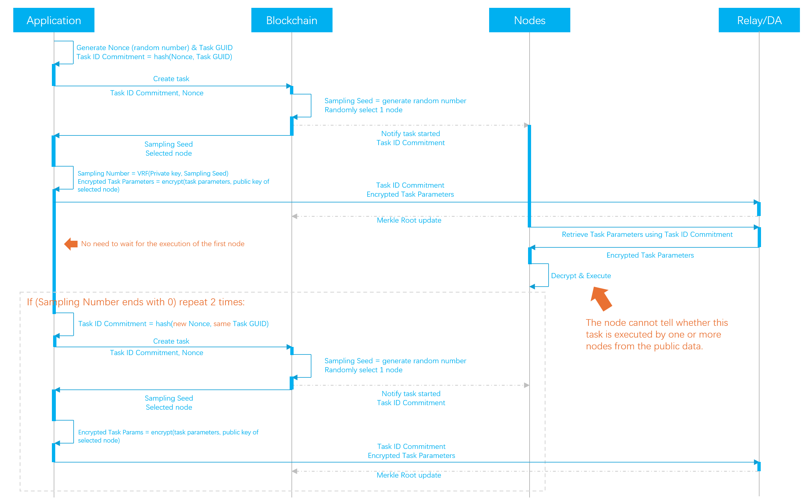
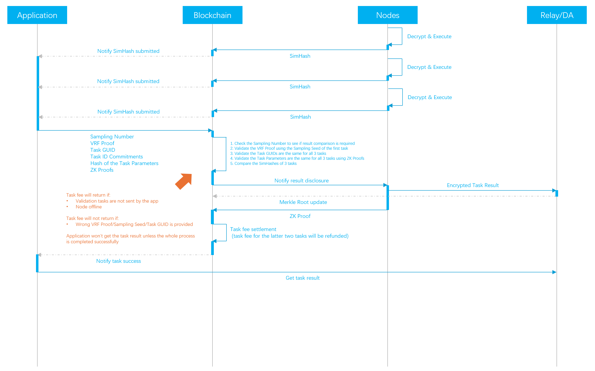

# VRF Task Sampling

## Task Creation

<figure><figcaption></figcaption></figure>

### Secret Selection of Validation Tasks

The sampling process begins when the application sends a task to the blockchain. Upon receiving the task, the blockchain:

1. Generates a random number to be used as the `Sampling Seed` for the VRF.
2. &#x20;Randomly selects a qualified node to execute the task.

The application uses VRF locally to generate the `Sampling Number`, giving the `Sampling Seed` and its own private key as the VRF inputs.

With a 10% sampling probability, we could select the tasks for validation if their `Sampling Number` ends in 0.

The `Sampling Number` is only known to the application, since no one else knows the private key.

The application can not cheat on the `Sampling Number` either, since the `Sampling Seed` is fixed on the blockchain, and the public key of the application is fixed prior to the task, and is known to the blockchain.

### Uploading Task Parameters to the DA/Relay

Knowing which node will execute the task, the application encrypts the task parameters, like the prompt and image size, using the node's public key. It then sends the encrypted parameters to the DA/Relay service.

The task parameters can only be decrypted by the assigned node. Nodes cannot decrypt the parameters of other tasks, making it impossible to determine if a task will be validated by comparing task parameters.


The DA/Relay will periodically update its Merkle Root on the blockchain. Smart contracts can then use this to validate the integrity of specific off-chain data.

Crynux will leverage the Merkle Root and Zero-Knowledge Proofs to validate task parameters and results. More details will follow.


### Sending the Validation Tasks

If the task is not selected for validation, the application will simply stop and await the computing results. However, if the task is selected, the application must send two additional tasks with the same parameters for validation purposes.


The application will not get the computing result if the validation tasks are not submitted or if they are submitted with inconsistent parameters. More details are provided in the next section.


The Task ID for each task is obscured by generating a `Task ID Commitment`. This commitment is a hash of the real task ID combined with a random number. For three tasks, each `Task ID Commitment` is derived from the same task ID but uses different random numbers, making them appear unrelated in public data. After execution, the application can reveal the real task ID on the blockchain so that the blockchain can find the related tasks and compare the results.

## Task Execution

Upon receiving a task from the blockchain, the node retrieves the task parameters from the DA/Relay service, decrypts them, and executes the task on the local GPU.

After the computation is finished, the node will calculate the `SimHash` of the result, and send the `SimHash` to the blockchain. Then the node should wait for a future notification from the blockchain. If the wait exceeds the timeout period, the node may abort the task. The task fee will then be refunded to the application.

The node cannot send the task result to the DA/Relay service at this stage. If the result is transmitted, the application could retrieve it prematurely and disrupt subsequent processes. The blockchain lacks mechanisms to identify and penalize the application in such scenarios.

## Task Validation

### Tasks Require Validation

<figure><figcaption></figcaption></figure>

The application will wait for the submission of all the 3 `SimHash` on the blockchain, and then disclose the relationship of the tasks, and the relevant proofs for the blockchain to validate:

#### Sampling Number Validation

The application sends the `VRF Proof` and the `Sampling Number` to the blockchain, and the blockchain validates the `Sampling Number` using the `VRF Proof` and the application's public key. This ensures that the `Sampling Number` is generated from the on-chain `Sampling Seed` and the application's private key.

If the `VRF Proof` is valid, the blockchain will verify whether the `Sampling Number` ends in 0. If valid, the blockchain confirms that the task was genuinely selected during the secret task selection.

#### Task Relationship Validation

The application sends the `Task ID Commitment` of all three tasks along with the actual `Task GUID` to the blockchain. The blockchain validates the `Task ID Commitment` with the previously uploaded `Nonce`, ensuring they are generated from the same `Task GUID`.

The task relationship validation ensures the application does not send misleading information to the blockchain, such as the combination of three irrelevant tasks, which could cause honest nodes to be penalized.

#### Task Parameters Validation

This validation ensures the `Task Parameters` provided by the application are consistent across all three nodes. Inconsistent parameters given to different nodes result in different `SimHash` being submitted to the blockchain, causing honest nodes to be penalized.

The validation is implemented using `Zero-Knowledge Proofs`. The application sends the hash of the `Task Parameters`, along with a `ZK Proof` to the blockchain.

The `ZK Proof` is constructed to use the plain text `Task Parameters` as the private input, and publicly outputs the hash of the `Task Parameters` and the hash of the cipher text of the `Task Parameters`. A valid `ZK Proof` ensures that:

1. The `Task Parameters` has the given hash value.
2. The `Task Parameters` are encrypted using the node's public key, and the cipher text has the given hash value.

The blockchain verifies the three hashes of the `Task Parameters` to ensure consistency across all three nodes.

The blockchain verifies the three hashes of the cipher text from the `Task Parameters` against the `Merkle Root` submitted by the DA/Relay. This ensures that the correct cipher texts have been uploaded to the DA/Relay service and are accessible to the nodes.

#### Task Result Validation

### Tasks Do Not Require Validation

## Task Result Disclosure
