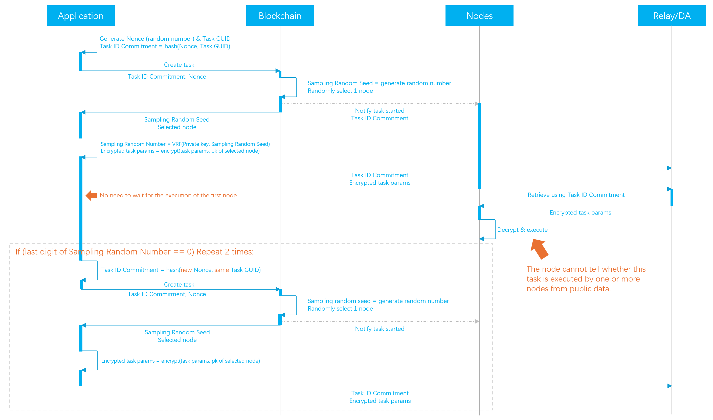

# VRF Task Sampling

## Task Creation

<figure><figcaption></figcaption></figure>

### Secret Selection of Tasks

The sampling process begins when the application sends a task to the blockchain. Upon receiving the task, the blockchain:

1. Generates a random number to be used as the `Random Seed` for the VRF.
2. &#x20;Randomly selects a qualified node to execute the task.

The application uses VRF locally to generate the `Sampling Number`, giving the `Random Seed` and its own private key as the VRF inputs.

With a 10% sampling probability, we could select the tasks for validation if their `Sampling Number` ends in 0.


The `Sampling Number` is only known to the application, since no one else knows the private key.

The application can not cheat on the `Sampling Number` either, since the `Random Seed` is generated on the blockchain, and the public key of the application is known to the blockchain. The `Sampling Number` is fixed to the application given the fixed `Sampling Seed`.


### Sending the validation tasks

