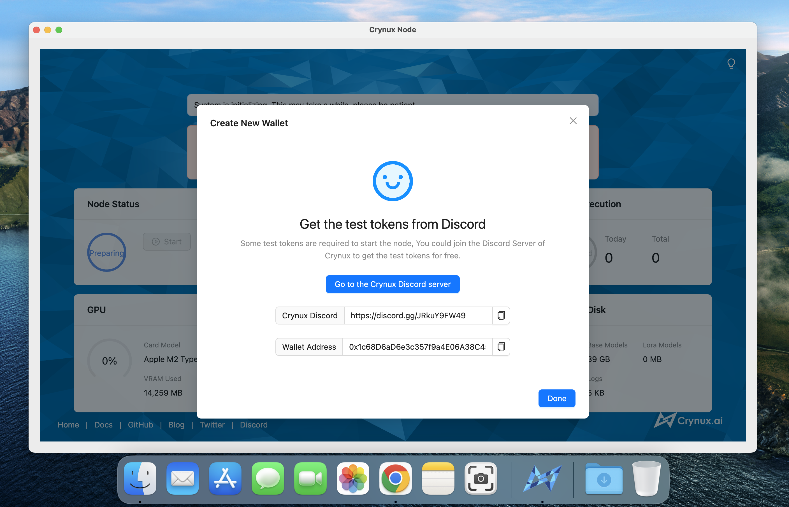
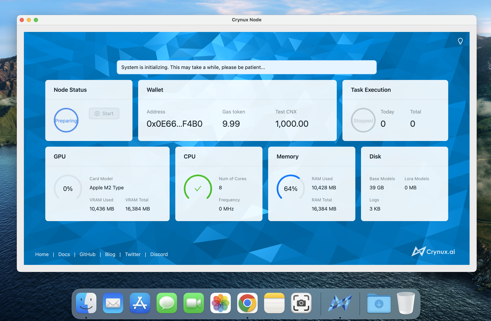
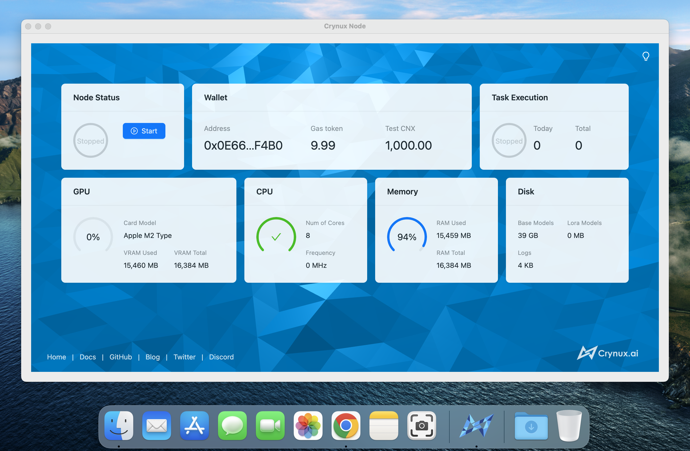
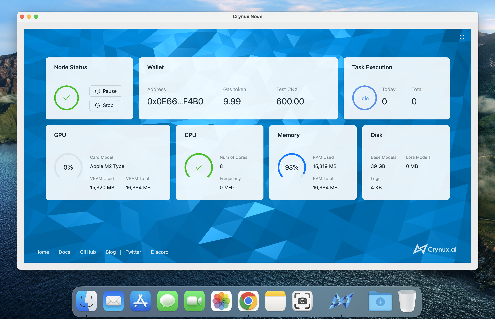

# Start a Node - Mac

## 1. Prerequisite

The Crynux Node supports only the Macs with the M1, M2, M3 or newer versions. Make sure your device meets the requirement before running the node.

<table><thead><tr><th width="187">Hardware</th><th>Requirements</th></tr></thead><tbody><tr><td>Model</td><td>Mac M1, M2, M3 or newer</td></tr><tr><td>Memory</td><td>16GB</td></tr><tr><td>Disk Space</td><td>60GB</td></tr><tr><td>Network</td><td>Public network access to Huggingface and Civitai</td></tr></tbody></table>

## 2. Download the Crynux Node software

Download the DMG file using the following link, double click the file, and drag the app to the application's folder:



## 3. Start the node

Double click on the icon of the newly installed app to start the node:

<figure><figcaption></figcaption></figure>

## 4. Prepare the wallet

A wallet with enough test tokens must be provided to the node. If this is the first time you start a node, click the "Create New Wallet" button and follow the instructions to create a new wallet and finish the backup of the private keys.

<figure><figcaption></figcaption></figure>

After the backup is completed, it is time to fill the wallet with some test tokens, the test tokens will be used to pay for the gas fees and the staking.

The test tokens can be acquired for free from the Discord server of Crynux, using the HappyAIGen bot. Go to the Discord server:



In the chat input bar of any channel, type in the following command:

```
/node wallet {address}
```

Remember to replace the `{address}` with the real wallet address from the node:

<figure><figcaption></figcaption></figure>

After the command is finished successfully, the test tokens should have already been transferred to your wallet. You could check the wallet balance in the UI of the node:

<figure><figcaption></figcaption></figure>

## 5. Wait for the system initialization to finish

If this is the first time you start a node, it could take quite a long while for the system to initialize. The most time consuming step is to download \~40GB of the commonly used model files from the Huggingface. The time may vary depending on your network speed.

After the models are downloaded, a test image generation task will be executed locally to examine the capability of your device. If the device is not capable to generate images, or the generation speed is too slow, the node will not be able to join the network. If the task is finished successfully, the initialization is completed:

<figure><figcaption></figcaption></figure>

## 6. Join the Crynux Network

Click the "Start" button to join the Crynux Network. After the transaction is confirmed on-chain, the node has successfully joined the network. When the node is selected by the network to execute a task, the task will start automatically, and the tokens will be transferred to the node wallet after the task is finished.

<figure><figcaption></figcaption></figure>

Now you could just leave it there to execute the tasks. When you shutdown the Crynux Node app, it will try to quit the network before exiting, so that new tasks will not be sent to the node any more. And the next time the app is started, it will join the network to receive new tasks automatically.
