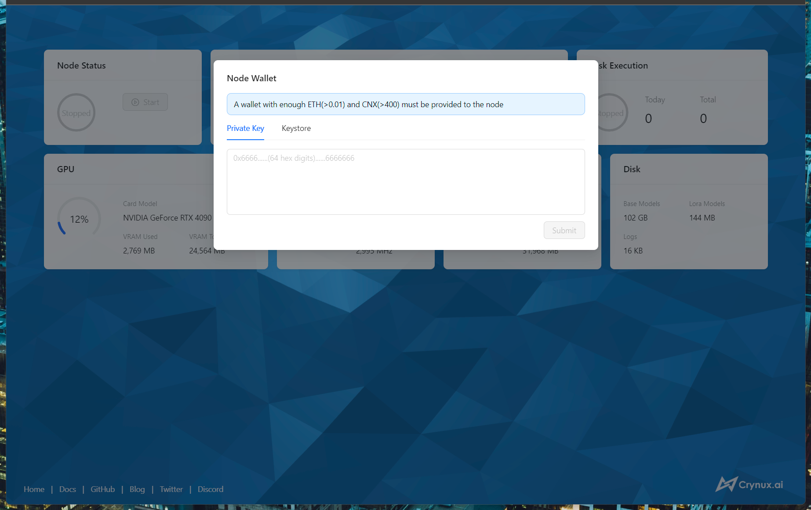
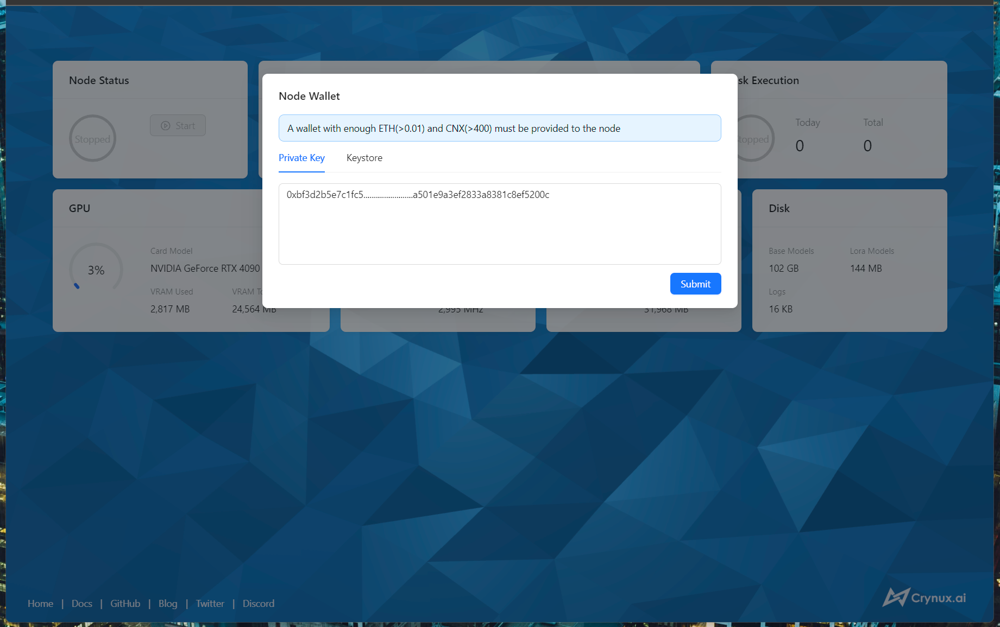
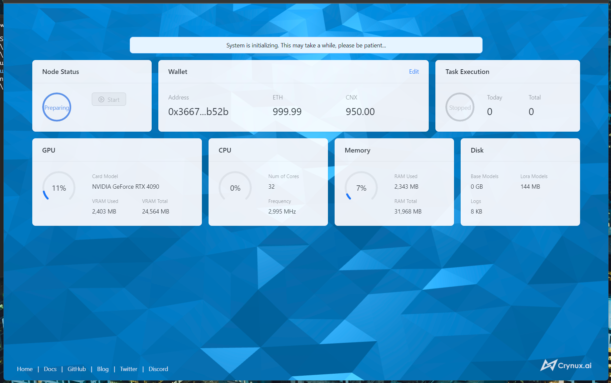
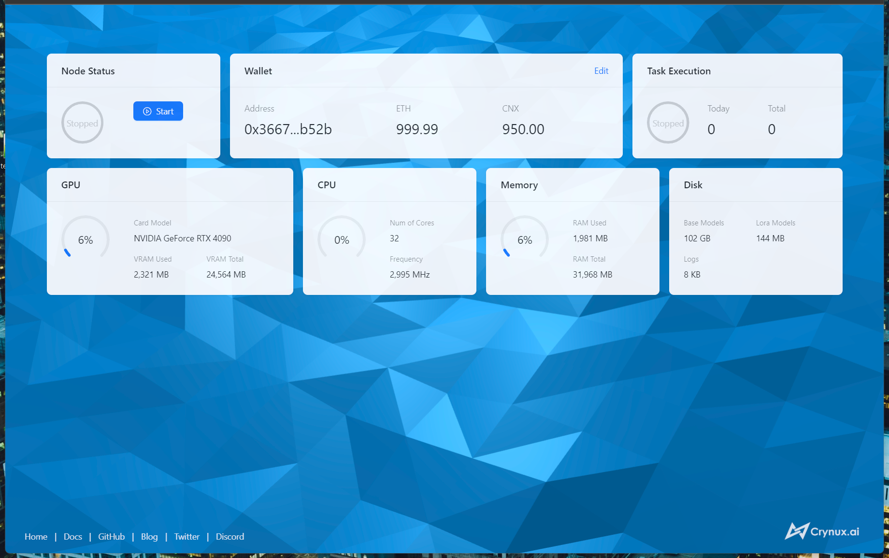
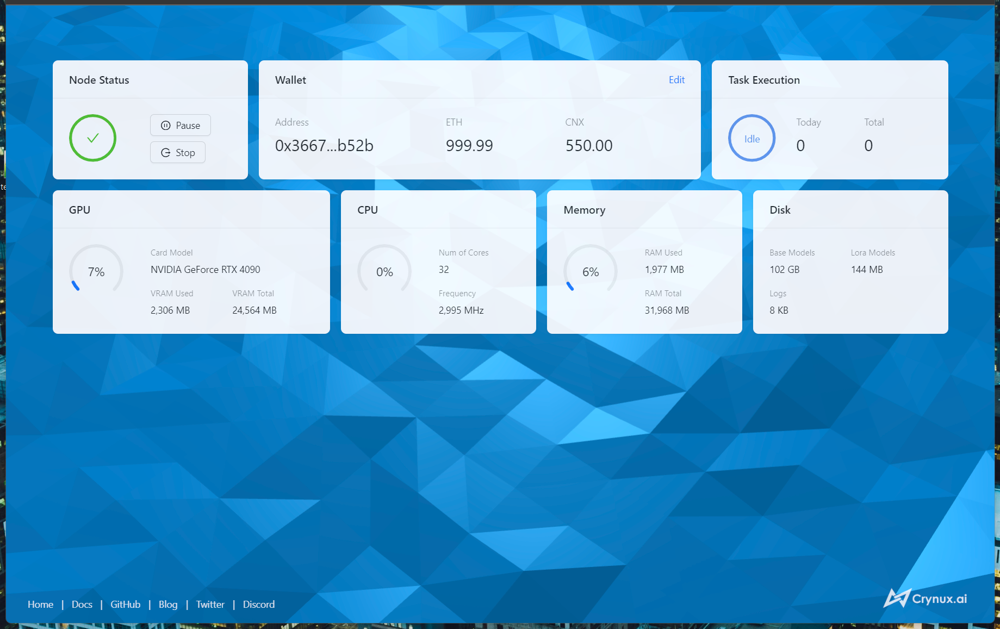

# Start a Node - Win/Linux

## 1. Prerequisite

Before you start, make sure your device meets the following requirements:

### Hardware requirements

<table><thead><tr><th width="187">Hardware</th><th>Requirements</th></tr></thead><tbody><tr><td>GPU</td><td>NVIDIA GPU with 8GB VRAM</td></tr><tr><td>Memory</td><td>16GB</td></tr><tr><td>Disk Space</td><td>60GB</td></tr><tr><td>Network</td><td>Public network access to Huggingface and Civitai</td></tr></tbody></table>

### Wallet requirements

* the private key or keystore of an Ethereum wallet
* \~**0.1** Test Gas Tokens
* **400 CNX** Test Tokens


Crynux Network is deployed on an Ethereum compatible **private** Blockchain. **No real ETH and CNX tokens are used**. You could[ join the Discord Server of Crynux and bind your wallet address](https://docs.crynux.ai/happyaigen#bind-the-wallet-address) using the bot to get the test tokens.


## 2. Install the software

### Install the latest NVIDIA driver

Download the latest NVIDIA driver from the [NVIDIA official website](https://www.nvidia.com/Download/index.aspx?lang=en-us), and finish the installation.

### Install the latest version of Docker

Download the latest version of the [Docker Desktop](https://docs.docker.com/get-docker/), and finish the installation.

<details>

<summary>If you have 16GB of memory and use Docker with WSL2 on Windows</summary>

The memory limit for WSL is default to 8GB, which is not enough to run the Node. You will have to change the default settings using a [`.wslconfig`](https://learn.microsoft.com/en-us/answers/questions/1296124/how-to-increase-memory-and-cpu-limits-for-wsl2-win) file to allow WSL to use 16GB memory.

</details>

## 2. Start the node using the Docker image

#### a. Pull the Docker image from GitHub

Make sure the Docker daemon is started, and run the following command in a terminal:

```sh
docker pull ghcr.io/crynux-ai/crynux-node:latest
```

#### b. Start the Docker container

Run the following command in a terminal:

```sh
docker run -d -p 127.0.0.1:7412:7412 --gpus all ghcr.io/crynux-ai/crynux-node:latest
```

The port `7412` is exposed for the WebUI. And GPUs must be provided to the container.

#### c. Visit the WebUI in the browser

Open the browser and go to [http://localhost:7412](http://localhost:7412)

You should see the WebUI of the Node:

<figure><figcaption><p>The Initial Interface of the WebUI of the Node</p></figcaption></figure>

The Node has been started successfully. But the node is not yet ready to join the network and accept tasks before the next steps are completed.

## 3. Configure the wallet in the WebUI

The node is waiting for a wallet to be configured at this time. Paste the private key of the wallet, or the keystore, into the form:

<figure><figcaption><p>Input the Private Key of the Wallet</p></figcaption></figure>

After clicking Submit, the address of the wallet should be displayed on the webpage, which means the wallet has been configured successfully:

<figure><figcaption><p>Preparing</p></figcaption></figure>

The Node is now downloading the frequently used models such as the Stable Diffusion 1.5. About 30GB of models will be downloaded during this preparing phase. And this is a one-time operation, please be patient to wait.&#x20;

After the downloading is finished, you will be able to control the node to join the network:

<figure><figcaption><p>Ready to Start</p></figcaption></figure>

## 4. Control the node in the WebUI

&#x20;Click the Start button, after a short while, the Node will be added to the network, waiting for incoming tasks:

<figure><figcaption><p>Node is Running and Waiting for the Tasks</p></figcaption></figure>

Now the Node is fully up and running. You could just leave it there to run tasks automatically.

The Node could be paused or stopped at any time by clicking the control buttons. If the node is in the middle of running a task, after clicking the buttons, the node will go into the "pending" status and continue with the running task. When the task is finished, the node will pause/stop automatically.

The difference between pausing and stopping is that pausing will not cause the staked CNX tokens to be returned, so that the transaction costs less gas fee than stopping. If you have a plan of going back, you could use pausing rather than stopping.&#x20;
