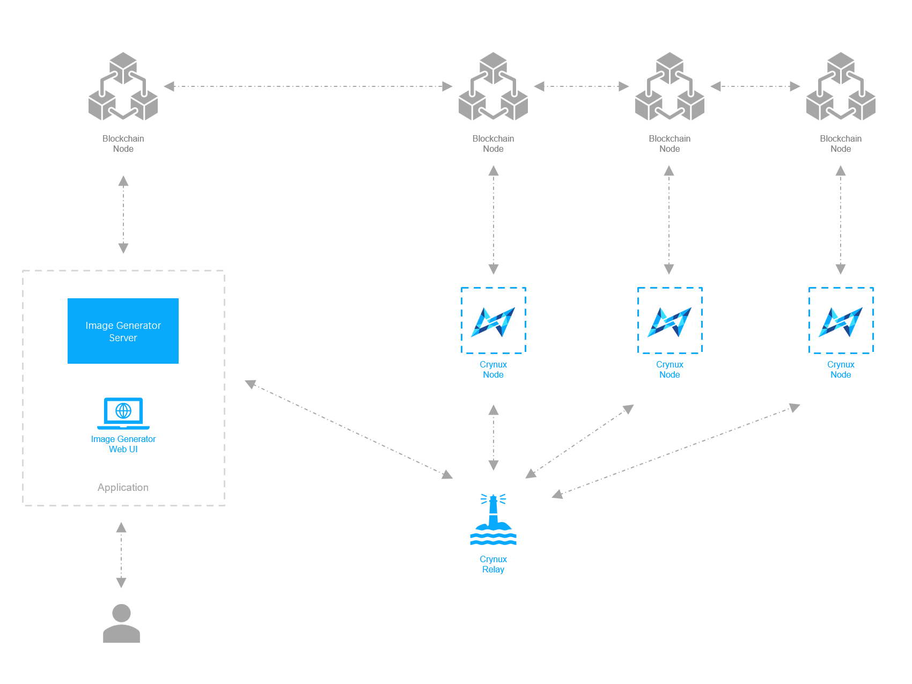

# Network Architecture

The Hydrogen Network is illustrated in the graph below:

<figure><figcaption>
The Hydrogen Network Architecture
</figcaption></figure>

The core participants in the network are the **Nodes** and the **Applications**. The nodes provide computing power to the network, executing the Stable Diffusion image generation tasks from the applications, and receive tokens as the reward. The applications send the tasks to the nodes, paying with tokens, and get the images back.

Each of the nodes and the applications will start a **Blockchain node**, and communicate with each other using it. The Blockchain executes a consensus mechanism to make sure no one is cheating: the nodes could never use the fake images to get rewards, and the applications could never get the images without paying.

Beside the Blockchain, the nodes and applications will also communicate through the **Relay**, to send data such as the task arguments and the images, which are too large to be stored on chain. These data are sent between the applications and the nodes directly, thus causes the data availability problem and the network reachability problem. The Relay stands between the nodes and the applications as a reliable intermediate to solve these problems.

## The Node

The Node, once started, constantly monitors the Blockchain for new tasks.&#x20;

When a new task arrives, the Node connects to the Relay to get the detailed task arguments, such as the ID of the base model on Huggingface, and the URL of the LoRA model on Civitai. Then the node executes the task on the local hardware, producing the result images.

> A general framework has been developed to support most of the popular configurations in a Stable Diffusion image generation task, such as LoRA, Controlnet and Textual Inversion. The details on how to define a Stable Diffusion task can be found [in this doc](../application-development/stable-diffusion-task.md).

After the images are generated, the node executes the consensus protocol to proof to the Blockchain that it is not cheating. The consensus protocol requires the node to calculate the p-hash of the images and disclose the p-hash on the Blockchain. The p-hash is compared to the p-hashes generated by the other two nodes on-chain. If the p-hashes are the same (similar under a given threshold), the tokens are paid to the nodes. Otherwise the node will be slashed, the tokens staked by the node will be transferred to the incentivization pool, and the node will be kicked out of the network.

The details of the consensus protocol is described [in this doc](consensus-mechanism.md). &#x20;

The source code of the Node of the Hydrogen Network could be found in the repository [https://github.com/crynux-ai/h-node](https://github.com/crynux-ai/h-node).

## The Application

The source code of the Image Generator could be found at:

Backend: [https://github.com/crynux-ai/ig-server](https://github.com/crynux-ai/ig-server)

Web UI: [https://github.com/crynux-ai/ig-web](https://github.com/crynux-ai/ig-web)

## The Blockchain

## The Relay

The source code of the Relay could be found at:

[https://github.com/crynux-ai/h-relay](https://github.com/crynux-ai/h-relay)

