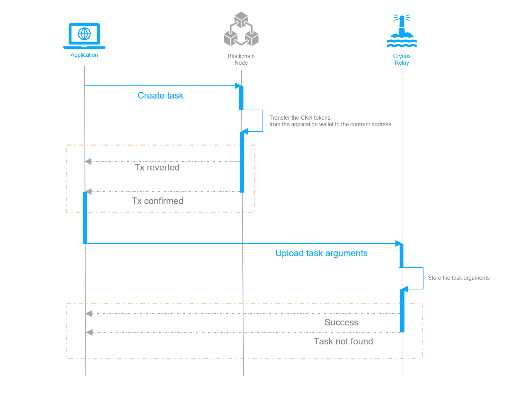
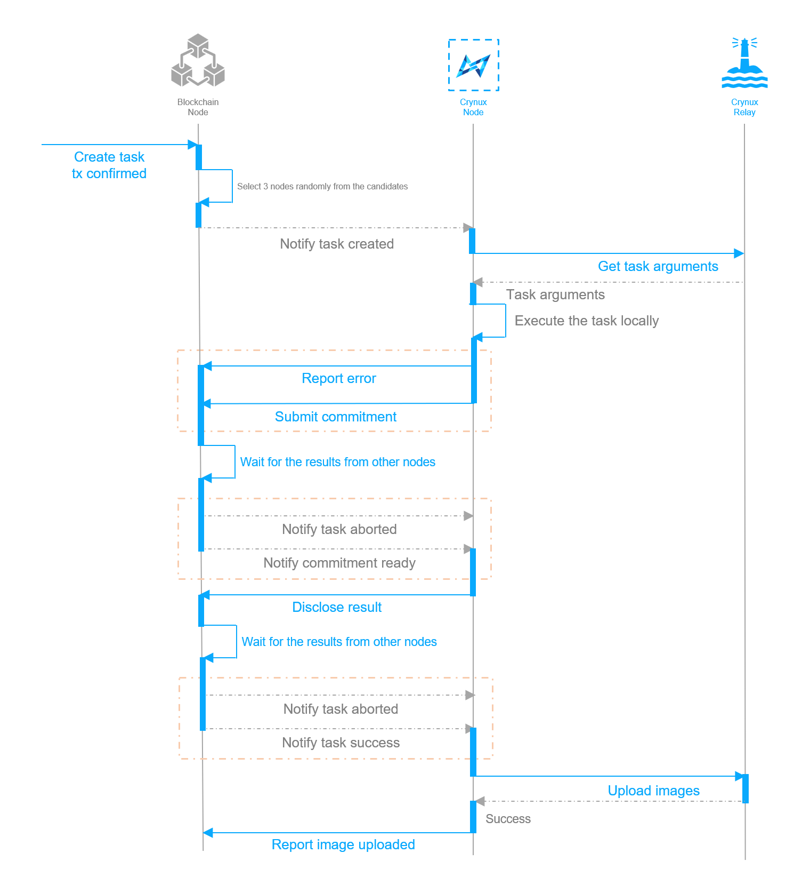
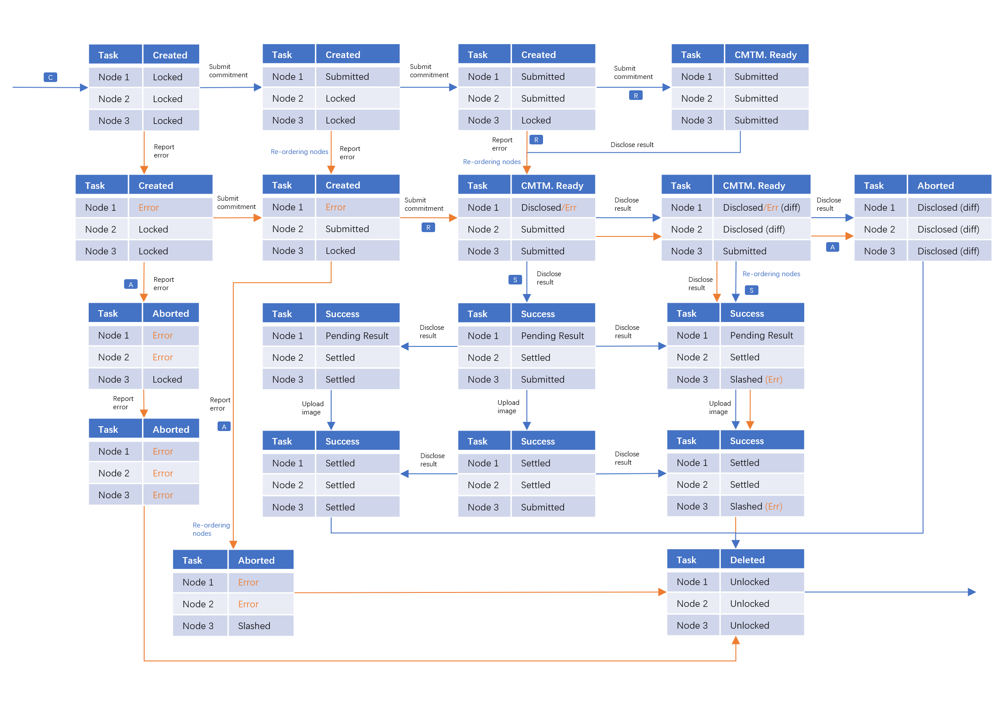
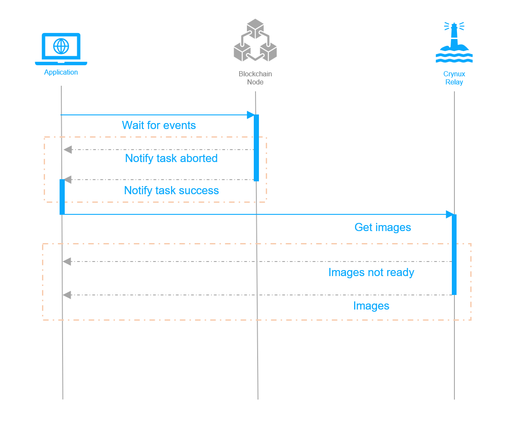

# Task Lifecycle

The task is firstly created on the Blockchain, by the application. The Blockchain dispatches the task to 3 randomly selected nodes. The nodes execute the task, and report the results to the Blockchain. The Blockchain validates the results, if correct, pays tokens to the nodes. After the images are uploaded to the Relay, the task is finished.

The node joins the Hydrogen Network by staking certain amount of tokens. After the staking, the node will be in the candidate list to be selected by the Blockchain.

The task lifecycle could be divided into 3 parts:

## Task Creation

<figure><figcaption>
The Sequential Graph of Task Creation
</figcaption></figure>

The task creation is initiated by the application. The application signs a transaction, invoking the smart contract to create the task on the Blockchain.

The transaction might be reverted, due to several reasons:

* Not enough CNX tokens left in the application's wallet.
* Not enough CNX allowance left for the task contract to spend.
* Not enough nodes available in the network.

The Blockchain will transfer the required amount of CNX tokens from the application's wallet to the address of the task contract, which will be paid to the nodes, by the Blockchain, if the task is completed successfully.

The Blockchain then randomly selects 3 available nodes to execute the task. The transaction is completed with 3 emitted events to notify the selected nodes.

The application will upload the task arguments to the relay when the transaction is confirmed. The relay will allow the uploading only when it receives the task created event from the Blockchain, the application might have to wait for a short period before the uploading can be successful.

After the task arguments are uploaded to the relay, the task creation process is completed.

## Task Execution

<figure><figcaption>
The Sequential Graph of Task Execution
</figcaption></figure>

When the node receives the `TaskCreated` event, it will start to execute the task locally.

The execution starts by fetching the task arguments from the relay. The node will check the local existence of the models specified in the task arguments. If the models are not cached locally, they will be downloaded.

If the model download link or the Huggingface ID is **confirmed** to be invalid, such as a 404 response from Civitai, the node will report error to the Blockchain. If there are network issues during the download, the node will retry the download several times until the timeout period is reached. The task will be cancelled by the node if the timeout is reached.

The task is then sent to the execution engine. If the execution engine finds out that the task is misconfigured, such as an SDXL LoRA model combined with an SD1.5 base model, it will report the error to the Blockchain.

When the task has finished successfully, the node has the result images. It will calculate the pHash of the images, and then goes into a 2-phase result disclosure process to disclose the pHashes on the Blockchain.

The reason for this process is explained in the consensus protocol:


[consensus-protocol.md](consensus-protocol.md)


The disclosure process starts by submitting a hash of the combination of the pHash and a random number, and then submitting the actual pHash to the Blockchain.

The Blockchain compares the pHashes from all the 3 nodes to determine whether the result is correct, and whether the nodes are cheating.

If one of the node have submitted a different pHash (the hamming distance is larger than a threshold) than the others, the node will be slashed. The staked tokens will be transferred to the incentivization pool, and the node will be kicked out of the network. But as long as there are two nodes that have submitted the same pHash, the task is a success to the Blockchain as well as to the applications. If all the 3 pHashes are different, the task is aborted with a `TaskAborted` event emitted.

The `TaskSuccess` event will be emitted to notify the relevant parties to continue the next steps.

Below is a state transition graph to list all the possible state of the task and the nodes:

<figure><figcaption>
Task State Transition Graph
</figcaption></figure>

The orange color indicates all the possible states and transitions of the task containing reported errors. The single-letter tag with blue background on the transition line indicates an emitted event.

&#x20;The `TaskSuccess` event selects one of the nodes to upload the images to the relay. The selected node, after receiving the `TaskSuccess` event, will upload the images to the relay, and then report to the Blockchain that the images have been uploaded. The Blockchain will mark the task as completed then, the state storage for the task on-chain will be cleared.

## Result Retrieval

<figure><figcaption>
The Sequential Graph of Result Retrieval
</figcaption></figure>
