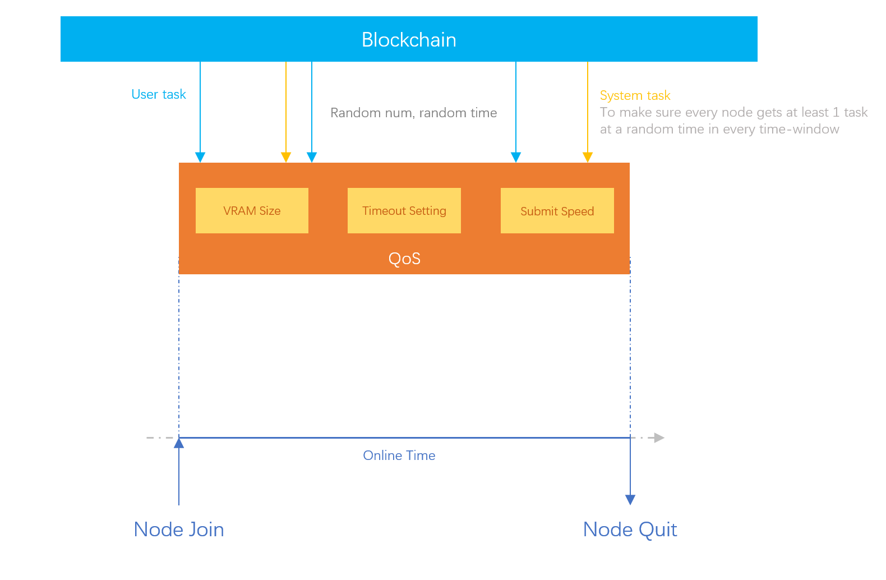
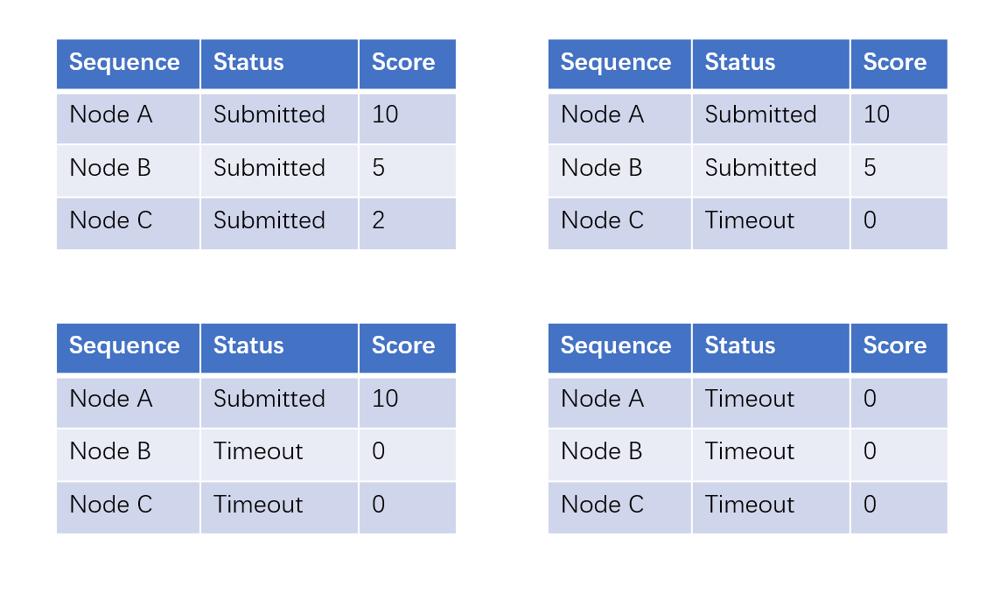

# Token Economy


The token economy is still a work-in-progress. A lot of simulations and discussions around the mechanism are taking place. Dramatic changes around every aspect of the design should be expected.


CNX token is the utility token that enables the trading of the computation power (and the models and dataset later) inside the Crynux Network. The applications pay CNXs to execute their AI tasks, and the nodes earn CNXs by executing the tasks.

Beside receiving the task fees paid by the applications, the nodes get extra rewards from the token mining mechanism as well. By providing higher quality service and longer serving time, the nodes will get more shares from the newly minted tokens.

The CNX token has a total supply of <mark style="color:blue;">**8,617,333,262**</mark>. Which is the first 10 digits of the Boltzmann constant.  <mark style="color:blue;">**1,723,466,652 (20%)**</mark>  of the tokens will be minted at the mainnet release, which will be used to bootstrap the network. And the rest part, 80%, will be minted and distributes to the nodes according to the 2 rules below:

## Node Mining

At the bootstrapping of the network, there must be enough nodes joining the network, before the applications could use the network to execute their tasks.

<mark style="color:blue;">**3,446,933,305 (40%)**</mark> tokens will be given to the nodes regardless of the number of the tasks they have executed.

Every month, a certain amount of tokens will be generated. The tokens will be distributed to the nodes according to their accumulative online time. And the tokens will be locked for 3 months before the nodes can freely transfer them.

### QoS Weighted Online Time

To encourage the nodes to provide better service to the network, i.e. faster response time, faster execution and shorter timeout period, a QoS (Quality of Service) score is introduced to evaluate the overall quality of the node. The QoS score is used to weight the online time of the node so that under the same online time, the node providing higher quality service gets more rewards.

The number of the tokens one node could get in a month is given by:

$$
t_m^a = \frac{s_m * T_a}{\sum_{i=1}^n s_i}
$$

Where $$T_a$$ is the total number of the tokens generated for month $$a$$, and $$s_i$$ is the QoS weighted online time of the $$i$$'s node in this month, $$m$$ is the index of the current node, and $$n$$ is the total number of nodes in the network.

The QoS weighted online time $$s_i$$ is calculated as following:

$$
s_i = Q_i * A_i
$$

Where $$Q_i$$ is the QoS score of the node this month, and $$A_i$$ is the total online time of the node in hours.

$$Q_i$$ is normalized to be in the range $$[0, 1]$$, three factors are taken into consideration: the VRAM size of the node, the timeout period setting of the node and the average submission speed of the tasks.

$$
Q_i = \alpha R_i + \beta P_i + \gamma B_i
$$

Where $$R_i$$, $$P_i$$, $$B_i$$ are the normalized scores of the VRAM size, the timeout period and the submission speed respectively. And $$\alpha$$, $$\beta$$, $$\gamma$$ are the weights of the factors.

<figure><figcaption>
QoS Score Calculation
</figcaption></figure>

#### The VRAM Size

The VRAM size is a critical factor that determines how many types of the AI tasks a node could support. For example, an SDXL image generation task will require roughly 12GB of VRAM. If running on an NVIDIA graphic card that has only 6GB of VRAM, the task will fail with a CUDA OOM error.

Comparing to the VRAM, the GPU frequency (and bandwidth) affects only the speed of the execution. For example, both NVIDIA RTX 4060 and RTX 3060 have the same VRAM size of 8GB. They will be able to run the same set of the tasks in the Crynux Network, it is just the execution time will be longer for the old 3060 card.

By including the VRAM size in the QoS score, Crynux Network will give more rewards to the nodes who have spent more money on the larger cards, which will allow the Crynux Network to run the larger tasks.

The VRAM size score $$R_i$$ is calculated by dividing the VRAM size of the node by the max VRAM size in the network:

$$
R_i = \frac{V_i}{max(V_j | j \in N )}
$$

Where $$V_i$$ is the VRAM size of the $$i$$th node in bytes, and $$N$$ is the collection of all the nodes in the network.

#### The Timeout Setting

According to the [Consensus Protocol](consensus-protocol.md), the nodes could perform the Timeout Attack to earn tokens for free. The solution is to limit the interest rate by increasing the timeout period and the staking amount.

However, longer timeout period makes the applications wait longer if something is wrong with the task,   which is bad for the user experience. And the nodes will also be hurt since they could run less tasks in the same time range.

By staking more tokens, the node could decrease its timeout period while still maintaining a safe interest rate that is acceptable by the network. Crynux Network encourages the nodes to set a shorter timeout by giving more incentives to them, thus increasing the overall responsiveness of the whole network.

The timeout settings score $$P_i$$ is calculated by normalizing the timeout period between the minimum timeout period allowed in the network, and the maximum timeout period set by the node in the network.

$$
P_i = 1 - \frac{O_i}{max(O_j | j \in N) - O_{min}}
$$

$$O_i$$ is the timeout period in seconds, and $$O_{min}$$ is the minimum timeout period allowed by the network.

#### The Submission Speed

There are quite a lot of factors that affect the submission speed of the node. Such as the network quality, the GPU frequency, the number of the tensor cores, and even the system memory speed. Crynux Network encourages faster submission of the tasks to improve the application's experience. By introducing competition between the nodes who are selected for the same task, giving different rewards to the nodes according to their submission order, Crynux Network rewards the improvement the node has made on all the submission speed related factors as a whole.

**Round score:** There are two rounds of submission in a single task: result commitment and result disclosure. For each round, the Crynux Network records the order of submission of the nodes, and assigns higher score to the nodes who have submitted earlier. The round score $${rs}_i$$ a node could get in a round $$i$$ can be visualized as:&#x20;

<figure><figcaption>
The round score of a node by its submission order and status
</figcaption></figure>

**Task score:** the task score a node gets for the $$i$$th task $${ts}_i$$ is calculated simply by summing up the scores the node gets for all the rounds in the task:

$$
{ts}_i = {rs}_c + {rs}_d
$$

where $${rs}_c$$ is the round score of the commitment round, and $${rs}_d$$ is the round score of the disclosure round.

**Node score:** the node score is calculated by averaging all the scores the node gets for all the tasks it received in the month:

$$
{ns}_i = \frac{\sum_{j=1}^n {ts}_j}{n}
$$

Where $$n$$ is the total number of the tasks the node has executed in this month.


Note that if there are no nodes that have submitted result in a task. It is highly likely that the task is itself misconfigured, and the task score is simply ignored, and will not be included in the average score calculation.


Finally, the score a node gets for the submission speed factor is calculated by normalizing the node score above to be a fraction between the max node score in the network and zero:

$$
B_i = \frac{ {ns}_i} {max({ns}_j | j \in N )}
$$

The exact number of the tokens to be generated each month is calculated by the exponential decay equation of 5-year half-life below:

$$
T_A^a = \hat{T}_A * (1 - e^{\frac{-a * \ln{2}}{60}})
$$

Where $$\hat{T}_A$$ is the total number of tokens given for the node mining.

<figure><figcaption>
Total tokens mined for a month in the node mining 
</figcaption></figure>

## Task Mining

The node mining schema above tends to encourage the nodes to join the network regardless of the number of the applications, and tasks. It is required as a bootstrapping strategy for the network, however, if there are not enough applications following, in a very long time, to join the network, using tokens to purchase the computation power, there will be no one to purchase the tokens from the nodes, who will be getting too many tokens with no one to sell them to. The tokens will become worthless, and the ecosystem will crash eventually.

To avoid the problem, only a portion (40%) of the tokens are given in the node mining schema above. The rest, which is <mark style="color:blue;">**3,446,933,305 (40%)**</mark> tokens, will be distributed to the nodes as rewards, only when the actual computation happens.

The tokens will be generated every month. The number is determined by the total number of the tasks that have been executed in the whole network during the past month. The tokens will be distributed equally to every successful task, and then equally to the 3 nodes participating in the task.

Just like in [Filecoin](https://spec.filecoin.io/#section-systems.filecoin\_token.block\_reward\_minting.baseline-minting), by giving an estimation of the number of the nodes at current month under a target growth curve, we could estimate a number of the tasks that should be executed at current month. An “effective network time” is calculated based on the estimated number of the tasks and the number of the tasks the network has actually executed in the month. The number of the tokens to generate is then given by an Avrami equation at the effective network time.

The effective network time could be seen as the real position of where we are, on the estimated timeline of how many tasks should be executed at a give month. If the network has actually executed more tasks that the estimated number, we are ahead of the time (the effective network time will be larger than the actual time), and more tokens will be generated. And if the network has executed less tasks than expected, the effective network time will be smaller than the actual time, and less tokens will be generated.

<figure><figcaption></figcaption></figure>

The incentivization is taking place at the early stage of the network growth, it is reasonable to assume that the number of the nodes, and the applications, should grow exponentially. The target number of the nodes at a given month is defined by:

$$
N_a = b_0 * e ^ {ga}
$$

And the number of the tasks that should be executed by these nodes in a month can be estimated as:

$$
K_a = \mu(a) * \frac{86400 * 30 * N_a}{3 * \hat{t}}
$$

Where $$\hat{t}$$ is the estimated time required to execute a task. The number 3 at the denominator means that the execution of one task requires 3 nodes. And $$\mu$$ is the network utilization rate at time $$a$$. The network utilization is set to be starting at a relatively low ratio, and growing exponentially in time:

$$
\mu(a) = 1 - e^{\frac{- a * \ln{2}}{288}}
$$

The cumulative number of the tasks executed at a given time a is then given, discretely, as:

$$
K = \sum_{i=1}^a K_i
$$

As the graph shows above. In which we choose the busy ratio $$\alpha$$ to be 1%, and the task execution time $$\hat{t}$$ to be 60 seconds. $$b_0$$ is set to be 2000, and $$g$$ 0.05.

When a month ends, and the total number of the tasks that have been executed has been determined. We could find the corresponding effective network time $$t$$ in the graph above. Given the time $$t$$, if it has increased by 1, discretely, the network will generate new tokens, the number of the tokens to generate is determined by the Avrami equation below:

$$
T_B^a = \hat{T}_B * (1 - e^{-0.0003 * (0.5 * a + 0.8) ^ 2})
$$

Where $$\hat{T}_B$$ is the total number of the tokens given for the task mining.

The Avrami equation will enforce a healthier network growth in the long term. Compared to the exponential decay, the Avrami equation increases slower at the very beginning of the time, which avoids the problem of distributing too many tokens to just a few nodes. The increasing speed goes higher at the middle age of the time, which contributes more power to the effective growth of the network. Less tokens will be generated at the ending time, since we have enough nodes in the network already, and hopefully the nodes are getting enough rewards from executing the tasks.

<figure><figcaption></figcaption></figure>


The [Avrami equation](https://en.wikipedia.org/wiki/Avrami\_equation) describes how solids transform from one phase to another at constant temperature. It can specifically describe the kinetics of [Crystallization ](https://en.wikipedia.org/wiki/Crystallization)and [Nucleation](https://en.wikipedia.org/wiki/Nucleation). Which is also the source of the project name Crynux (Cry-Nux).


Note that if the effective network time $$t$$ is increased not larger than 1, no tokens will be generated under task mining.
