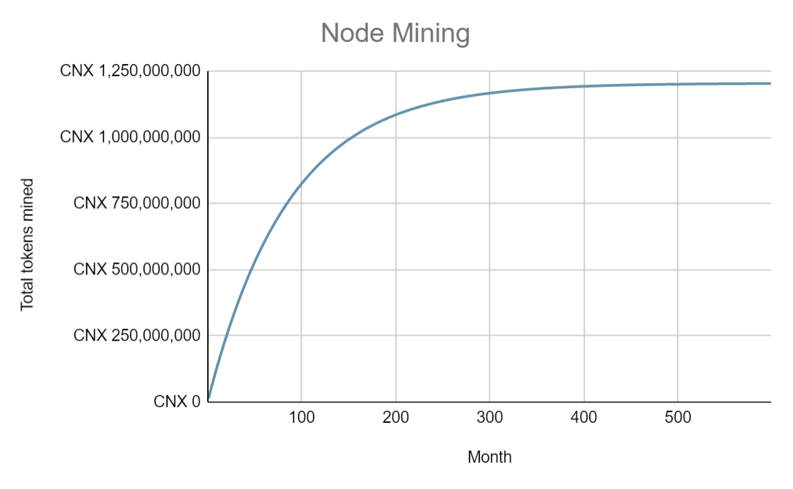
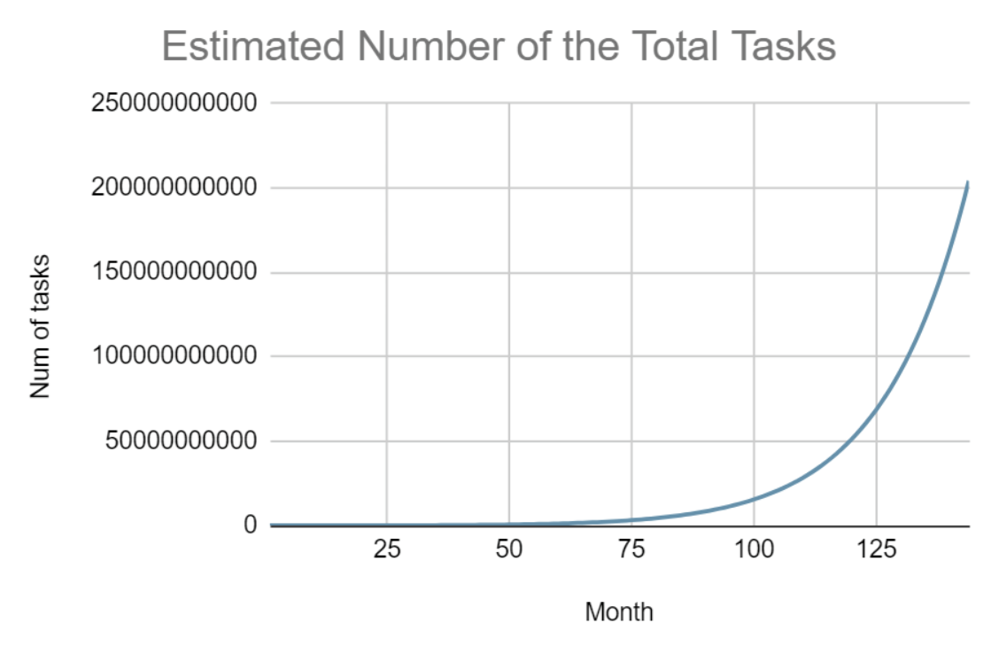
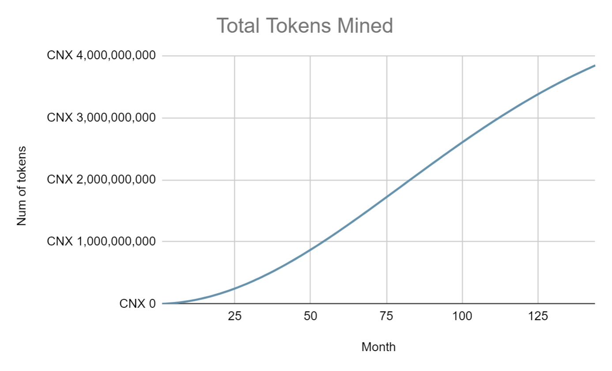

# Token Economy


The token economy is still a work-in-progress. A lot of simulations and discussions around the mechanism are taking place. The coefficients in the equations are subject to change. The estimations might be adjusted as well.


CNX token is the utility token that enables the trading of the computation power (and the models and dataset later) inside the Crynux Network. The applications pay CNXs to execute their AI tasks, and the nodes earn CNXs by executing the tasks.

The CNX token has a total supply of <mark style="color:blue;">**8,617,333,262**</mark>. Which is the first 10 digits of the Boltzmann constant.

## Pre-mining

At the mainnet release, <mark style="color:blue;">**2,585,199,979 (30%)**</mark> tokens will be pre-mined for the bootstrapping of the project which will be distributed according to the vesting schedule below:

<figure><figcaption></figcaption></figure>

## Node Mining

At the bootstrapping of the network, there must be enough nodes joining the network, before the applications could use the network to execute their tasks.

<mark style="color:blue;">**1,206,426,657(14%)**</mark> tokens will be given to the nodes regardless of the number of the tasks they have executed.

Every month, a certain amount of tokens will be generated. The tokens will be distributed to the nodes according to their accumulative online time. And the tokens will be locked for 3 months before the nodes can freely transfer them.

The number of the tokens one node could get in a month is given by:

$$
t_m^a = \frac{o_m * T_a}{\sum_{i=1}^n o_i}
$$

Where $$T_a$$ is the total number of tokens generated for month $$a$$, and $$o_i$$ is the total online time of the $$i$$'s node in this month, $$m$$ is the number of the current node, and $$n$$ is the total number of nodes in the network.

The exact number of the tokens to be generated each month is calculated by the exponential decay equation of 5-year half-life below:

$$
T_A^a = \hat{T}_A * (1 - e^{\frac{-a * \ln{2}}{60}})
$$

Where $$\hat{T}_A$$ is the total number of tokens given for the node mining.

<figure><figcaption>
Total tokens mined for a month in the node mining 
</figcaption></figure>

## Task Mining

The node mining schema above tends to encourage the nodes to join the network regardless of the number of the applications, and tasks. It is required as a bootstrapping strategy for the network, however, if there are not enough applications following, in a very long time, to join the network, use tokens to purchase the computation power, there will be no one to purchase the tokens from the nodes, who will be getting too many tokens with no one to sell them to. The tokens will become worthless, and the ecosystem will crash eventually.

To avoid the problem, only a small portion (14%) of the tokens are given in the node mining schema above. The rest, which is <mark style="color:blue;">**4,825,706,627**</mark><mark style="color:blue;">** **</mark><mark style="color:blue;">**(56%)**</mark> tokens, will be distributed to the nodes as rewards, only when the actual computation happens.

The tokens will be generated every month. The number is determined by the total number of the tasks that have been executed in the whole network during the past month. The tokens will be distributed equally to every successful task, and then equally to the 3 nodes participating in the task.

Just like in [Filecoin](https://spec.filecoin.io/#section-systems.filecoin\_token.block\_reward\_minting.baseline-minting), by giving an estimation of the number of the nodes at current month under a target growth curve, we could estimate a number of the tasks that should be executed at current month. An “effective network time” is calculated based on the estimated number of the tasks and the number of the tasks the network has actually executed in the month. The number of the tokens to generate is then given by an Avrami equation at the effective network time.

The effective network time could be seen as the real position of where we are, on the estimated timeline of how many tasks should be executed at a give month. If the network has actually executed more tasks that the estimated number, we are ahead of the time (the effective network time will be larger than the actual time), and more tokens will be generated. And if the network has executed less tasks than expected, the effective network time will be smaller than the actual time, and less tokens will be generated.

<figure><figcaption></figcaption></figure>

The incentivization is taking place at the early stage of the network growth, it is reasonable to assume that the number of the nodes, and the applications, should grow exponentially. The target number of the nodes at a given month is defined by:

$$
N_a = b_0 * e ^ {ga}
$$

And the number of the tasks that should be executed by these nodes in a month can be estimated as:

$$
K_a = \mu(a) * \frac{86400 * 30 * N_a}{3 * \hat{t}}
$$

Where $$\hat{t}$$ is the estimated time required to execute a task. The number 3 at the denominator means that the execution of one task requires 3 nodes. And $$\mu$$ is the network utilization rate at time $$a$$. The network utilization is set to be starting at a relatively low ratio, and growing exponentially in time:

$$
\mu(a) = 1 - e^{\frac{- a * \ln{2}}{288}}
$$

The cumulative number of the tasks executed at a given time a is then given, discretely, as:

$$
K = \sum_{i=1}^a K_i
$$

As the graph shows above. In which we choose the busy ratio $$\alpha$$ to be 1%, and the task execution time $$\hat{t}$$ to be 60 seconds. $$b_0$$ is set to be 2000, and $$g$$ 0.05.

When a month ends, and the total number of the tasks that have been executed has been determined. We could find the corresponding effective network time $$t$$ in the graph above. Given the time $$t$$, if it has increased by 1, discretely, the network will generate new tokens, the number of the tokens to generate is determined by the Avrami equation below:

$$
T_B^a = \hat{T}_B * (1 - e^{-0.0003 * (0.5 * a + 0.8) ^ 2})
$$

Where $$\hat{T}_B$$ is the total number of tokens given for the task mining.

The Avrami equation will enforce a healthier network growth in the long term. Compared to the exponential decay, the Avrami equation increases slower at the very beginning of the time, which avoids the problem of distributing too many tokens to just a few nodes. The increasing speed goes higher at the middle age of the time, which contributes more power to the effective growth of the network. Less tokens will be generated at the ending time, since we have enough nodes in the network already, and hopefully the nodes are getting enough rewards from executing the tasks.

<figure><figcaption></figcaption></figure>


The [Avrami equation](https://en.wikipedia.org/wiki/Avrami\_equation) describes how solids transform from one phase to another at constant temperature. It can specifically describe the kinetics of [Crystallization ](https://en.wikipedia.org/wiki/Crystallization)and [Nucleation](https://en.wikipedia.org/wiki/Nucleation). Which is also the source of the project name Crynux (Cry-Nux).


Note that if the effective network time $$t$$ is increased not larger than 1, no tokens will be generated under task mining.
